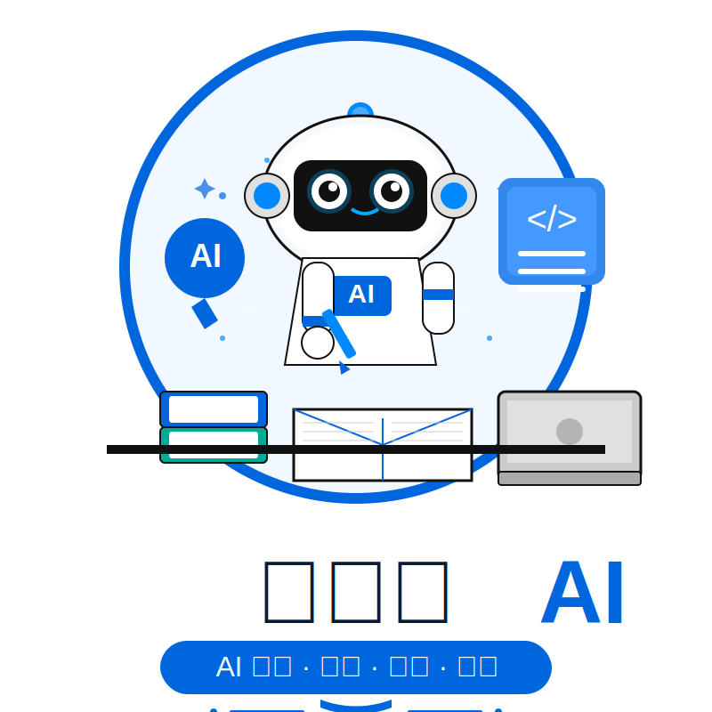

::: center

  

    
  

  

    

      系统化的 AI 编程工具教程，涵盖 Claude Code、Codex、OpenClaw、Skills 技能开发、Agent 智能体框架等内容。每篇教程均附有可复现的配置示例和操作步骤，持续跟踪工具版本更新。
    

  

:::

🌟 **【重磅推荐】AI编程工具终极指南！「小林学AI」全网首发，一站式掌握AI辅助开发！** 🌟

无论你是后端开发者、前端工程师，还是全栈程序员，面对AI编程工具的快速迭代，是否总被这些问题困扰？  
❓ **Claude Code功能太多，不知道从哪里上手？**  
❓ **OpenClaw配置复杂，模型选择一头雾水？**  
❓ **AI智能体开发概念抽象，难以落地实践？**  
**👉 别慌！「小林学AI」来了！最全AI编程工具教程+实战指南，助你效率翻倍！**

---

### **🔥 为什么选择「小林学AI」？**
1. **全网最全教程**：覆盖Claude Code、Codex、OpenClaw等主流AI工具，从安装到进阶，一网打尽！
2. **结构化分类**：清晰划分**工具教程**、**配置指南**、**最佳实践**，精准定位学习目标！
3. **深度源码解析**：拒绝"只会用不懂原理"，深入理解工具设计思想与实现机制！
4. **持续更新迭代**：紧跟AI工具发展（如Claude 4.x、OpenClaw新特性），拒绝过时内容！
5. **完全免费开放**：无套路，无付费墙，技术人的纯粹分享社区！

---

### **🚀 网站核心内容一览**

#### 一、Claude Code [进入 →](/claudecode/)
- **入门**：[安装配置](/claudecode/01-claude-quick-install-guide.html)、[基础命令](/claudecode/05-claude-commands-guide.html)、[权限模式](/claudecode/03-claude-permission-modes.html)
- **进阶**：[Hooks 钩子](/claudecode/06-claude-hooks-tutorial.html)、[MCP 协议](/claudecode/07-claude-mcp-guide.html)、[Skills 技能](/claudecode/08-claude-skills-guide.html)、[子代理](/claudecode/09-claude-subagent-guide.html)
- **实践**：[常见工作流](/claudecode/04-claude-common-workflows.html)、[最佳实践](/claudecode/14-claude-best-practices.html)、[扩展选型](/claudecode/12-claude-extensions-guide.html)
- **配置**：[内存机制](/claudecode/10-claude-memory-configuration.html)、[目录配置](/claudecode/11-claude-directory-configuration.html)、[插件系统](/claudecode/13-claude-plugins-guide.html)

#### 二、OpenClaw [进入 →](/openclaw/)
- **核心**：[Session 会话](/openclaw/04-openclaw-session-management.html)、[Context 上下文](/openclaw/05-openclaw-context-guide.html)、[Agent 工作区](/openclaw/06-openclaw-agent-workspace.html)
- **模型**：[模型选择](/openclaw/12-openclaw-model-selection.html)、故障转移、认证轮转
- **多智能体**：[隔离机制](/openclaw/07-openclaw-multi-agent-mechanism.html)、[消息路由](/openclaw/09-openclaw-messages-mechanism.html)、[技能系统](/openclaw/14-openclaw-skills-system.html)
- **集成**：[飞书接入](/openclaw/19-openclaw-feishu-integration.html)、[浏览器自动化](/openclaw/17-openclaw-browser-automation.html)、[任务调度](/openclaw/18-openclaw-task-scheduling.html)

#### 三、Codex [进入 →](/codex/)
- **配置**：[基础安装](/codex/01-codex-basic-configuration.html)、[高级配置](/codex/02-codex-advanced-configuration.html)、[提示词](/codex/03-codex-prompt-tutorial.html)
- **功能**：[MCP 集成](/codex/05-codex-mcp-tutorial.html)、[Hooks 钩子](/codex/04-codex-hooks-tutorial.html)、[Plugins 插件](/codex/07-codex-plugins-tutorial.html)
- **定制**：[Rules 权限](/codex/08-codex-rules-tutorial.html)、[Subagent 并行](/codex/09-codex-subagent-tutorial.html)、[记忆功能](/codex/10-codex-memory-tutorial.html)
- **实践**：[工作流指南](/codex/12-codex-workflow-guide.html)、[示例配置](/codex/14-codex-example-configurations.html)

#### 四、Skills & Agent [Skills →](/skills/) | [Agent →](/agent/)
- **技能集**：[Superpowers Skills](/skills/04-skills-superpowers-tutorial.html)、[baoyu-skills](/skills/05-skills-baoyu-tutorial.html)
- **智能体框架**：[Hermes Agent](/agent/02-agent-hermes-tutorial.html)、[Agency Agents](/agent/03-agent-agency-agents-tutorial.html)
- **工具集成**：[OpenCLI](/agent/01-agent-opencli-tutorial.html)、[gstack](/agent/04-agent-gstack-tutorial.html)

#### 五、开发工具 [进入 →](/tool/)
- **版本控制**：[Git常用命令与最佳实践](/tool/01-tool-git.html)！
- **文档编写**：[Markdown语法](/tool/02-tool-markdown.html)、[Mermaid流程图绘制](/tool/03-tool-mermaid.html)！
- **浏览器自动化**：[Playwright测试与爬虫实战](/tool/04-tool-playwright.html)！
- **本地模型**：[Ollama本地大模型部署与使用](/tool/05-tool-ollama.html)！
---

### 适合读者

- **初学者** — 按编号顺序阅读，建立完整知识体系
- **开发者** — 按需查阅特定功能的配置和用法
- **架构师** — 关注多智能体路由、模型选型、企业级集成方案

---

### **📢 立即访问**
🔗 **网站地址**：[https://xiaolinxueai.com](https://xiaolinxueai.com)
📅 **持续更新**：关注网站，获取最新AI工具教程与技术解析！
📧 **联系反馈**：如有问题或建议，欢迎邮件联系 **xiaolinxueai@163.com**
🌐 **友情链接**：[AI3927 - AI网站导航](https://ai3927.com) — 精选AI工具与资源导航站

