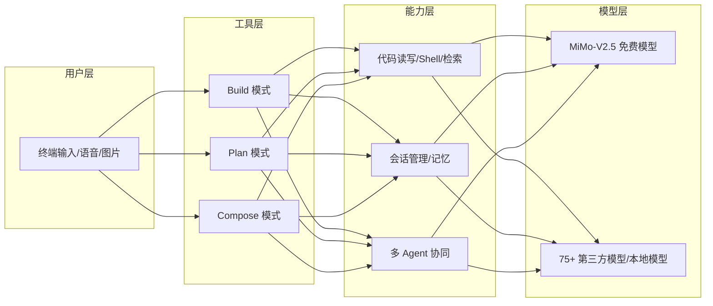
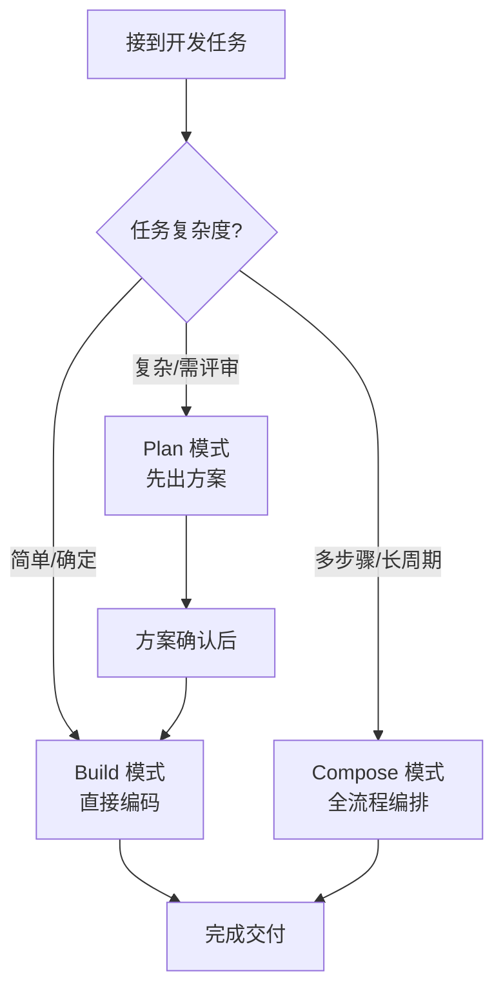

# MiMo Code 完整使用教程：终端AI编码代理从入门到精通

## 一、工具概述

你是否遇到过这样的场景：接手一个陌生仓库，看了一天代码还是云里雾里；写一个新功能，IDE 里的 AI 补全只给几行代码，上下文稍长就开始"失忆"；或者想用命令行 AI 工具，却发现配置繁琐、功能单一，连个完整的文件都改不利索。其实，这些问题的背后是同一种能力的缺失——一个真正理解项目、能完整执行开发任务的**终端 AI 编码代理**。

**MiMo Code** 正是为此而生。它是小米 MiMo 团队推出的终端 AI 编码代理，基于开源项目 OpenCode 二次深度开发，采用 MIT 开源协议，个人与企业均可免费使用与二次分发。它不仅能理解代码仓库的完整结构，还能拆解开发任务、安全编辑代码、审查变更，并与团队现有的 Git、测试等工具无缝协同。

在能力层面，MiMo Code 内置**限时免费的 MiMo-V2.5 多模态大模型**，拥有百万级 Token 上下文窗口，性能对标主流高端编码模型，同时兼容 DeepSeek、Kimi、GLM 等 75 余款主流 LLM 提供商，也支持本地模型部署。除核心编码能力外，它还搭载智能文件检索、多模态图片输入、持久记忆系统、语音指令控制、动态上下文压缩、子智能体协同等贴心功能，有效解决长会话失忆、任务衔接断裂等痛点，兼顾新手入门与团队复杂开发场景。

读完这篇教程，你将掌握 MiMo Code 的安装部署、模型配置、三种核心运行模式、内置工具集使用、会话管理以及个性化定制等全链路技能，即使是终端新手也能快速上手。

**图1：MiMo Code 整体能力架构**



## 二、环境准备与安装部署

### 2.1 前置要求

MiMo Code 依托终端模拟器运行，需提前准备适配的终端环境，推荐终端如下：

1. 跨平台终端：WezTerm、Alacritty；

2. Linux/macOS 专属终端：Ghostty、Kitty；

3. 额外推荐：Mac 用户优先使用 iTerm，全平台可选用 VSCode 内置终端，交互体验更佳。
同时，若需对接第三方大模型，需提前准备对应 LLM 提供商的 API 密钥。

### 2.2 分系统安装教程

MiMo Code 提供两种主流安装方式，不同操作系统对应不同安装命令，全程仅需一行指令即可完成安装：

1. **Mac / Linux 系统（推荐）**
打开终端，执行官方安装脚本：

```bash
curl -fsSL https://mimo.xiaomi.com/install | bash
```

该方式为官方主推方案，自动配置环境变量，安装完成后可直接全局调用。

2. **Windows 系统**
依赖 Node.js 环境，通过 npm 全局安装 CLI 工具：

```bash
npm install -g @mimo-ai/cli
```

安装完成后，可在任意终端输入 `mimo` 验证是否安装成功，若进入 MiMo Code 交互式终端（TUI），则代表部署完成。

## 三、连接大模型提供商

模型是 MiMo Code 的核心算力支撑，工具原生集成 AI SDK 与 Models.dev，支持 75+ 大模型服务商，新手优先选择小米官方免费模型，进阶用户可自定义接入第三方模型。

### 3.1 新手首选：接入 Xiaomi MiMo 免费模型

1. 在终端输入 `mimo` 进入交互式界面；

2. 执行斜杠命令 `/connect`，在弹出的列表中选择 **Xiaomi MiMo**；

3. 根据提示跳转至 `platform.xiaomimimo.com` 平台，完成登录并补充账单信息，复制专属 API 密钥；

4. 将密钥粘贴至终端输入框并回车，完成模型绑定。

> 提示：当前 MiMo-V2.5 模型限时免费开放，无需额外付费即可使用百万 Token 上下文与多模态能力，开箱即用。
> 
> 

### 3.2 切换与管理模型

绑定服务商后，可通过 `/models` 命令查看当前可用模型列表，按需切换使用的模型。此外，工具支持同时配置多个模型提供商，所有已添加的凭据会在启动 MiMo Code 时自动加载，切换十分便捷。

### 3.3 进阶用法：接入第三方 / 本地模型

若需使用 DeepSeek、GLM 等第三方模型，或运行本地大模型，同样通过 `/connect` 命令选择对应服务商，录入其 API 密钥即可。所有遵循 OpenAI 兼容协议的模型，均可无缝接入 MiMo Code。

## 四、项目初始化与基础交互使用

完成模型配置后，即可绑定业务项目，开展编码协作，本节讲解项目初始化、输入规则与基础实操案例。

### 4.1 项目初始化

1. 通过 `cd` 命令切换至目标代码项目根目录：

```bash
cd /你的项目路径
```

2. 执行 `mimo` 启动工具，再输入初始化命令：

```bash
/init
```

3. 工具会自动分析项目整体结构，并在项目根目录生成 `AGENTS.md` 文件。**建议将该文件提交至 Git 仓库**，它能帮助 MiMo Code 长期记忆项目架构、编码规范，持续提升交互精准度。

### 4.2 交互式输入核心规则

MiMo Code 终端交互有一套通用语法与快捷键，熟练掌握可大幅提升操作效率：

1. **基础输入**：底部输入框输入指令，按 `Enter` 发送；换行编辑（不发送）可使用 `Shift+Enter`、`Ctrl+J` 等组合键。

2. **文件引用（智能检索）**：使用 `@` + 文件路径模糊检索项目文件，输入后工具会智能提示匹配文件，文件内容会自动挂载至对话上下文。示例：

    ```text
    分析 @src/api/index.ts 中的身份验证逻辑
    ```

3. **执行终端命令**：指令以 `!` 开头，可直接调用系统 Shell 命令，命令输出结果会同步至对话。示例：`!ls -la`。

4. **图片输入（多模态）**：直接将本地图片拖拽至终端，适用于参考 UI 设计图、报错截图等场景，依赖所选模型的多模态能力。

5. **退出终端**：按下 `Ctrl+C` / `Ctrl+D`，或执行 `/exit` 命令。

6. **通用斜杠命令**：以 `/` 开头调用内置功能，如 `/help` 查看帮助、 `/undo` 撤销操作等。

### 4.3 基础实操案例

#### 案例 1：代码提问与解读

适用于陌生项目学习、老旧代码梳理，结合 `@` 引用文件快速解读逻辑：

```text
@packages/functions/src/notes.ts 请详细讲解该文件的业务逻辑与函数作用
```

#### 案例 2：直接修改代码

针对简单代码调整，直接描述需求 + 引用文件，工具自动完成编辑：

```text
@src/settings.ts @src/notes.ts 参照 notes.ts 中的鉴权逻辑，为 settings 路由添加相同的身份验证功能
```

#### 案例 3：撤销与重做变更

若代码修改不符合预期，使用内置命令回滚或恢复：

- 撤销上一次代码变更：`/undo`（支持多次撤销）

- 恢复已撤销的变更：`/redo`

## 五、三大核心运行模式（Agent）详解

MiMo Code 内置 **Build、Plan、Compose** 三种运行模式，适配不同开发阶段，按下 `Tab` 键可快速循环切换，终端右下角会显示当前模式标识。三种模式分工明确，覆盖从规划、编码到全流程交付的全部场景。

### 5.1 Build 模式（默认模式）

Build 是工具启动后的默认模式，**开放全部工具权限**，支持读取 / 编辑 / 新建文件、执行 Shell 命令、应用补丁等所有操作，是日常编码、Bug 修复、功能迭代的主力模式。
适用场景：确定性需求开发、代码重构、脚本执行、紧急 Bug 修复。

### 5.2 Plan 模式（规划只读模式）

该模式为**只读受限模式**，默认禁用文件写入、编辑、补丁应用、Shell 执行等高风险操作，仅保留代码读取、分析能力。工具只会输出文字版实施方案，不会对代码库做任何修改。
适用场景：复杂功能前期方案评审、大型重构风险评估、多人协作任务拆解，可有效避免误操作破坏代码。

### 5.3 Compose 模式（全流程编排模式）

Compose 是 MiMo Code 的特色高阶模式，内置 13 类标准化开发技能，将拆解、规划、编码、测试、评审、合并等环节串联为自动化工作流，相当于 “一站式开发团队”。

1. **内置技能分类**

    - 测试类：TDD 测试驱动开发；

    - 调试类：系统化排错、开发完成校验；

    - 协作类：需求头脑风暴、方案编写、代码评审、分支合并、子智能体调度等；

    - 元能力：自定义新技能。

2. **使用方式**：按下 `Tab` 切换至 Compose 模式，或在指令中使用 `@compose` 快速唤起。仅需输入简易需求，工具即可自动完成从需求分析到成品交付的全流程。
适用场景：完整新功能开发、标准化团队流程落地、复杂长周期任务。

**图2：三种模式选择流程**



## 六、内置工具集与权限配置

MiMo Code 搭载丰富的内置工具，支撑各类编码操作，同时支持精细化权限管控，兼顾灵活性与安全性，所有工具均可在配置文件中设置访问规则。

### 6.1 核心内置工具说明

|工具名称|功能介绍|
|---|---|
|bash|执行终端命令，如依赖安装、Git 操作等|
|edit / write|edit 修改已有文件，write 新建 / 覆盖文件，为核心编码工具|
|read|读取文件内容，支持按行读取大文件|
|grep / glob|grep 正则检索代码内容；glob 按匹配规则查找文件|
|apply\_patch|应用代码补丁、合并差异文件|
|webfetch / websearch|webfetch 抓取指定网页文档；websearch 联网检索技术资料（需开启环境变量）|
|question|交互提问，主动向开发者确认模糊需求、方案选择|
|todowrite|生成任务清单，追踪多步骤复杂任务进度|
|lsp（实验性）|对接代码 LSP 服务，提供代码跳转、引用查询等智能提示能力|

### 6.2 工具权限管控

通过项目根目录的 `mimocode.json` 配置文件管控工具权限，支持三种权限策略：

- `allow`：默认放行，工具可直接调用；

- `deny`：禁止使用该工具；

- `ask`：调用前向开发者弹窗确认。

配置示例（限制 Shell 命令需手动确认，禁止部分文件编辑）：

```json
{
  "permission": {
    "bash": "ask",
    "edit": "allow",
    "internal_*": "deny"
  }
}
```

同时工具支持 `.ignore` 文件，可自定义检索规则，强制检索 `.gitignore` 中忽略的 `node_modules`、`dist` 等目录。

## 七、会话（Session）管理

MiMo Code 具备**会话持久化能力**，所有对话历史、代码变更记录都会以会话形式保存，关闭终端后可随时断点续连，搭配会话分支、导出、上下文压缩功能，适配长期迭代任务。

### 7.1 会话基础操作

1. **新建会话**：TUI 内执行 `/new`（别名 `/clear`），清空当前上下文，开启全新会话；快捷键 `Ctrl+X + N`。

2. **恢复历史会话**

    - 恢复当前目录最近一次会话：终端执行 `mimo --continue`（简写 `mimo -c`）；

    - 指定会话 ID 恢复：`mimo --session 会话ID`（简写 `mimo -s 会话ID`）。

3. **查看会话列表**：终端执行 `mimo session list`，可搭配 `--max-count` 限制展示数量。

4. **切换会话**：TUI 内执行 `/sessions`，在列表中选择目标会话快速切换。

### 7.2 高阶会话功能

1. **会话分支（Fork）**
基于已有会话创建独立副本，用于尝试新方案、对比不同实现思路，原会话不受影响。命令示例：

```bash
# 基于最近会话创建分支并进入
mimo --continue --fork
```

2. **会话导入 / 导出**
支持将会话导出为 JSON 文件，用于归档、问题反馈、团队分享：

```bash
# 导出会话
mimo export 会话ID
# 导入本地会话文件/在线会话链接
mimo import 本地文件.json
```

3. **上下文压缩**
受限于大模型上下文窗口，长会话可手动执行 `/compact`（别名 `/summarize`）压缩历史对话，工具会通过专属压缩智能体精简内容、释放 Token。也可在 `mimocode.json` 中配置**自动压缩**，默认开启。

### 7.3 数据管理

会话、配置、缓存等数据统一存放在 `$MIMOCODE_HOME` 目录。卸载工具时，若需保留历史会话与配置，执行：

```bash
mimo uninstall --keep-data
```

> 注意：请勿手动修改会话目录内文件，容易导致会话损坏无法恢复。
> 
> 

## 八、个性化配置：主题、自定义命令与技能

MiMo Code 支持深度个性化定制，包含终端主题、自定义快捷命令、团队通用技能三大模块，可贴合个人使用习惯与团队开发规范。

### 8.1 终端主题配置

工具内置十余款精美主题，同时支持自适应主题与自定义主题，要求终端开启 **24 位真彩色（truecolor）** 以保证色彩正常显示。

1. **快速切换主题**：TUI 内直接执行 `/theme`，在列表中选择内置主题（Tokyonight、Nord、Catppuccin、Matrix 等）。

2. **自适应主题**：选择 `system` 主题，界面会自动跟随终端原生配色，保持全终端视觉统一。

3. **配置文件设置**：编辑 `tui.json`，通过 `theme` 字段指定固定主题：

```json
{
  "theme": "tokyonight"
}
```

4. **自定义主题**：在用户目录或项目目录新建 JSON 主题文件，支持十六进制色值、ANSI 色值等格式，实现完全定制化界面。

### 8.2 自定义快捷命令

可将高频操作封装为自定义斜杠命令，支持 JSON 配置或 Markdown 文件两种定义方式，还可传递参数、嵌入 Shell 输出与文件引用。

1. **Markdown 方式（推荐，分项目 / 全局）**
在项目目录 `.mimocode/commands/` 新建 `test.md`，内容示例：

```markdown
---
description: 执行全量测试并排查用例故障
agent: build
model: mimo/mimo-v2.5-pro
---
运行完整测试套件并生成覆盖率报告，定位失败用例并给出修复方案。
```

保存后，在 TUI 内输入 `/test` 即可触发该命令。

2. **参数传递**：自定义命令支持 `$1`、`$2` 等位置参数，以及 `$ARGUMENTS` 整体参数，适配动态传参场景。

### 8.3 自定义开发技能（Skill）

技能（Skill）是可复用的标准化流程，以 `SKILL.md` 文件形式存在，适合沉淀团队编码规范、发布流程、审查标准等。

1. **文件存放路径**

    - 项目局部技能：`.mimocode/skills/` 目录；

    - 全局通用技能：`~/.config/mimocode/skills/` 目录。

2. **技能文件规范**：文件头部必须包含 YAML 前置信息（名称、描述），工具会自动检索并加载所有合规 `SKILL.md`。

3. **技能权限**：在 `mimocode.json` 中基于名称通配符管控技能访问权限，实现团队权限隔离。

## 九、特色功能与实用技巧

结合 MiMo Code 差异化能力，整理高频实用技巧，进一步提升开发效率：

1. **三重持久记忆系统**
工具搭载项目记忆、会话检查点、任务进度三重记忆机制，由独立子智能体专职归档会话信息，解决长会话上下文丢失问题，上百轮交互仍可保持输出稳定。搭配 `/dream` 指令可定期自动整合、精简历史记忆。

2. **LSP 代码智能提示**
开启环境变量 `MIMOCODE_EXPERIMENTAL_LSP_TOOL=true` 启用实验性 LSP 工具，获得代码定义跳转、引用查询、悬停提示等 IDE 级智能编码提示。

3. **语音指令控制**
内置语音输入功能，无需敲击键盘，通过自然语音即可下发开发指令，降低操作门槛，适合快速构思与需求下达。

4. **子智能体协同**
支持调度多个子智能体并行处理任务，例如同时完成编码、测试、文档编写，充分发挥多 Agent 协同优势。

5. **快捷键体系**
大部分组合键以 `Ctrl+X` 为前缀（主引导键），如 `Ctrl+X + L` 打开会话列表、`Ctrl+X + C` 手动压缩上下文，熟记快捷键可脱离鼠标纯键盘操作。

6. **免费模型福利**
内置 MiMo-V2.5 多模态模型限时免费，无需额外注册付费，国内网络直连，是个人开发者练手、小型项目开发的高性价比选择。

## 十、总结

MiMo Code 的核心竞争力可以概括为四个关键词：**免费优质模型、全流程开发模式、灵活的工具权限、持久的会话与记忆能力**。基于 OpenCode 打造的它，将终端、AI 与开发工作流整合为一条完整的工具链，覆盖从代码理解到全功能交付的全过程。

对于个人开发者，开箱即用 + 免费模型 + 百万级上下文，足以应对日常学习和个人项目开发；对于团队，自定义命令、标准化技能、权限管控、Compose 工作流等成熟体系，可统一编码规范、降低协作成本。

**现在可以做的三件事**：

1. 打开终端执行安装命令 `curl -fsSL https://mimo.xiaomi.com/install | bash`，5 分钟完成部署
2. 运行 `mimo` 进入交互界面，通过 `/connect` 绑定免费模型
3. 切换到一个熟悉的项目，用 `@` 引用文件尝试一次代码解读或修改

按 Build → Plan → Compose 的顺序逐步进阶，从简单的代码解读开始，逐步尝试复杂功能开发与团队协作。后续可以进一步探索子智能体协同、自定义技能编写等高级话题，让 MiMo Code 成为你终端开发的得力搭档。
