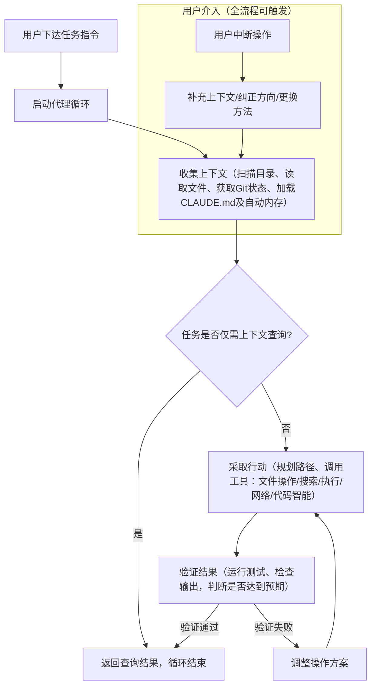

# Claude Code 官方工作原理与使用指南

在AI辅助编程工具的代际演进中，Claude Code 作为Anthropic推出的终端智能体，实现了从“代码补全”到“自主代理”的跨越，其核心优势在于能深度融入开发全流程，自主完成代码读取、编辑、测试、部署等一系列操作，而非局限于片段式代码生成。本文基于Claude Code官方文档，系统解析其工作原理、核心功能、使用场景及高效实操技巧，帮助开发者快速上手这一强大工具，提升开发效率与质量。

## 一、核心定位：不止于编码的终端AI代理

Claude Code 本质是一款运行在终端的AI代理助手，其核心定位是“开发者的结对编程伙伴”，遵循“终端优先”的Unix哲学，通过CLI接入实现与编译、构建、测试工具链的零距离对接。与传统代码补全工具不同，Claude Code 具备完整的任务闭环能力，不仅能出色完成编码工作，还能处理所有可通过命令行实现的任务，包括编写文档、运行构建、搜索文件、研究技术主题等，真正实现“自然语言描述需求，AI完成全流程落地”。

Claude Code 的核心价值在于“模型推理能力+工具执行能力+环境感知能力”的三者协同，使其能够跨越单一文件，全局理解项目结构，完成从需求理解到结果验证的端到端任务，这也是其在SWE-bench Verified测试中能达到80.9%自主问题解决率的关键原因。它支持多环境部署，除终端外，还可在VS Code、JetBrains IDE、桌面应用、浏览器等场景使用，底层核心机制保持一致，确保开发者在不同工作流中获得统一体验。

## 二、核心工作原理：代理循环与双驱动组件

Claude Code 的所有操作都围绕“代理循环（Agentic Loop）”展开，这是其实现自主工作的核心引擎。该循环并非线性流程，而是由“收集上下文、采取行动、验证结果”三个相互融合的阶段构成，可根据任务需求反复迭代，同时允许用户随时介入引导，形成“AI自主工作+人工可控”的协同模式。

### 2.1 代理循环的完整流程

当用户向Claude Code 下达任务指令后，其代理循环会自动启动，具体流程如下：

1. **收集上下文**：这是任务执行的基础阶段。Claude Code 会调用相关工具，扫描项目目录、读取文件内容、获取Git状态、加载CLAUDE.md（项目专属说明文件）及自动内存，快速建立“项目地图”，理解代码结构、依赖关系及项目约定，为后续操作提供完整上下文支撑。对于简单的代码库查询类任务，可能仅需完成此阶段即可给出答案。

2. **采取行动**：基于上下文分析，Claude Code 会自主规划执行路径，调用对应工具完成具体操作。例如，修复失败测试时，会先运行测试套件查看错误、读取错误输出、搜索相关源文件，再编辑文件进行修复；重构任务时，会跨多个文件进行协调编辑，确保代码一致性。每一步操作的结果都会实时反馈，为下一步决策提供依据。

3. **验证结果**：行动完成后，Claude Code 会通过运行测试、检查命令输出等方式，验证操作是否达到预期目标。若验证失败，会自动返回上一阶段，调整操作方案后重新执行，形成闭环迭代。例如，代码修复后会再次运行测试，直至测试通过；文档生成后会检查格式与内容准确性。

值得注意的是，用户是代理循环的重要组成部分。在任何阶段，用户都可中断操作，补充上下文、纠正方向或要求尝试不同方法，Claude Code 会实时响应调整，既保证了自主性，又避免了“AI失控”的问题。

### 2.2 代理循环流程图（核心工作流程）



### 2.3 双驱动组件：模型与工具

代理循环的高效运转，依赖于“推理模型”与“执行工具”两大核心组件的协同作用，二者共同构成了Claude Code 的能力基座。

#### （1）推理模型：核心决策引擎

Claude Code 采用Claude系列模型作为推理核心，具备强大的代码理解与任务拆解能力，可读取任何编程语言的代码，理解组件间的关联关系，并将复杂任务拆解为可执行的子步骤。目前提供两款主流模型，适配不同场景需求：

- Sonnet：适用于大多数编码任务，兼顾效率与性能，能快速完成常规代码编写、错误修复、文档生成等工作，是日常开发的首选。

- Opus：具备更强的推理能力，适用于复杂架构决策、大型项目重构、跨模块问题排查等场景，能应对高难度的技术挑战。

用户可在会话期间使用`/model`命令切换模型，或通过`claude --model <name>`命令启动指定模型，灵活适配不同任务需求。文档中提及的“Claude 选择”“Claude 决定”，本质上都是模型基于上下文进行推理决策的结果。

#### （2）执行工具：行动落地载体

工具是Claude Code 实现“行动能力”的关键，没有工具支撑，模型仅能输出文本建议，无法直接操作项目。Claude Code 内置五大类工具，覆盖开发全流程，每类工具的使用都会返回实时反馈，持续优化后续决策。具体分类及功能如下：

|工具类别|核心功能|应用场景示例|
|---|---|---|
|文件操作|读取、编辑、创建、重命名、重组文件|修改代码文件、创建新的模块文件、整理项目目录|
|搜索|按模式/正则查找文件、搜索内容、探索代码库|查找特定功能的代码片段、定位错误所在文件|
|执行|运行Shell命令、启动服务器、运行测试、使用Git|运行npm test测试、启动本地服务、提交Git更改|
|网络|搜索网络、获取文档、查找错误消息|查询技术文档、搜索错误解决方案、获取依赖包信息|
|代码智能|查看类型错误、跳转定义、查找引用（需插件）|排查代码语法错误、理解函数调用关系|

除内置工具外，Claude Code 还提供subagents（子代理）、任务编排等辅助工具，可进一步提升任务处理效率。例如，通过subagents可将复杂任务拆分给多个子代理并行处理，大幅缩短任务耗时。

### 2.4 双驱动组件协同流程图

```mermaid

flowchart LR
    A[代理循环] --> B[推理模型（核心决策）]
    A --> C[执行工具（行动落地）]
    B --> D{模型选择}
    D -- 常规任务 --> E[Sonnet模型（高效适配多数编码场景）]
    D -- 复杂任务 --> F[Opus模型（强推理，适配架构/重构）]
    E --> G[拆解任务、推理决策]
    F --> G
    G --> H[选择对应工具]
    H --> I[五大类内置工具（文件操作/搜索/执行/网络/代码智能）]
    I --> J[执行操作，返回反馈]
    J --> G
    subgraph 扩展能力
    K[Skills（扩展功能）] --> I
    L[MCP（连接外部服务）] --> I
    M[Subagents（子代理并行处理）] --> I
    N[Hooks（自动化工作流）] --> I
    end
    ```

## 三、核心功能与环境配置

### 3.1 可访问范围：全局掌控项目

在目录中运行`claude`命令启动后，Claude Code 可访问以下资源，确保对项目的全局掌控能力：

- 项目文件：当前目录及子目录下的所有文件，以及用户授权的其他路径文件，支持跨文件协同操作。

- 终端命令：可运行用户能执行的所有命令，包括构建工具、Git、包管理器、系统实用程序等，实现与开发工具链的无缝集成。

- Git状态：实时获取当前分支、未提交更改、最近提交历史，便于代码版本管理相关操作。

- CLAUDE.md：项目根目录下的Markdown文件，用户可在其中存储项目说明、编码规范、约定等信息，每次会话自动加载，确保AI遵循团队规范。

- 自动内存：Claude Code 会自动保存工作过程中的学习内容，如项目模式、用户偏好等，MEMORY.md前200行在每次会话启动时加载，实现跨会话学习。

- 扩展组件：包括MCP服务器（连接外部服务）、skills（扩展功能）、subagents（子代理）等，可根据需求灵活配置。

这种全局访问能力，使得Claude Code 能够处理“修复身份验证错误”“重构整个模块”等跨文件、跨模块的复杂任务，区别于仅能查看当前文件的内联代码助手。

### 3.2 运行环境与交互界面

Claude Code 的核心机制（代理循环、工具、模型）在所有场景中保持一致，差异仅在于代码执行位置和交互方式，可灵活适配不同开发场景。

#### （1）三大运行环境

|环境类型|代码运行位置|核心用例|优势|
|---|---|---|---|
|本地|用户自有机器|日常开发、本地项目调试|默认环境，完全访问本地文件、工具和环境|
|云|Anthropic管理的虚拟机|任务卸载、处理本地无权限的仓库|减轻本地机器负担，支持跨设备访问|
|远程控制|用户机器，通过浏览器控制|需要Web UI操作，同时保持本地数据安全|兼顾Web操作便捷性与本地环境安全性|

### 3.3 运行环境与交互界面流程图

```mermaid

flowchart TD
    A[Claude Code 核心机制（代理循环+模型+工具）] --> B{选择运行环境}
    B -- 默认 --> C[本地环境（运行在用户自有机器，完全访问本地资源）]
    B -- 任务卸载 --> D[云环境（运行在Anthropic虚拟机，跨设备访问）]
    B -- Web UI控制 --> E[远程控制环境（运行在用户机器，浏览器操作）]
    C --> F[选择交互界面]
    D --> F
    E --> F
    F -- 熟练开发者 --> G[终端（核心方式，启动快）]
    F -- 编码场景 --> H[IDE扩展（VS Code/JetBrains IDE）]
    F -- 临时使用 --> I[网页端（claude.ai/code，无需安装）]
    F -- 团队协作 --> J[其他场景（桌面应用/Slack/CI/CD管道）]
    ```

#### （2）多场景交互界面

Claude Code 支持多种交互界面，用户可根据习惯选择：

- 终端：核心交互方式，启动快速、操作便捷，适合熟练开发者。

- IDE扩展：支持VS Code、JetBrains IDE等主流开发工具，可在编码过程中直接调用，无缝融入开发流程。

- 网页端：通过claude.ai/code访问，无需本地安装，适合临时使用或跨设备操作。

- 其他场景：支持桌面应用、Slack、CI/CD管道等，可集成到团队协作流程中，实现自动化开发。

### 3.3 扩展能力：灵活适配个性化需求

内置工具是Claude Code 的基础能力，用户可通过以下扩展方式，适配更复杂的开发场景，构建个性化工作流：

- Skills：扩展Claude Code 的功能范围，可按需加载，会话开始时仅加载描述，使用时才加载完整内容，避免占用过多上下文。

- MCP：通过模型上下文协议（MCP）连接外部服务，如Jira、Slack、Google Drive等，实现跨工具链数据交互。

- Hooks：用于自动化工作流，可设置触发条件，实现任务的自动执行，如代码提交后自动运行测试。

- Subagents：子代理拥有独立的上下文，可承接主代理的部分任务，并行处理，避免主会话上下文膨胀，适合长会话和复杂任务。

## 四、会话管理与上下文控制

Claude Code 的会话管理机制，确保了开发过程的可追溯性、可恢复性，同时通过上下文控制，避免资源浪费，提升任务处理效率。

### 4.1 会话核心特性

- 本地保存：所有会话数据（消息、工具使用记录、结果）均保存在本地，支持回退、恢复和分叉操作，确保开发过程可追溯。

- 会话独立：每个新会话启动时，都会开启新的上下文窗口，不继承之前的会话历史，避免上下文干扰；同时可通过自动内存和CLAUDE.md，实现跨会话的知识留存。

- 跨分支工作：会话与当前目录绑定，切换Git分支后，Claude Code 会自动识别新分支的文件，同时保留原有对话历史；可通过git worktrees创建多个独立目录，运行并行会话。

- 恢复与分叉：使用`claude --continue`或`claude --resume`可恢复中断的会话，新消息附加到原有对话；使用`--fork-session`可分叉会话，创建新的会话ID，尝试不同解决方案，不影响原始会话。

注意：在多个终端中恢复同一会话，会导致消息交错，建议使用分叉会话实现并行工作。

### 4.2 会话管理流程图

```mermaid

flowchart TD
    A[启动新会话] --> B[开启新上下文窗口（不继承历史会话，加载CLAUDE.md和自动内存）]
    B --> C[会话与当前目录绑定（实时识别当前Git分支文件）]
    C --> D{会话操作}
    D -- 中断会话 --> E[本地保存会话数据（消息、工具记录、文件快照）]
    E -- 恢复 --> F[使用claude --continue/claude --resume（附加新消息，需重新批准权限）]
    E -- 分叉 --> G[使用--fork-session（创建新会话ID，保留历史，不影响原会话）]
    D -- 并行工作 --> H[使用git worktrees（创建独立目录，运行多个并行会话）]
    D -- 多终端操作 --> I[警告：消息交错（建议使用分叉会话）]
    F --> C
    G --> C
    H --> C
    I --> G
    ```

### 4.2 上下文窗口管理

上下文窗口是Claude Code 存储会话相关信息的载体，包括对话历史、文件内容、命令输出、CLAUDE.md、加载的skills等。随着任务推进，上下文会逐渐填满，Claude Code 会自动进行管理，确保高效运行：

- 自动压缩：当接近上下文限制时，会先清除较旧的工具输出，必要时总结对话内容，保留用户请求和关键代码片段，避免早期详细说明丢失。

- 手动控制：可在CLAUDE.md中添加“Compact Instructions”部分，或使用`/compact`命令（如`/compact focus on the API changes`），控制压缩时保留的内容。

- 上下文查看：运行`/context`命令，可查看当前上下文的占用情况；运行`/mcp`命令，可检查MCP服务器的上下文消耗。

- 优化技巧：通过skills按需加载、subagents独立上下文，可有效减少主会话的上下文占用，提升长会话处理效率。

### 4.3 上下文管理流程图

```mermaid

flowchart TD
    A[上下文窗口（存储对话/文件/命令/CLAUDE.md等）] --> B[任务推进，上下文逐渐填满]
    B --> C{接近上下文限制?}
    C -- 否 --> B
    C -- 是 --> D[自动压缩（清除旧工具输出→总结对话，保留关键内容）]
    D --> E{需手动控制压缩?}
    E -- 是 --> F[方式1：CLAUDE.md添加Compact Instructions方式2：使用/compact命令指定保留重点]
    E -- 否 --> G[继续任务]
    F --> G
    G --> H{需查看上下文占用?}
    H -- 是 --> I[运行/context（查看整体占用）运行/mcp（查看MCP服务器消耗）]
    H -- 否 --> B
    subgraph 上下文优化
    J[Skills按需加载（仅会话开始加载描述，使用时加载完整内容）] --> A
    K[Subagents独立上下文（不占用主会话资源，完成后返回摘要）] --> A
    end
    ```

## 五、安全机制：可控可追溯

Claude Code 提供双重安全机制，既保证操作的安全性，又避免过度繁琐的权限验证，平衡效率与安全，尤其针对沙箱隔离、权限控制等关键场景进行了优化。

### 5.1 检查点：可撤销的文件操作

Claude Code 在编辑任何文件前，都会对当前文件内容进行快照（检查点），确保所有文件修改均可撤销：

- 撤销操作：出现问题时，按两次`Esc`键可回退到修改前的状态，或直接要求Claude Code 撤销操作。

- 局限性：检查点仅针对文件更改，且是会话本地的，独立于Git；影响远程系统（如数据库、API、部署）的操作无法通过检查点撤销，因此这类操作执行前，Claude Code 会主动询问用户确认。

### 5.2 安全机制流程图

```mermaid

flowchart TD
    A[安全机制双重保障] --> B[检查点机制（文件操作可撤销）]
    A --> C[权限控制机制（管控操作范围）]
    
    subgraph 检查点流程
    B --> D[编辑文件前，自动创建文件快照]
    D --> E{操作出现问题?}
    E -- 是 --> F[按两次Esc回退或要求Claude撤销]
    E -- 否 --> G[操作完成，快照保留]
    F --> H[恢复文件原始状态]
    note[注：检查点仅针对文件更改，独立于Git；远程操作无法撤销，执行前需确认]
    end
    
    subgraph 权限控制流程
    C --> I[按Shift+Tab切换权限模式]
    I --> J{选择模式}
    J -- 安全优先 --> K[默认模式（文件编辑+命令执行前均询问）]
    J -- 效率优先 --> L[自动接受编辑（文件编辑免确认，命令仍询问）]
    J -- 高风险操作 --> M[计划模式（仅只读工具，先出计划再执行）]
    K --> N[可自定义权限（.claude/settings.json配置信任命令）]
    L --> N
    M --> N
    N --> O[沙箱隔离（文件/网络隔离，防止敏感泄露）]
    end
   ```

### 5.2 权限控制：灵活管控操作范围

Claude Code 采用权限分级模式，用户可通过快捷键或配置文件，灵活控制AI的操作权限，同时通过沙箱隔离技术，进一步提升安全性：

- 权限模式切换：按`Shift+Tab`可循环切换三种权限模式：

- 默认模式：文件编辑和Shell命令执行前，均需用户确认，安全性最高。

- 自动接受编辑：文件编辑无需确认，Shell命令仍需询问，兼顾效率与安全。

- 计划模式：仅使用只读工具，先生成执行计划，经用户批准后再执行，适合高风险操作。

自定义权限：在`.claude/settings.json`中，可配置允许的特定命令（如`npm test`、`git status`），避免重复询问，提升效率。

沙箱隔离：通过文件系统隔离和网络隔离，限制Claude Code 的访问范围，防止敏感文件泄露或恶意操作，可减少84%的权限提示，同时提升安全性。

## 六、高效使用技巧：解锁Claude Code 全部潜力

要充分发挥Claude Code 的优势，需掌握以下实操技巧，实现“精准指令、高效协作”：

### 6.1 善用内置帮助命令

Claude Code 具备自解释能力，可直接询问使用方法，同时提供多个内置命令，快速完成配置与问题排查：

- `/init`：引导用户创建CLAUDE.md，快速配置项目专属说明。

- `/agents`：帮助配置自定义subagents，优化复杂任务处理效率。

- `/doctor`：诊断安装过程中的常见问题，快速定位故障。

### 6.2 对话式迭代，而非一次性指令

Claude Code 是对话式工具，无需完美的初始指令，可通过多轮迭代优化结果。例如：先下达“修复登录错误”的指令，待AI执行后，补充“问题在于会话处理”的反馈，AI会自动调整方案，无需重新启动会话。

### 6.3 随时中断，主动引导

若AI执行方向偏离需求，可随时输入更正内容并按Enter，AI会立即停止当前操作，根据新的指令调整方案，无需等待操作完成或重新启动会话，大幅节省时间。

### 6.4 指令精准，减少引导成本

初始指令越具体，AI的执行准确率越高，需参考特定文件、提及约束条件、指出示例模式。例如，避免“修复结账流程”的模糊指令，改为“结账流程对于持有过期卡的用户来说已损坏，检查src/payments/中的问题，特别是令牌刷新，首先编写一个失败的测试，然后修复它”。

### 6.5 提供验证标准，提升结果准确性

AI在具备验证标准的情况下，表现更出色。可提供测试用例、预期输出、设计截图等，让AI自行验证结果。例如，实现邮箱验证函数时，可附加测试用例：`'user@example.com' → true，'invalid' → false，'user@.com' → false`，并要求AI运行测试。

### 6.6 复杂任务：先探索，再实现

对于复杂任务，建议采用“两阶段法”：先使用计划模式（按`Shift+Tab`两次），让AI分析代码库、生成执行计划，经用户审查细化后，再让AI执行实现，避免直接编码导致的方向偏差。

### 6.7 学会委派，而非过度指示

将AI视为有能力的同事，提供上下文和目标方向即可，无需指定具体操作步骤。例如，指令“结账流程已损坏，相关代码在src/payments/中，你可以调查并修复它吗？”，AI会自主规划步骤、调用工具，完成修复任务。

## 七、总结

Claude Code 并非传统的代码补全工具，而是一款具备自主决策、全局感知、安全可控的终端AI代理，其核心在于“代理循环”的闭环机制，以及“模型+工具”的双驱动架构。通过全局访问项目资源、多环境适配、灵活扩展能力，它能够深度融入开发全流程，帮助开发者解决从简单编码到复杂项目重构的各类问题。

掌握其会话管理、上下文控制、安全机制及高效使用技巧，可充分发挥其优势，减少重复劳动，聚焦核心业务逻辑，实现开发效率的大幅提升。无论是新手开发者还是资深工程师，Claude Code 都能成为高效的结对编程伙伴，推动开发工作的智能化升级。

