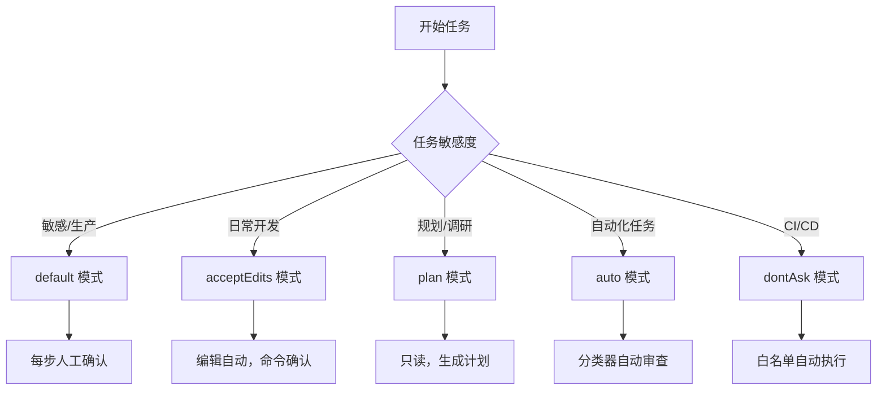

# Claude Code 权限模式完全指南
## 一、权限模式总览

用 Claude Code 做日常开发时，你大概率遇到过这些情况：改个文件还要逐个点确认，弹窗多到打断思路；或者让它跑个脚本，结果一条命令都没执行就卡在权限审批上。根本原因是权限模式没选对。

权限模式控制的是 AI 执行文件读写、代码编辑、Shell 命令、网络请求时是否需要用户确认。Claude Code 提供了 6 种模式，从每步必确认到全自动执行，覆盖不同的风险容忍度。

选择哪种模式，取决于你当前任务的敏感度：


官方提供 6 种标准模式：**default、acceptEdits、plan、auto、dontAsk、bypassPermissions**，覆盖从强管控到全自动化的完整梯度，所有模式可通过 CLI、IDE 插件、桌面端、Web 端统一切换与配置。

下面先看怎么切换模式，再逐一拆解每种模式的行为细节。

## 二、权限模式切换与配置
### 2.1 会话内快速切换
- CLI / JetBrains：**Shift+Tab** 循环切换 default → acceptEdits → plan → auto（需先启用）；bypassPermissions 需启动参数开启。
- VS Code / Desktop / Web：使用界面模式选择器，UI 标签与配置键一一映射，便于可视化操作。

### 2.2 启动指定模式
```bash
# 启动为规划模式
claude --permission-mode plan
# 非交互式脚本执行
claude -p "重构代码" --permission-mode acceptEdits
# 启用 Auto 模式
claude --enable-auto-mode
# 跳过所有权限检查（高危）
claude --dangerously-skip-permissions
```

配置默认模式后，每次启动都会自动使用该模式，不用每次手动指定。

### 2.3 设置默认模式
在 `.claude/settings.json` 中配置全局默认权限模式，持久生效：
```json
{
  "permissions": {
    "defaultMode": "acceptEdits"
  }
}
```
## 三、6 种权限模式详解与选型

### 3.1 default（默认询问模式）

- 自动允许：读取文件
- 需要确认：文件编辑、Shell 命令、网络请求

典型行为示例：让 AI 修复一个 bug，它会读取代码（自动通过），但修改文件时弹出确认框，执行 `npm test` 时再次弹出确认框。

适用场景：首次接触项目、敏感业务开发、生产环境附近操作。

### 3.2 acceptEdits（自动接受编辑）

- 自动允许：读取文件 + 编辑文件
- 需要确认：Shell 命令、网络请求

典型行为示例：让 AI 重构一个模块，它直接修改代码文件（不弹窗），但执行 `git commit` 或 `npm run build` 时仍需确认。

这是日常开发的首选模式——编辑操作频繁且低风险，命令操作影响大且需要把关，刚好各取所需。

适用场景：熟悉项目、迭代开发、代码重构。

### 3.3 plan（只读规划模式）

- 自动允许：读取文件、分析代码
- 阻止：所有修改操作（编辑、命令、网络）

典型行为示例：让 AI 分析一个遗留项目的重构方案，它只会读取代码并输出计划文档，不会修改任何文件。也可以通过 `/plan` 命令单次启用，不需要切换整个会话的模式。

适用场景：多文件重构前的方案设计、代码库探索、需求分析。

### 3.4 auto（自动模式，带安全分类器）

- 自动允许：由分类器审查后决定
- 阻止：分类器判定为高危的操作

典型行为示例：让 AI 批量重命名 50 个文件，分类器会自动批准这类文件编辑；但如果 AI 尝试执行 `curl | bash`、强制推送 main 分支、删除大量文件，分类器会拦截。

核心约束：需 Team/Enterprise 套餐、Sonnet 4.6+/Opus 4.6+ 模型。分类器会临时禁用通配符 Bash 规则等高风险权限。

默认阻止的行为：curl|bash 类远程执行、生产部署、大规模删除、强制推送 main 分支、泄露敏感数据。

适用场景：长时间自动化任务、批量重构，信任任务方向但需要安全兜底。

### 3.5 dontAsk（仅允许预授权工具）

- 自动允许：`permissions.allow` 白名单中的工具/命令
- 阻止：所有未显式允许的操作（无弹窗，直接拒绝）

典型行为示例：在 CI 脚本中配置 `"allow": ["Bash(npm test)", "Bash(npm run build)"]`，AI 只能执行这两条命令，其他操作一律拒绝，不会弹出任何交互窗口。

适用场景：CI/CD 流水线、受限环境、自动化脚本。

### 3.6 bypassPermissions（跳过所有检查，高危）

- 自动允许：所有操作
- 安全检查：无

典型行为示例：AI 可以不经确认执行任何命令，包括 `rm -rf /`、推送代码、访问网络。没有任何防注入、防误操作保护。

官方明确仅用于隔离容器/VM/无网开发环境，严禁用于生产相关环境。管理员可在托管配置中强制关闭此模式，防止滥用。

## 四、权限模式对比与选型指南

上面逐个看过了每种模式的行为，下面用一张表做横向对比：
| 模式 | 权限提示 | 安全检查 | 自动化程度 | 最佳场景 |
| :--- | :--- | :--- | :--- | :--- |
| **default** | 文件编辑+命令 | 人工逐次确认 | 低 | 陌生项目、敏感开发 |
| **acceptEdits** | 仅命令 | 人工审核命令 | 中 | 日常迭代、信任项目 |
| **plan** | 所有操作（只读） | 人工全量审核 | 极低 | 规划重构、探索代码 |
| **auto** | 无（触发回退除外） | AI 分类器审查 | 高 | 长时任务、批量处理 |
| **dontAsk** | 无 | 预配置白名单 | 中高 | CI/CD、受限环境 |
| **bypassPermissions** | 无 | 无 | 极高 | 隔离沙箱、实验环境 |

结合上表，选型建议如下：
- 个人开发：优先 **acceptEdits**，平衡效率与安全。
- 敏感/生产相关：固定 **default** 或 **plan**，全程人工把关。
- 长时间自动化：用 **auto**，比 bypassPermissions 更安全。
- 流水线/脚本：用 **dontAsk**，白名单严格管控。
- 沙箱实验：仅在此场景使用 **bypassPermissions**。

如果选型后还想对特定命令做更细的管控，可以配合权限规则和 Hooks，详见第六节。

## 五、Auto 模式安全机制与回退规则

Auto 模式的核心是分类器替代人工做审批，下面拆解它的审查逻辑和异常兜底机制。

### 5.1 分类器审查逻辑
1. 优先匹配用户自定义 allow/deny 规则。
2. 只读与本地文件编辑自动批准。
3. 其余操作送入分类器，基于上下文意图判断安全性。
4. 阻止后会尝试替代方案，不直接中断会话。

举例：AI 执行 `git push --force origin main`，分类器判定为高危操作，阻止执行，但可能建议改为 `git push origin feature-branch`。

### 5.2 回退保护机制
- 连续阻止 3 次 或 会话累计阻止 20 次 → 自动退出 auto，切回手动确认模式。
- 非交互式会话触发回退则直接中止，保障安全。

回退机制确保 Auto 模式不会"一路狂奔"——分类器判断失误累积到阈值后，会主动交还控制权。

### 5.3 子代理安全约束
- 子代理启动前分类器审查任务描述。
- 运行中继承父会话权限与分类器规则。
- 执行结束后全量审计操作历史，异常追加安全警告。

子代理不会因为"子任务"的身份就获得额外权限，它的行为被约束在父会话的安全边界内。

## 六、权限扩展与安全加固

权限模式是粗粒度的开关，实际使用中往往需要对特定命令做更精细的控制。权限规则和 Hooks 提供了这种能力。

### 6.1 权限规则（优先级高于模式）
在 settings.json 中配置 allow/ask/deny 规则，精细化管控工具与命令，覆盖所有模式（bypassPermissions 除外）。

```json
{
  "permissions": {
    "allow": ["Bash(npm test)", "Bash(npm run build)"],
    "deny": ["Bash(rm -rf *)"],
    "ask": ["Bash(deploy *)"]
  }
}
```

上面的配置在任何模式下都生效：`npm test` 和 `npm run build` 始终自动允许，`rm -rf *` 始终拒绝，`deploy` 开头的命令始终要求确认。

### 6.2 Hooks 高级控制
- PreToolUse：工具调用前执行自定义校验，按路径、命令、策略服务动态允许/拒绝/升级。
- PermissionRequest：自动应答权限请求，实现无人值守合规审批。

### 6.3 企业安全管控
- 托管配置 managed-settings.json 优先级最高，可禁用 bypassPermissions、限制 Auto 模式、白名单受信任仓库与云服务。
- 审计分类器默认规则：`claude auto-mode defaults`。
- 配置信任环境：通过 autoMode.environment 声明可信仓库、存储桶、内部服务，减少误拦。

## 七、常见问题与最佳实践

**Q1：切换了模式但行为没变，怎么回事？**
检查三层覆盖关系：托管配置（managed-settings.json）优先级最高，会覆盖 CLI 参数和本地配置；CLI 参数会覆盖默认配置。如果是 IDE 插件，切换后可能需要重启插件才能生效。

**Q2：Auto 模式频繁阻止正常操作，怎么解决？**
两种思路：一是补充信任环境配置（`autoMode.environment`），把内部仓库、云服务加入信任列表，减少误拦；二是如果阻止率确实高，说明任务敏感度不适合 Auto，改用 acceptEdits 由人工审核命令。

**Q3：弹窗太多影响效率，怎么办？**
这是用了 default 模式的典型体验。日常开发建议切到 acceptEdits（编辑不弹窗，仅命令确认），批量任务用 auto，脚本用 dontAsk。也可以通过权限规则把常用命令加入 allow 列表。

**Q4：生产环境有没有必须遵守的安全底线？**
三条红线：1) 任何生产相关操作不使用 bypassPermissions；2) 敏感文件与凭证通过 deny 规则禁止读取；3) 定期清理会话记录，降低泄露风险。

## 八、总结

Claude Code 权限模式的核心是按场景匹配风险等级。日常开发用 acceptEdits（编辑自动、命令确认），敏感场景用 default 或 plan（全程人工把控），长时间自动化用 auto（分类器兜底），CI/流水线用 dontAsk（白名单管控），隔离沙箱才用 bypassPermissions。

建议从 acceptEdits 开始尝试，根据实际体验调整。配合权限规则可以实现更细粒度的控制——比如在 acceptEdits 模式下把 `npm test` 加入 allow 列表，进一步减少弹窗而不降低安全性。

