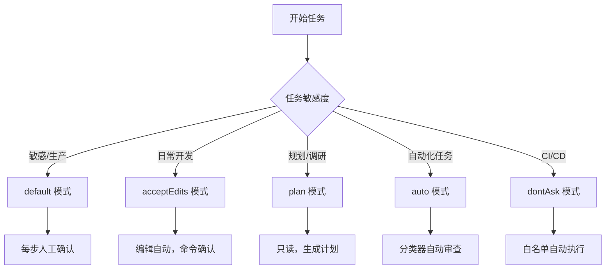

# Claude Code 权限模式完全指南
## 一、权限模式总览
Claude Code 权限模式用于控制 AI 在执行文件读写、代码编辑、Shell 命令、网络请求等操作时是否需要用户确认，在**安全可控**与**自动化效率**之间做分级平衡，支持会话中切换、启动指定、默认配置三种生效方式，适配从敏感开发到自动化任务的全场景。

Claude Code 权限模式决策流程如下：



官方提供 6 种标准模式：**default、acceptEdits、plan、auto、dontAsk、bypassPermissions**，覆盖从强管控到全自动化的完整梯度，所有模式可通过 CLI、IDE 插件、桌面端、Web 端统一切换与配置。

## 二、权限模式切换与配置
### 2.1 会话内快速切换
- CLI / JetBrains：**Shift+Tab** 循环切换 default → acceptEdits → plan → auto（需先启用）；bypassPermissions 需启动参数开启。
- VS Code / Desktop / Web：使用界面模式选择器，UI 标签与配置键一一映射，便于可视化操作。

### 2.2 启动指定模式
```bash
# 启动为规划模式
claude --permission-mode plan
# 非交互式脚本执行
claude -p "重构代码" --permission-mode acceptEdits
# 启用 Auto 模式
claude --enable-auto-mode
# 跳过所有权限检查（高危）
claude --dangerously-skip-permissions
```
### 2.3 设置默认模式
在 `.claude/settings.json` 中配置全局默认权限模式，持久生效：
```json
{
  "permissions": {
    "defaultMode": "acceptEdits"
  }
}
```
## 三、6 种权限模式详解与选型
### 3.1 default（默认询问模式）
- 权限行为：仅**读取文件**自动允许；文件编辑、Shell 命令、网络请求均需用户手动确认。
- 核心优势：每一步操作都在监督下，安全性最高，避免误执行高危指令。
- 适用场景：首次接触项目、敏感业务开发、生产环境附近操作、不信任代码场景。

### 3.2 acceptEdits（自动接受编辑）
- 权限行为：自动允许**读取 + 编辑文件**；仅 Shell 命令、网络等高风险操作需确认。
- 核心优势：大幅减少确认弹窗，兼顾编辑效率与命令安全，是日常开发首选。
- 适用场景：熟悉项目、迭代开发、代码重构，信任 AI 编辑但严控命令执行。

### 3.3 plan（只读规划模式）
- 权限行为：**禁止任何修改执行**，仅允许读取、分析、生成方案，输出计划文件。
- 核心优势：先调研后动手，不污染源码，适合复杂任务前置设计。
- 适用场景：多文件重构、架构调整、代码库探索、需求分析，可通过 `/plan` 单请求启用。

### 3.4 auto（自动模式，带安全分类器）
- 权限行为：无人工弹窗，由后台分类器自动审查操作，拦截越权、高危、恶意指令。
- 核心约束：需 Team/Enterprise 套餐、Sonnet 4.6+/Opus 4.6+ 模型；分类器会临时禁用通配符 Bash 规则等高风险权限。
- 默认阻止：curl|bash 类远程执行、生产部署、大规模删除、强制推送 main 分支、泄露敏感数据等高危行为。
- 适用场景：长时间自动化任务、批量重构、减少提示疲劳，信任任务方向但需安全兜底。

### 3.5 dontAsk（仅允许预授权工具）
- 权限行为：**自动拒绝所有未显式允许**的操作，无任何交互弹窗，纯非交互模式。
- 核心逻辑：只执行 permissions.allow 里白名单明确许可的工具/命令，完全可控。
- 适用场景：CI/CD 流水线、受限环境、自动化脚本、批量任务，杜绝越权执行。

### 3.6 bypassPermissions（跳过所有检查，高危）
- 权限行为：关闭所有权限提示与安全检查，**所有操作立即执行**，无任何验证。
- 风险提示：无防注入、无防误操作保护，官方明确仅用于隔离容器/VM/无网开发环境。
- 禁用方式：管理员可在托管配置中强制关闭此模式，防止滥用。
- 适用场景：完全隔离的沙箱、实验环境、本地测试虚拟机，严禁用于生产相关环境。

## 四、权限模式对比与选型指南
| 模式 | 权限提示 | 安全检查 | 自动化程度 | 最佳场景 |
| :--- | :--- | :--- | :--- | :--- |
| **default** | 文件编辑+命令 | 人工逐次确认 | 低 | 陌生项目、敏感开发 |
| **acceptEdits** | 仅命令 | 人工审核命令 | 中 | 日常迭代、信任项目 |
| **plan** | 所有操作（只读） | 人工全量审核 | 极低 | 规划重构、探索代码 |
| **auto** | 无（触发回退除外） | AI 分类器审查 | 高 | 长时任务、批量处理 |
| **dontAsk** | 无 | 预配置白名单 | 中高 | CI/CD、受限环境 |
| **bypassPermissions** | 无 | 无 | 极高 | 隔离沙箱、实验环境 |

### 选型建议
- 个人开发：优先 **acceptEdits**，平衡效率与安全。
- 敏感/生产相关：固定 **default** 或 **plan**，全程人工把关。
- 长时间自动化：用 **auto**，比 bypassPermissions 更安全。
- 流水线/脚本：用 **dontAsk**，白名单严格管控。
- 沙箱实验：仅在此场景使用 **bypassPermissions**。

## 五、Auto 模式安全机制与回退规则
### 5.1 分类器审查逻辑
1. 优先匹配用户自定义 allow/deny 规则。
2. 只读与本地文件编辑自动批准。
3. 其余操作送入分类器，基于上下文意图判断安全性。
4. 阻止后会尝试替代方案，不直接中断会话。

### 5.2 回退保护机制
- 连续阻止 3 次 或 会话累计阻止 20 次 → 自动退出 auto，切回手动确认模式。
- 非交互式会话触发回退则直接中止，保障安全。

### 5.3 子代理安全约束
- 子代理启动前分类器审查任务描述。
- 运行中继承父会话权限与分类器规则。
- 执行结束后全量审计操作历史，异常追加安全警告。

## 六、权限扩展与安全加固
### 6.1 权限规则（优先级高于模式）
在 settings.json 中配置 allow/ask/deny 规则，精细化管控工具与命令，覆盖所有模式（bypassPermissions 除外）：
- 示例：允许 npm test、拒绝 rm -rf、强制询问部署命令。

### 6.2 Hooks 高级控制
- PreToolUse：工具调用前执行自定义校验，按路径、命令、策略服务动态允许/拒绝/升级。
- PermissionRequest：自动应答权限请求，实现无人值守合规审批。

### 6.3 企业安全管控
- 托管配置 managed-settings.json 优先级最高，可禁用 bypassPermissions、限制 Auto 模式、白名单受信任仓库与云服务。
- 审计分类器默认规则：`claude auto-mode defaults`。
- 配置信任环境：通过 autoMode.environment 声明可信仓库、存储桶、内部服务，减少误拦。

## 七、常见问题与最佳实践
1. 模式切换不生效：检查是否被托管配置覆盖，CLI 确认参数传入正确，IDE 重启插件。
2. Auto 模式频繁阻止：补充信任基础设施配置，或改用 acceptEdits 人工审核命令。
3. 权限弹窗过多：日常开发切到 acceptEdits，批量任务用 auto，脚本用 dontAsk。
4. 安全底线：任何生产相关操作不使用 bypassPermissions；敏感文件与凭证通过权限规则禁止读取；定期清理会话记录，降低泄露风险。

## 八、总结
Claude Code 权限模式提供**从强管控到全自动化**的完整安全梯度，核心是按场景匹配风险等级：日常用 acceptEdits、敏感用 default/plan、自动化用 auto、流水线用 dontAsk、沙箱用 bypassPermissions。配合权限规则、Hooks、企业托管配置，可构建安全、高效、合规的 AI 辅助开发环境，在提升效率的同时严格控制操作风险。

