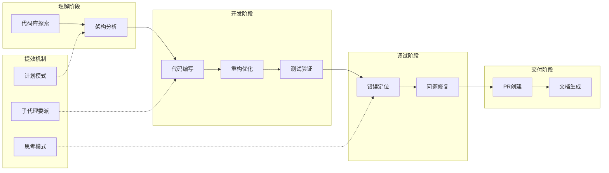

# Claude Code 常用工作流

你是否遇到过这样的场景：接手一个陌生项目，花了一整天才理清架构？线上报错，翻遍日志却找不到根因？想重构遗留代码，又怕改出新Bug？这些问题有一个共同特征——它们都不是单纯的编码问题，而是需要"理解→行动→验证"闭环的工程任务。Claude Code 的代理循环恰好为这类任务而生，掌握正确的工作流，能让它从"聊天工具"变成真正的"开发伙伴"。

Claude Code 覆盖开发全流程，以下流程图展示了核心工作流及其应用场景：


## 一、新代码库快速理解与探索
快速上手陌生项目是开发日常，Claude Code 可通过结构化指令，快速完成代码库概览、架构解析与核心模块梳理，降低新项目上手成本。
1. 进入项目根目录并启动工具
```bash
cd /path/to/project
claude
```
2. 发起全局概览请求，掌握项目整体结构
```
> give me an overview of this codebase
```
3. 深度拆解核心架构与组件
```
> explain the main architecture patterns used here
> what are the key data models?
> how is authentication handled?
```
使用技巧：先宽泛提问建立整体认知，再聚焦具体模块——例如先用 `overview` 了解全貌，再用 `how is X handled?` 深入某个子系统。主动询问 `CLAUDE.md` 中是否有编码规范，可快速对齐团队协作标准。

## 二、高效定位与修复代码错误

理解了项目结构后，开发中最常见的工作就是排障。遇到程序报错时，Claude Code 可快速定位问题根源、给出修复方案并直接完成代码修改，形成闭环排障流程。

1. 向 Claude 同步错误信息与复现条件
```
> I'm seeing an error when I run npm test
```
2. 请求针对性修复建议
```
> suggest a few ways to fix the @ts-ignore in user.ts
```
3. 直接执行修复操作
```
> update user.ts to add the null check you suggested
```
使用技巧：提供完整报错堆栈和复现步骤，比只说"报错了"定位效率高数倍。标注错误是否间歇性出现——偶发问题通常涉及并发或时序，Claude 会据此调整排查方向。

## 三、安全代码重构与优化

Bug修复之外，代码质量的持续提升同样重要。针对遗留代码、废弃API、老旧语法的重构任务，Claude Code 可在保证功能不变的前提下，完成现代化改造并验证兼容性。

1. 识别待重构的老旧代码
```
> find deprecated API usage in our codebase
```
2. 获取重构方案与优化思路
```
> suggest how to refactor utils.js to use modern JavaScript features
```
3. 执行安全重构，保留原有行为
```
> refactor utils.js to use ES2024 features while maintaining the same behavior
```
4. 验证重构结果，运行测试用例
```
> run tests for the refactored code
```
使用技巧：重构的关键词是"while maintaining the same behavior"——明确要求保持行为不变，Claude 会优先选择安全的重构路径。分小增量完成修改，每次重构一个模块后立即跑测试，避免大规模变更导致难以定位的回归。

## 四、专项子代理使用工作流

上述工作流都是主代理直接执行，但遇到复杂场景时，子代理能将任务拆分并行处理，是效率提升的关键机制。子代理是 Claude Code 的专业化任务单元，可自动或手动委派专项任务。

1. 查看可用子代理列表
```
> /agents
```
2. 自动委派专项任务
```
> review my recent code changes for security issues
> run all tests and fix any failures
```
3. 手动指定子代理处理任务
```
> use the code-reviewer subagent to check the auth module
> have the debugger subagent investigate why users can't log in
```
4. 创建团队共享的自定义子代理
   执行 `/agents` 选择创建新子代理，配置标识、触发场景、可用工具与角色提示，配置文件存放于 `.claude/agents/` 目录。

使用技巧：子代理的核心价值是**独立上下文**——它不会撑大主会话的上下文窗口，适合长链路任务。限定子代理可用工具范围可提升安全性，用清晰的描述字段（如"专门排查认证模块问题"）可实现精准自动委派。

## 五、计划模式：安全前置分析与规划

当面对"不确定怎么改才对"的复杂任务时，直接让AI动手可能改错方向。计划模式为**只读权限**，仅分析、调研并输出方案，不修改任何代码，是"先想清楚再动手"的安全网。

1. 切换至计划模式
- 会话内切换：按 `Shift+Tab` 循环至计划模式
- 启动时指定：
```bash
claude --permission-mode plan
```
2. 发起复杂任务规划请求
```
> I need to refactor our authentication system to use OAuth2. Create a detailed migration plan.
```
3. 迭代细化方案
```
> What about backward compatibility?
> How should we handle database migration?
```
4. 设置计划模式为默认
```json
// .claude/settings.json
{
  "permissions": {
    "defaultMode": "plan"
  }
}
```
适用场景：多文件跨模块开发、代码库深度探索、架构调整规划等需要先设计后动手的场景。典型做法是：计划模式出方案 → 审查确认 → 切回默认模式执行。

## 六、自动化测试覆盖与验证

重构和修复之后，必须验证结果。Claude Code 可匹配项目现有测试风格，自动生成测试用例、补充测试覆盖并完成测试执行。

1. 定位未覆盖测试的代码
```
> find functions in NotificationsService.swift that are not covered by tests
```
2. 生成基础测试框架
```
> add tests for the notification service
```
3. 补充边界场景测试用例
```
> add test cases for edge conditions in the notification service
```
4. 运行测试并修复失败用例
```
> run the new tests and fix any failures
```
使用技巧：明确指定测试框架与断言风格（如"使用Jest的expect风格"），否则Claude可能生成与项目风格不一致的测试。要求覆盖异常场景和边界值时，给出具体示例（如"空输入、超长字符串、并发请求"），比泛泛说"覆盖边界"效果好得多。

## 七、拉取请求（PR）创建与完善

测试通过后，就进入交付环节。Claude Code 可自动生成规范PR描述，补充变更说明、测试信息与风险提示。

1. 总结代码变更内容
```
> summarize the changes I've made to the authentication module
```
2. 一键生成PR
```
> create a pr
```
3. 完善PR描述与安全说明
```
> enhance the PR description with more context about the security improvements
> add information about how these changes were tested
```
使用技巧：提交前审查PR内容，要求标注潜在风险与兼容事项，符合团队代码合并规范。一个实用做法是在CLAUDE.md中写入团队PR模板，Claude生成PR时会自动遵循。

## 八、代码文档生成与维护

PR之外，代码文档同样是交付质量的重要一环。自动为未注释代码生成规范文档，对齐项目文档标准，补充示例与上下文说明。

1. 查找缺少文档的函数/模块
```
> find functions without proper JSDoc comments in the auth module
```
2. 生成标准化文档注释
```
> add JSDoc comments to the undocumented functions in auth.js
```
3. 优化文档内容与可读性
```
> improve the generated documentation with more context and examples
```
4. 校验文档合规性
```
> check if the documentation follows our project standards
```
使用技巧：指定文档格式（JSDoc、docstrings），重点为公共API、复杂逻辑补充文档。避免对简单getter/setter生成冗余文档——Claude倾向于"全面覆盖"，需要你主动过滤优先级。

## 九、图像辅助开发工作流

文本指令有时难以精确描述视觉需求——"调一下那个按钮的样式"到底要调成什么样？Claude Code 支持图像输入与分析，可基于UI截图、架构图、报错截图生成代码或定位问题。

1. 导入图像：拖拽、粘贴（Ctrl+V）或指定路径
```
> Analyze this image: /path/to/your/image.png
```
2. 解析图像内容与UI元素
```
> Describe the UI elements in this screenshot
> What does this image show?
```
3. 基于视觉内容生成代码
```
> Generate CSS to match this design mockup
> What HTML structure would recreate this component?
```
使用技巧：多图像配合使用效果更佳——同时提供设计稿和当前效果截图，让Claude对比差异。点击图像引用可快速查看原图，适合文本难以描述的视觉类需求。

## 十、高效文件引用与上下文注入

Claude Code 的表现很大程度上取决于你提供的上下文质量。通过 `@` 符号快速引入文件/目录，无需等待 Claude 主动读取，主动控制上下文输入。

1. 引用单个文件，加载完整内容
```
> Explain the logic in @src/utils/auth.js
```
2. 引用目录，查看结构清单
```
> What's the structure of @src/components?
```
3. 引用MCP资源，获取外部数据
```
> Show me the data from @github:repos/owner/repo/issues
```
使用技巧：`@` 引用比让Claude自己搜索更精准——你比AI更清楚哪些文件与任务相关。支持多文件同时引用，路径支持相对/绝对格式。

## 十一、扩展思考（思考模式）深度推理

有些问题不是指令不够清晰，而是需要更深的推理。思考模式为复杂任务分配专属推理令牌，支持分步推理、方案权衡与自我纠错，适合架构决策、疑难Bug排查。

1. 快捷启用/关闭
- macOS：`Option+T`；Windows/Linux：`Alt+T`
- 单请求启用：
```
> ultrathink: design a caching layer for our API
```
2. 查看思考过程：按 `Ctrl+O` 切换详细模式
3. 全局默认配置：执行 `/config` 开启，保存至 `~/.claude/settings.json`
4. 自定义令牌预算：
```bash
export MAX_THINKING_TOKENS=1024
```
适用场景：复杂架构设计、多方案选型、边界场景分析、高难度故障定位。思考过程可视化是调试Claude推理链的有效手段——如果结果不对，查看思考过程往往能发现它在哪一步走偏了。

## 十二、会话管理：恢复、命名与隔离

开发不是线性推进的——你可能同时修两个Bug、或在调试和重构间来回切换。Claude Code 支持会话恢复、命名、分支隔离，适配多任务并行开发场景。

1. 恢复最近会话
```bash
claude --continue
```
2. 按名称恢复会话
```bash
claude --resume auth-refactor
```
3. 命名当前会话
```
> /rename auth-refactor
```
4. Git工作树隔离并行任务
```bash
# 创建独立工作树
git worktree add ../project-feature-a -b feature-a
# 隔离环境启动Claude Code
cd ../project-feature-a && claude
```
使用技巧：尽早命名会话（`/rename`），否则几天后你很难从会话列表中找到想要的那个。用工作树隔离不同任务，避免代码与上下文相互干扰——这在同时处理多个PR时尤为关键。

## 十三、Unix风格集成与自定义命令

Claude Code 不仅是对话式工具，还能像Unix命令一样融入自动化流水线。可集成至Shell脚本、CI/CD流水线，支持自定义斜杠命令，实现标准化自动化流程。

1. 管道输入输出集成
```bash
cat build-error.txt | claude -p 'concisely explain the root cause' > output.txt
```
2. 自定义输出格式
```bash
# 纯文本
cat code.py | claude -p 'analyze bugs' --output-format text
# JSON格式
cat code.py | claude -p 'analyze bugs' --output-format json
```
3. 创建项目级自定义命令
```bash
mkdir -p .claude/commands
echo "Analyze performance and suggest optimizations:" > .claude/commands/optimize.md
```
4. 使用自定义命令
```
> /optimize
```
使用技巧：将Claude Code集成至构建脚本做自动化审查，用参数占位符`$ARGUMENTS`提升命令灵活性。例如创建 `.claude/commands/review.md` 写入 "Review $ARGUMENTS for security issues"，之后用 `/review auth module` 即可触发定向安全审查。

## 十四、工作流通用最佳实践

回顾以上14个工作流，高效使用Claude Code的核心原则可以归纳为5条：

1. **权限匹配**：敏感操作使用计划模式/默认询问模式，批量任务使用自动接受编辑模式——权限过低浪费确认时间，权限过高增加误操作风险
2. **上下文精简**：用`@`精准引用文件，避免冗余上下文加载——上下文越精准，推理越准确
3. **任务拆分**：复杂工作分步骤执行，单次请求聚焦单一目标——一个指令修10个Bug不如10个指令各修1个
4. **安全合规**：生产环境禁用无检查权限模式，关键操作保留人工审核——AI可以自主执行，但人必须可控
5. **团队协同**：共享子代理、自定义命令与CLAUDE.md规范，统一团队工作流——一个人优化出来的用法，应该变成全团队的效率

Claude Code的工作流覆盖**代码理解、开发、调试、优化、交付**全流程。建议从一个你当前最需要的工作流开始实践——比如先用"错误定位与修复"体验代理循环的闭环能力，再逐步扩展到重构、测试、PR等场景。掌握这些工作流后，你会发现Claude Code不是一个"聊天工具"，而是一个能理解上下文、自主执行、验证结果的开发伙伴。