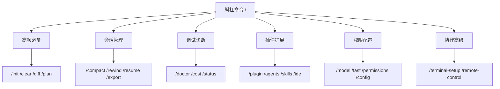

# Claude Code 常用命令

你有没有这样的体验：每次用 Claude Code 都要手动输入同样的指令，会话卡顿时不知如何清理上下文，环境出了问题却找不到诊断入口？这些问题，斜杠命令都能一行解决。Claude Code 内置 30+ 斜杠命令，覆盖会话管理、调试诊断、权限配置等全场景，但多数开发者只用了 `/clear` 和 `/help`，大量提效命令被遗忘。

本文按**使用频率与重要性**分级归类全部命令，每个命令附带实操场景说明，让你快速建立"遇到什么问题用什么命令"的条件反射。

Claude Code 命令分类体系如下：

---

## 一、高频必备命令（日常开发优先掌握）

日常编码、会话切换、文件操作最常用，建议熟记，大幅减少重复操作。其中 `/clear` 和 `/diff` 是最高频的两条命令——前者解决上下文臃肿，后者替代 `git diff` 的终端切换。

| 命令（Commands） | 参数格式 | 核心用途 | 备注/别名 |
| :--- | :--- | :--- | :--- |
| /init | 无参数 | 初始化或重新生成项目 CLAUDE.md 文件 | 项目接入必备 |
| /clear | 无参数 | 清空对话历史、释放上下文 | /reset、/new |
| /diff | 无参数 | 交互式查看未提交Git变更 | 支持箭头键切换轮次差异 |
| /plan | /plan [description] | 进入计划模式，只分析不修改代码 | 复杂任务规划首选 |
| /fast | /fast [on/off] | 切换快速模式，加速模型响应输出 | 简单任务开启可提效 |
| /add-dir | /add-dir &lt;path&gt; | 为当前会话添加文件访问目录 | 不加载目录内.claude配置 |
| /copy | /copy [N] | 复制最近助手响应；N指定倒数第N条 | 代码块支持交互式选择 |
| /help | 无参数 | 查看所有可用命令与帮助 | 快速查遗忘命令 |
| /exit | 无参数 | 退出CLI | /quit |
| /btw | /btw &lt;question&gt; | 快速附加提问，不污染当前对话上下文 | 不打断当前任务流程 |

---

## 二、会话与上下文管理命令

掌握高频命令后，会话管理是下一个提效关键。Claude Code 的上下文窗口有限，长时间会话会导致模型遗忘早期指令、遵循度下降——以下命令专门解决"会话越来越笨"的问题。

| 命令（Commands） | 参数格式 | 核心用途 | 备注/别名 |
| :--- | :--- | :--- | :--- |
| /compact | /compact [instructions] | 压缩对话历史，可指定保留重点 | 降低Token消耗 |
| /context | 无参数 | 可视化上下文占用，给出优化建议 | 排查内存膨胀问题 |
| /rewind | 无参数 | 回退对话/代码到上一节点 | /checkpoint、/undo |
| /branch | /branch [name] | 对话分支创建，不影响原会话 | /fork |
| /resume | /resume [session] | 按ID/名称恢复历史会话 | /continue |
| /rename | /rename [name] | 重命名当前会话；无参自动生成 | 便于会话管理 |
| /export | /export [filename] | 导出当前对话到文件或剪贴板 | 存档/分享会话内容 |
| /recap | 无参数 | 显示当前会话摘要回顾 | 快速梳理对话要点 |

---

## 三、调试与诊断命令

会话管理解决"效率下降"问题，而调试诊断命令解决"环境出错"问题。安装失败、连接异常、Token 超限等故障，均可通过以下命令快速定位。

| 命令（Commands） | 参数格式 | 核心用途 | 备注/别名 |
| :--- | :--- | :--- | :--- |
| /doctor | 无参数 | 诊断并校验Claude Code安装与配置 | 环境排错首选 |
| /cost | 无参数 | 显示令牌（Token）使用统计 | 订阅用户费用参考 |
| /stats | 无参数 | 可视化每日使用量、会话历史 | 分析使用习惯 |
| /insights | 无参数 | 生成会话分析报告，识别交互摩擦点 | 优化工作流 |
| /status | 无参数 | 查看版本、模型、账户与连接状态 | 无需等待响应完成 |
| /usage | 无参数 | 查看计划用量与速率限制状态 | 避免超限中断 |

---

## 四、插件、代理与扩展命令

调试诊断是"发现问题"的利器，而扩展命令则是"增强能力"的入口。通过以下命令管理插件、代理、MCP 服务器和钩子，按需扩展 Claude Code 的能力边界。

| 命令（Commands） | 参数格式 | 核心用途 | 备注/别名 |
| :--- | :--- | :--- | :--- |
| /plugin | 无参数 | 管理Claude Code插件（Plugins） | 安装、卸载、启用、禁用 |
| /reload-plugins | 无参数 | 热重载插件，无需重启 | 实时生效配置修改 |
| /agents | 无参数 | 管理代理（Agents）配置 | 查看/切换专项任务代理 |
| /skills | 无参数 | 列出所有可用技能（Skills） | 含内置与插件扩展技能 |
| /hooks | 无参数 | 查看工具事件钩子（Hooks）配置 | 自动化工作流校验 |
| /mcp | 无参数 | 管理MCP服务器连接与OAuth认证 | 对接外部服务 |
| /ide | 无参数 | 管理IDE集成配置（VS Code、JetBrains等） | 编辑器协同 |

---

## 五、权限、模型与基础配置命令

扩展命令解决"能力不足"的问题，而配置命令解决"偏好不一致"的问题。切换模型、调整权限、管理账号、设置主题，以下命令让 Claude Code 适配你的开发习惯与团队安全规范。

| 命令（Commands） | 参数格式 | 核心用途 | 备注/别名 |
| :--- | :--- | :--- | :--- |
| /model | /model [model] | 切换AI模型，立即生效 | 支持Opus/Sonnet/Haiku |
| /effort | /effort [low/medium/high/max/auto] | 设置模型工作量等级 | max仅当前会话生效 |
| /fast | /fast [on/off] | 切换快速模式，加速响应输出 | 简单任务提效 |
| /permissions | 无参数 | 管理工具权限规则 | /allowed-tools |
| /memory | 无参数 | 编辑 CLAUDE.md 或管理自动记忆 | 持久化项目/用户偏好 |
| /config | 无参数 | 打开设置界面，调整主题/模型/样式 | /settings |
| /theme | 无参数 | 切换颜色主题 | 支持浅色/深色/色盲友好 |
| /color | /color [color/default] | 设置提示栏颜色 | 支持red/blue/green等 |
| /statusline | 无参数 | 配置状态栏样式 | 可自动适配Shell |
| /sandbox | 无参数 | 切换沙箱模式开关 | 控制文件系统隔离 |
| /keybindings | 无参数 | 配置键盘快捷键 | 自定义操作绑定 |
| /focus | 无参数 | 切换专注模式，隐藏非必要UI | 精简界面 |
| /tui | 无参数 | 切换全屏终端UI模式 | 沉浸式交互 |
| /login | 无参数 | 切换或重新登录Anthropic账号 | 账号管理 |
| /logout | 无参数 | 退出登录 | - |
| /upgrade | 无参数 | 升级订阅计划等级 | Pro/Max计划 |

---

## 六、协作与高级功能命令

基础配置适配个人习惯，而协作命令则打通团队与云端的边界——远程控制会话、定时执行任务、安全审查代码、多端协同，以下命令面向进阶协作场景。

| 命令（Commands） | 参数格式 | 核心用途 | 备注/别名 |
| :--- | :--- | :--- | :--- |
| /install-github-app | 无参数 | 为仓库配置Claude GitHub Actions | 一键集成CI |
| /remote-control | 无参数 | 开启会话远程控制 | /rc |
| /schedule | /schedule [description] | 创建/管理云定时任务 | 自动化后台任务 |
| /security-review | 无参数 | 分析待提交代码安全漏洞 | 检测注入/权限/数据泄露 |
| /terminal-setup | 无参数 | 配置终端快捷键（Shift+Enter换行等） | iTerm2/VS Code终端适配 |
| /desktop | 无参数 | 切换到桌面端继续会话 | 仅macOS/Windows，/app |
| /mobile | 无参数 | 显示移动端App二维码 | /ios、/android |
| /voice | 无参数 | 切换语音输入模式 | 按住说话 |
| /feedback | /feedback [report] | 提交反馈/Bug | /bug |

---

## 七、命令使用核心技巧（实战必看）

1. **快速筛选**：输入 **/** + 字母，自动过滤匹配命令（如输入 `/co` 显示 copy/compact/config），无需记住完整命令名。
2. **参数规则**：`<arg>` 为必填参数，`[arg]` 为可选参数，严格按格式传入。例如 `/compact focus on API changes` 指定压缩时保留API相关内容。
3. **MCP动态命令**：MCP服务器会自动生成命令，格式为 `/mcp__<server>__<prompt>`，无需手动配置。例如接入 GitHub MCP 后，`/mcp__github__list_prs` 即可列出所有PR。
4. **权限可见**：部分命令随平台、订阅计划显示（如 `/upgrade` 仅Pro/Max可用，`/desktop` 仅桌面端）。输入 `/help` 可查看当前环境下的完整可用列表。
5. **无等待生效**：`/model`、`/effort`、`/status`、`/fast` 等命令无需等待当前响应完成，立即执行——这在模型陷入长循环时尤其有用，可随时切换模型或调整工作量等级。
6. **项目初始化**：首次在项目中使用 Claude Code 时，先执行 `/init` 生成 CLAUDE.md 文件，系统会自动填充项目技术栈、目录结构、常用命令等信息，后续会话自动加载，大幅提升回答准确度。
7. **计划模式**：遇到复杂重构或多文件改动任务时，先用 `/plan` 进入计划模式——Claude 只分析不改代码，待方案确认后再执行，避免反复修改。

---

## 八、已废弃/移除的命令（注意避坑）

以下命令在较新版本中已被移除或废弃，使用时需注意版本兼容性：

| 命令 | 状态 | 替代方案 |
| :--- | :--- | :--- |
| /pr-comments | v2.1.91 移除 | 使用 `gh pr view --comments` 替代 |
| /review | 已废弃 | 安装 `code-review` 插件，使用 `/code-review` |
| /output-style | v2.1.73 移除 | 通过 `/config` 设置默认输出风格 |
| /vim | v2.1.92 移除 | 使用系统终端自带的 vim 模式 |

---

本文覆盖 Claude Code 官方全部内置命令（含已废弃命令说明），按使用场景分级整理，可作为日常开发速查手册。建议从第一节的高频命令开始实践——先用 `/init` 初始化项目、`/clear` 和 `/diff` 替代手动操作，再用 `/plan` 做任务规划、`/compact` 管理长会话上下文，逐步扩展到调试、配置、协作等场景。配合插件与代理扩展，能进一步释放 Claude Code 的自动化与定制化能力。