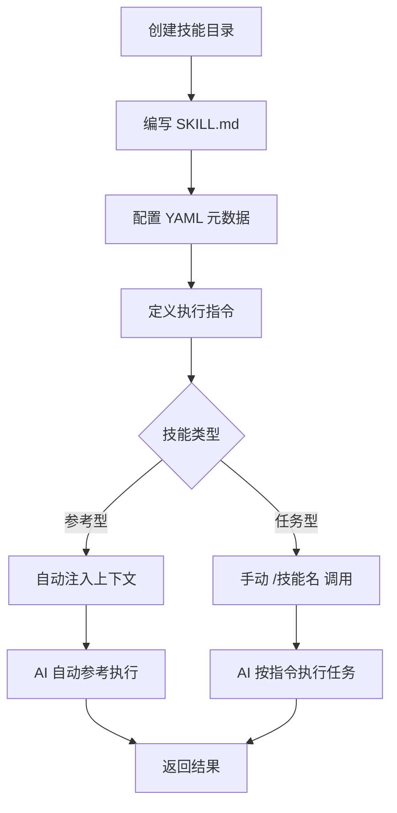

# Claude Code Skills 使用教程

Claude Code Skills 是平台核心扩展机制，用于封装可复用的指令、工作流与领域知识，本质是“自定义斜杠命令的升级版”。通过 Skills，可将高频重复操作、团队规范、专项任务固化为可调用的技能，支持手动触发与自动匹配，既能减少重复提示成本，也能统一团队协作标准，大幅提升 AI 辅助开发效率。本文将从基础入门、实操创建、高级功能到问题排查，结合完整代码示例，手把手教你掌握 Skills 的使用，严格控制在 3000 字以内，所有标题均为二级及以下层级。

## 一、Skills 核心概念与价值

在学习实操前，先明确 Skills 的核心定位，避免混淆其与 Claude Code 其他功能（如 Subagents、Plugins）：

- **核心定义**：Skills 是轻量化扩展组件，用于封装可复用的指令集、工作流或领域知识，可通过 `/技能名` 手动调用，也可根据对话场景自动触发。

- **核心价值**：减少重复提示（无需每次输入相同指令）、统一团队规范（共享技能确保操作一致）、提升效率（复杂工作流一键触发）。

- **与其他功能区别**：Subagents 是专项任务代理（独立上下文），Plugins 是完整功能插件（包含多个 Skills），而 Skills 是最小可复用单元，可单独使用或组合到插件、子代理中。

兼容性说明：Skills 完全兼容原有 `.claude/commands/` 目录，原有自定义命令可直接迁移为 Skills，且支持更高级的参数传递、上下文隔离等能力，遵循 Agent Skills 开放标准，可跨工具复用。

## 二、快速上手：创建并使用第一个技能

### Skills 创建与调用流程图



以“代码可视化解释”技能（`explain-code`）为例，3 步完成从创建到调用的全流程，所有操作均提供规范代码块，可直接复制实操。

### 2.1 第一步：创建技能目录

Skills 需按固定目录结构存放，目录位置决定其适用范围（个人/项目），先创建个人全局技能（所有项目可用）：

```bash
# 创建个人全局技能目录（所有项目可调用）
mkdir -p ~/.claude/skills/explain-code

# 若需创建项目专属技能（仅当前项目可用），执行以下命令
# mkdir -p .claude/skills/explain-code
```

### 2.2 第二步：编写 SKILL.md（核心文件）

每个技能必须包含 `SKILL.md` 文件，这是技能的核心配置文件，结构分为两部分：YAML 前置元数据（可选但推荐）+ Markdown 执行指令（必需）。

创建并编辑 `SKILL.md`：

```bash
# 进入技能目录
cd ~/.claude/skills/explain-code

# 创建并编辑 SKILL.md（可使用vim、vscode等编辑器）
vim SKILL.md
```

写入以下内容（包含元数据与执行指令）：

```yaml
---
# YAML 前置元数据（可选，用于配置技能基础信息与触发规则）
name: explain-code          # 技能名，即斜杠命令名（小写、连字符分隔）
description: 使用日常类比+ASCII图表解释代码逻辑，用户询问“代码如何工作”时自动触发
argument-hint: "[file-path]" # 参数提示，告诉用户调用时需传入文件路径
---
# Markdown 执行指令（必需，定义技能的具体操作逻辑）
# 代码解释规则（技能核心执行逻辑）
1. 先用1个日常类比，通俗说明代码核心功能（避免技术术语堆砌）
2. 用ASCII图表绘制代码执行流程或数据结构（清晰直观）
3. 逐行拆解关键代码，说明每一步的作用
4. 指出代码中常见的使用误区与踩坑点
5. 最终输出简洁总结，便于快速理解
```

### 2.3 第三步：测试调用技能

技能创建完成后，无需额外配置，即可在 Claude Code 中调用，支持两种调用方式：自动触发、手动调用。

#### 2.3.1 自动调用（场景匹配）

当对话内容匹配 `description` 中的关键词时，技能会自动触发：

```bash
# 询问代码工作原理，触发 explain-code 技能
> How does this code work?
> 这段代码是如何工作的？
```

#### 2.3.2 手动调用（斜杠命令）

直接使用 `/技能名` 调用，可传入参数（文件路径）：

```bash
# 手动调用 explain-code 技能，解释指定文件
> /explain-code src/auth/login.ts

# 传入参数时，直接紧跟技能名（无多余空格）
> /explain-code src/utils/format.js
```

调用成功后，Claude 会按照 `SKILL.md` 中的规则，输出代码解释内容，包含类比、ASCII 图表、逐行拆解等。

## 三、技能存储路径与标准目录结构

Skills 的存储路径决定其适用范围、共享权限，不同路径的技能有明确的优先级（项目技能覆盖同名个人技能），同时需遵循标准目录结构，确保技能能被正常加载。

### 3.1 技能存储路径与适用范围

不同类型的技能，存储路径不同，适用范围也不同，具体如下表所示：

|技能类型|存储路径|适用范围|共享方式|
|---|---|---|---|
|个人技能|`~/.claude/skills/<name>/SKILL.md`|当前用户所有项目|仅个人可见，无法共享|
|项目技能|`.claude/skills/<name>/SKILL.md`|仅当前项目|可通过 Git 提交，共享给团队成员|
|插件技能|`<plugin>/skills/...}`|启用该插件的所有项目|随插件安装，统一共享|
|企业技能|企业托管设置|组织内所有用户、所有项目|管理员统一配置，全员共享|

补充说明：Monorepo 项目（多子包）支持嵌套目录自动发现，子包可在自身目录下创建 `.claude/skills/`，维护专属技能，不影响主项目。

### 3.2 技能标准目录结构

除了必需的 `SKILL.md`，技能还可包含可选文件，形成完整的目录结构，便于维护与扩展，标准结构如下：

```bash
my-skill/                  # 技能根目录（目录名与技能名一致，推荐）
├── SKILL.md              # 必需：核心配置与执行指令（YAML+Markdown）
├── reference.md          # 可选：技能详细参考文档（按需加载，不占用上下文）
├── examples.md           # 可选：技能输出示例，帮助用户理解使用效果
└── scripts/              # 可选：辅助执行脚本（Shell、Python等）
    └── helper.sh         # 可选：技能执行时调用的辅助脚本，提升功能复杂度
```

示例：给 `explain-code` 技能添加辅助脚本，用于生成更复杂的 ASCII 图表：

```bash
# 创建脚本目录
mkdir -p ~/.claude/skills/explain-code/scripts

# 创建辅助脚本 helper.sh
echo '#!/bin/bash
# 辅助生成代码流程ASCII图表
echo "┌───────────┐  读取代码  ┌───────────┐"
echo "│  用户传入文件  ├─────────>│  解析代码逻辑  │"
echo "└───────────┘           └───────────┘"
echo "                              │"
echo "                              ▼"
echo "┌───────────┐  输出解释  ┌───────────┐"
echo "│  生成类比+图表  <─────────┤  逐行拆解代码  │"
echo "└───────────┘           └───────────┘"
' > ~/.claude/skills/explain-code/scripts/helper.sh

# 给脚本添加执行权限
chmod +x ~/.claude/skills/explain-code/scripts/helper.sh
```

修改 `SKILL.md`，调用该脚本：

```yaml
---
name: explain-code
description: 使用日常类比+ASCII图表解释代码逻辑
argument-hint: "[file-path]"
allowed-tools: Bash       # 允许技能调用Bash工具
---
# 代码解释规则
1. 执行辅助脚本，生成代码流程ASCII图表
```bash
~/.claude/skills/explain-code/scripts/helper.sh
```
2. 先用日常类比说明核心逻辑
3. 逐行拆解执行步骤
4. 指出常见误区与坑点
```

## 四、SKILL.md 配置完全解析

SKILL.md 是技能的核心，分为 YAML 前置元数据与 Markdown 执行指令两部分，其中 YAML 元数据用于配置技能的基础信息、触发规则、权限等，Markdown 指令用于定义技能的具体执行逻辑。

### 4.1 YAML 前置元数据（可选，推荐配置）

YAML 元数据放在 SKILL.md 开头，用 `---` 包裹，所有字段均为可选，但 `name` 和 `description` 是推荐配置，决定技能的调用方式与自动触发时机。完整字段说明如下，搭配示例代码：

```yaml
---
# 1. 核心基础配置（必选/推荐）
name: skill-name             # 技能名，即斜杠命令名（仅允许小写、数字、连字符，如 code-review）
description: 技能功能说明    # 核心：用于AI判断是否自动触发，需包含触发关键词（如“代码审查”“部署应用”）

# 2. 调用控制配置（按需选择）
disable-model-invocation: true # 禁止AI自动调用，仅允许用户手动调用（适合高危操作，如部署）
user-invocable: false       # 隐藏斜杠命令，用户无法手动调用，仅AI自动使用（适合背景知识注入）
argument-hint: "[file] [option]" # 参数提示，告诉用户调用时需传入的参数格式（如 [文件路径] [审查类型]）

# 3. 权限与环境配置（按需选择）
allowed-tools: Read,Grep,Bash # 技能启用时，免授权即可使用的工具（最小权限原则）
model: sonnet-4.6           # 指定技能运行的模型（默认继承主会话模型）
context: fork               # 在隔离子代理中运行，不污染主会话上下文（适合复杂调研、脚本执行）
agent: Explore              # 指定子代理类型，适配技能场景（如 Explore 用于调研，Debug 用于调试）
---
```

常用配置组合示例（高危操作技能）：

```yaml
---
name: deploy-prod
description: 部署应用到生产环境（高危操作）
disable-model-invocation: true # 禁止AI自动触发，仅手动调用
allowed-tools: Bash,gh        # 仅允许使用Bash和GitHub CLI工具
argument-hint: "[branch]"     # 需传入部署分支参数
---
```

### 4.2 Markdown 执行指令（必需）

Markdown 执行指令是技能的核心逻辑，用于定义技能执行时的具体操作，支持多种内容类型，可根据需求灵活编写，常见类型如下：

#### 4.2.1 参考型技能（自动生效，注入规范）

用于注入项目规范、风格指南等背景知识，无需手动调用，AI 会自动参考，适合团队统一规范：

```yaml
---
name: api-conventions
description: 项目REST API设计规范，AI处理API相关任务时自动参考
---
# 项目REST API设计规范（参考型技能）
1. 路径命名：使用kebab-case（如 /api/user-info，禁止下划线）
2. 参数命名：JSON请求/响应使用camelCase（如 userId，禁止下划线）
3. 列表接口：必须支持分页，默认页码page=1，每页条数size=10
4. 响应格式：统一返回 { code: 数字, message: 字符串, data: 任意类型 }
5. 错误处理：异常状态码统一使用4xx（客户端错误）、5xx（服务端错误），并返回具体错误信息
```

#### 4.2.2 任务型技能（手动调用，分步执行）

用于定义分步工作流，适合手动调用，如代码审查、部署、测试等场景：

```yaml
---
name: code-review
description: 按团队规范审查代码，手动调用时执行
allowed-tools: Read,Grep
argument-hint: "[file-path]"
---
# 代码审查工作流（任务型技能）
1. 读取指定文件，检查语法与ESLint规范（使用项目自带的ESLint配置）
2. 排查潜在问题：空指针、未处理异常、变量未定义、死循环等
3. 分析性能：是否存在冗余逻辑、无效查询、频繁IO操作
4. 检查可读性：变量/函数命名是否规范、是否有必要的注释
5. 输出格式：文件路径+行号+问题类型+具体问题+修复建议
   示例：src/utils/format.js:15 【冗余逻辑】多余的if判断，可简化为三元表达式
```

## 五、技能高级功能与实战用法

掌握基础用法后，可通过 Skills 的高级功能，实现更灵活、更强大的操作，如参数传递、动态上下文注入、子代理隔离等，以下结合实战示例详细说明。

### 5.1 参数传递（$ARGUMENTS 占位符）

当技能需要动态传入参数（如文件路径、Issue 编号、分支名）时，可使用 `$ARGUMENTS` 占位符，调用时传入的参数会自动替换该占位符，实现动态执行。

实战示例：创建“修复 GitHub Issue”技能（`fix-issue`）：

```yaml
---
name: fix-issue
description: 修复指定GitHub Issue，手动调用时执行
disable-model-invocation: true
allowed-tools: Bash,gh
argument-hint: "[issue-number]" # 参数为Issue编号
---
# 修复GitHub Issue 工作流
修复GitHub Issue #$ARGUMENTS（参数为Issue编号）：
1. 用gh命令查看Issue详情，获取需求与问题描述
```bash
gh pr view $ARGUMENTS --comments
```
2. 定位Issue相关的代码文件，分析问题根源
3. 实现修复代码，确保符合项目规范
4. 编写单元测试，验证修复效果
5. 提交代码，创建PR，关联该Issue（PR描述中包含 #$ARGUMENTS）
```

调用示例（修复编号为 123 的 Issue）：

```bash
> /fix-issue 123
```

注意：参数需紧跟技能名，无多余空格；若需传入多个参数，用空格分隔，`$ARGUMENTS` 会获取所有传入的参数。

### 5.2 动态上下文注入（!`command` 语法）

使用 `!`命令`` 语法，可在技能执行时，先运行 Shell 命令，将命令输出注入到技能的上下文的中，实现动态获取数据（如 PR 差异、代码统计等）。

实战示例：创建“PR 变更总结”技能（`pr-summary`）：

```yaml
---
name: pr-summary
description: 总结当前PR的变更内容，手动调用时执行
context: fork # 隔离子代理运行，不污染主会话
allowed-tools: Bash(gh:*) # 仅允许使用gh相关命令
---
# PR 变更总结（动态注入上下文）
## 一、PR 基础信息
- PR 差异内容：!`gh pr diff` # 运行gh pr diff，将输出注入到这里
- PR 评论信息：!`gh pr view --comments`
- 变更文件列表：!`gh pr diff --name-only`

## 二、总结规则
1. 提炼核心变更（新增功能/修复bug/重构）
2. 列出变更的关键文件，说明每个文件的修改目的
3. 指出潜在的风险点与需要注意的兼容性问题
4. 总结测试情况（是否通过所有测试）
```

调用示例：

```bash
> /pr-summary
```

技能执行时，会先运行`gh pr diff` 等命令，获取 PR 相关信息，再结合总结规则，输出完整的 PR 变更总结。

### 5.3 子代理隔离运行（context: fork）

通过在 YAML 元数据中配置 `context: fork`，可让技能在独立的子代理中运行，拥有独立的上下文与工具权限，不会污染主会话的上下文，适合复杂调研、脚本执行等场景。

实战示例：创建“深度代码调研”技能（`deep-research`）：

```yaml
---
name: deep-research
description: 深度调研指定代码模块，输出详细总结
context: fork # 隔离子代理运行
agent: Explore # 指定子代理类型为探索型
allowed-tools: Read,Grep,Glob
argument-hint: "[module-path]"
---
# 深度代码调研流程
彻底调研 $ARGUMENTS 模块（参数为模块路径）：
1. 检索该模块下所有相关文件（使用Glob工具匹配）
2. 分析每个文件的核心逻辑、函数关系、数据流向
3. 关联项目其他模块，说明该模块的作用与依赖关系
4. 输出带文件引用的总结（标注文件路径+行号）
5. 提出优化建议（若有）
```

调用示例：

```bash
> /deep-research src/auth/
```

该技能会在独立子代理中执行，调研过程中读取的文件、执行的命令，不会占用主会话的上下文，调研完成后，仅输出总结结果。

### 5.4 辅助脚本与可视化输出

技能可捆绑 Shell、Python 等辅助脚本，实现更复杂的功能，如生成可视化页面、批量处理文件等，以下是“代码库可视化”技能示例：

```yaml
---
name: codebase-visualizer
description: 生成项目目录结构、文件统计的交互式可视化页面
allowed-tools: Bash(python:*)
---
# 代码库可视化流程
1. 执行Python辅助脚本，生成HTML可视化页面
```bash
python ~/.claude/skills/codebase-visualizer/scripts/visualize.py .
```
2. 脚本功能说明：
   - 统计项目中不同类型文件（.js、.ts、.json等）的数量与大小
   - 生成交互式目录结构（可展开/折叠）
   - 标注核心文件与关键代码行数
3. 输出提示：打开生成的 codebase-map.html 文件，查看可视化结果
```

辅助脚本（visualize.py）简化示例：

```python
# ~/.claude/skills/codebase-visualizer/scripts/visualize.py
import os
import json

# 统计文件类型与大小
file_stats = {}
for root, dirs, files in os.walk('.'):
    for file in files:
        ext = os.path.splitext(file)[1] or '无后缀'
        size = os.path.getsize(os.path.join(root, file))
        if ext not in file_stats:
            file_stats[ext] = {'count': 0, 'size': 0}
        file_stats[ext]['count'] += 1
        file_stats[ext]['size'] += size

# 生成HTML页面
html = f"""
<!DOCTYPE html>
<html>
<head><title>代码库可视化</title></head>
<body>
<h1>项目文件统计</h1>
<pre>{json.dumps(file_stats, indent=2)}</pre>
</body>
</html>
"""

# 写入HTML文件
with open('codebase-map.html', 'w', encoding='utf-8') as f:
    f.write(html)

print("可视化页面已生成：codebase-map.html")
```

## 六、技能调用控制与权限管理

为确保技能使用安全，避免误操作或越权，Claude Code 提供了完善的调用控制与权限管理机制，可通过 YAML 元数据、权限命令，精准控制技能的调用权限与工具使用范围。

### 6.1 调用权限控制（YAML 配置）

通过 YAML 元数据中的 `disable-model-invocation` 和 `user-invocable` 字段，控制技能的调用主体（AI/用户），具体组合如下：

|配置组合|用户可手动调用|AI可自动触发|适用场景|
|---|---|---|---|
|默认（不配置两个字段）|是|是|通用规范、通用工具（如代码解释、格式检查）|
|`disable-model-invocation: true`|是|否|部署、提交、删除等高危操作|
|`user-invocable: false`|否|是|背景知识、隐性规范注入（用户无需手动调用）|

### 6.2 工具权限限制（allowed-tools）

使用 `allowed-tools` 字段，限定技能可使用的工具，遵循“最小权限原则”，避免技能越权操作（如禁止高危工具的使用）。

```yaml
---
# 只读技能，仅允许查看文件，禁止修改、执行命令
name: safe-reader
description: 只读查看文件内容，禁止任何修改操作
allowed-tools: Read,Grep,Glob # 仅允许读取、搜索、匹配文件，无修改/执行权限
---

# 部署技能，仅允许指定工具
name: deploy-dev
description: 部署应用到开发环境
allowed-tools: Bash,npm,gh # 仅允许Bash、npm、gh工具，禁止其他工具
disable-model-invocation: true
---
```

### 6.3 全局权限管控（/permissions 命令）

通过 `/permissions` 命令，可全局控制技能的调用权限，如禁用所有技能、仅允许指定技能、拒绝高危技能等，操作示例如下：

```bash
# 1. 禁用所有技能（全局禁止调用任何技能）
> /permissions deny Skill

# 2. 仅允许调用指定技能（如 code-review、pr-summary）
> /permissions allow Skill(code-review)
> /permissions allow Skill(pr-summary:*)

# 3. 拒绝调用指定技能（如 deploy-prod 高危技能）
> /permissions deny Skill(deploy-prod:*)

# 4. 查看当前技能权限配置
> /permissions list Skill
```

## 七、实用技能模板与示例（可直接复制使用）

整理 3 个高频实用技能模板，涵盖代码审查、会话日志、批量格式化，可直接复制到对应目录，修改参数后即可使用。

### 7.1 模板1：代码审查技能（项目级，团队共享）

路径：`.claude/skills/code-review/SKILL.md`

```yaml
---
name: code-review
description: 按团队ESLint规范、代码标准审查指定文件
allowed-tools: Read,Grep
argument-hint: "[file-path] [review-type]" # review-type可选：syntax/performance/readability
---
# 团队代码审查清单
## 审查规则（按类型区分）
1. 语法审查（syntax）：
   - 符合项目ESLint配置，无语法错误
   - 禁止使用var，统一用let/const
   - 函数、变量命名规范（camelCase）
2. 性能审查（performance）：
   - 避免冗余逻辑、无效循环
   - 禁止频繁IO操作、重复查询
   - 优化大型数组、对象的处理方式
3. 可读性审查（readability）：
   - 关键逻辑添加注释（类、函数、复杂逻辑）
   - 代码缩进、换行规范（2空格缩进）
   - 避免过长函数（单函数不超过80行）

## 输出要求
- 格式：文件路径+行号 | 问题类型 | 具体问题 | 修复建议
- 示例：src/utils/format.js:20 | 语法 | 使用var声明变量 | 替换为const
- 无问题时，输出“未发现不符合规范的问题”
```

### 7.2 模板2：会话日志技能（个人级，记录操作）

路径：`~/.claude/skills/session-logger/SKILL.md`

```yaml
---
name: session-logger
description: 记录当前会话的操作日志，手动调用时执行
allowed-tools: Bash
argument-hint: "[operation-description]" # 传入操作描述
---
# 会话日志记录流程
1. 创建日志目录（若不存在）
```bash
mkdir -p ~/.claude/session-logs
```
2. 写入日志（格式：时间+会话ID+操作描述）
```bash
echo "$(date +'%Y-%m-%d %H:%M:%S') - 会话ID: $CLAUDE_SESSION_ID - 操作: $ARGUMENTS" >> ~/.claude/session-logs/session.log
```
3. 输出提示：日志已记录至 ~/.claude/session-logs/session.log

### 7.3 模板3：代码批量格式化技能（个人级）

路径：`~/.claude/skills/batch-format/SKILL.md`

```yaml
---
name: batch-format
description: 批量格式化指定目录下的JS/TS文件，按ESLint规范
disable-model-invocation: true
allowed-tools: Bash,npm
argument-hint: "[dir-path]" # 传入要格式化的目录路径
---
# 代码批量格式化流程
1. 检查指定目录是否存在
```bash
if [ ! -d "$ARGUMENTS" ]; then
  echo "目录不存在：$ARGUMENTS"
  exit 1
fi
```
2. 进入目录，执行ESLint格式化
```bash
cd $ARGUMENTS
npm run lint -- --fix
```
3. 输出格式化结果，统计修改的文件数量
```bash
echo "批量格式化完成，修改文件数量：$(find . -name "*.js" -o -name "*.ts" | xargs grep -l "/* eslint-disable */" | wc -l)"
```

## 八、常见问题排查

使用 Skills 过程中，可能会遇到技能未触发、参数不生效、加载失败等问题，以下是高频问题的排查方法与解决方案，搭配实操代码示例。

### 8.1 问题1：技能未触发（自动/手动均无法调用）

排查步骤与解决方案：

1. 检查技能目录结构是否正确：确保技能目录下有 `SKILL.md`，路径符合要求（如个人技能路径为 `~/.claude/skills/技能名/`）。
```
# 检查技能目录与文件
ls ~/.claude/skills/explain-code # 查看目录是否存在
ls ~/.claude/skills/explain-code/SKILL.md # 查看SKILL.md是否存在
```

2. 确认技能已被加载：在 Claude 中输入以下指令，查看可用技能列表。
```bash
# 有哪些技能可用？
/skills list
```

3. 检查 `description` 关键词：自动触发需对话内容包含 `description` 中的关键词，可精简关键词提高触发精准度。

4. 检查是否被权限规则禁用：查看全局权限配置，确保技能未被拒绝。
        `> /permissions list Skill # 查看技能权限配置
> /permissions allow Skill(explain-code) # 允许该技能调用`

### 8.2 问题2：技能触发过于频繁（无关场景也触发）

原因：`description` 关键词过于宽泛，导致 AI 误判场景。

解决方案：

1. 精简 `description`，添加更精准的触发关键词（如限定场景、文件类型）。
        `# 优化前（过于宽泛）
description: 解释代码
# 优化后（精准触发）
description: 解释JS/TS代码的执行逻辑，用户询问“JS代码如何工作”时触发`

2. 添加 `disable-model-invocation: true`，改为仅手动调用，避免自动误触发。

### 8.3 问题3：参数不生效（$ARGUMENTS 未被替换）

原因：SKILL.md 中未添加 `$ARGUMENTS` 占位符，或调用时参数格式错误。

解决方案：

1. 确认 SKILL.md 中包含`$ARGUMENTS` 占位符，且占位符拼写正确。

2. 调用时，参数紧跟技能名，无多余空格（多个参数用空格分隔）。
        `# 正确调用（参数紧跟技能名）
> /fix-issue 123
# 错误调用（参数前有空格）
> /fix-issue  123（错误）`

### 8.4 问题4：技能加载不全（部分指令未执行）

原因：SKILL.md 总长度超过 15000 字符上限，模型无法加载全部内容。

解决方案：

1. 拆分超大技能，将复杂逻辑拆分为多个小技能，组合使用。

2. 将非核心内容（如详细示例、参考文档）移至 `reference.md` 或 `examples.md`，按需加载。

3. 设置环境变量，扩容字符上限：
```
# 临时扩容（当前会话有效）
export SLASH_COMMAND_TOOL_CHAR_BUDGET=30000
# 永久扩容（添加到 ~/.bashrc 或 ~/.zshrc）
echo "export SLASH_COMMAND_TOOL_CHAR_BUDGET=30000" >> ~/.bashrc
source ~/.bashrc
```

## 九、总结

Claude Code Skills 是提升 AI 辅助开发效率的核心工具，其核心优势在于“可复用、可共享、可扩展”。通过本文的教程，你可以掌握技能的创建、调用、高级功能与权限管理，从基础的简单技能，逐步迭代到包含脚本、动态上下文的复杂技能。

实操建议：从高频重复操作入手（如代码审查、格式美化），创建简单技能，熟悉配置规则后，再尝试参数传递、子代理隔离等高级功能；团队协作时，可将项目规范、工作流固化为项目技能，通过 Git 共享，实现团队操作统一。

Skills 的使用没有固定标准，关键是适配自身项目与开发习惯，持续优化技能配置，逐步构建属于自己的技能工具库，最大化 Claude Code 的辅助价值。
