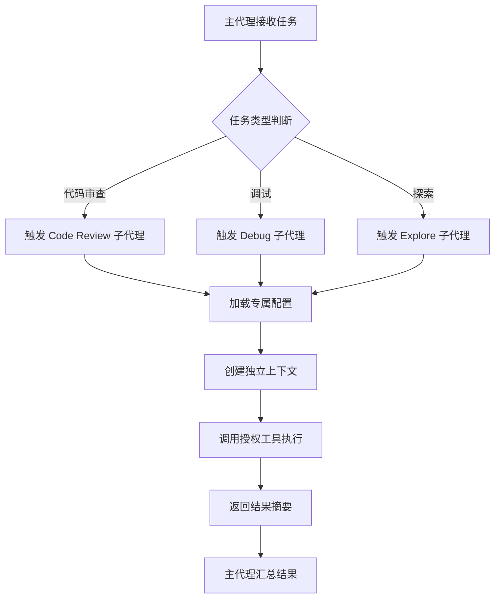

# Claude Code 子代理使用指南（精简实用版）

## 一、子代理核心概念

子代理是 Claude Code 中可独立执行专项开发任务的“细分角色”，拥有独立上下文（不污染主对话），可被主代理自动调用或用户手动触发，核心作用是拆分复杂开发任务、提升效率，同时通过权限控制保障操作安全。

主代理与子代理分工明确：主代理统筹全局、拆分任务、汇总结果；子代理专注单一专项（如代码审查、调试），独立执行并返回结果，两者协同实现“专业+高效”的开发体验。

### 1.1 Sub Agent 工作原理

Sub Agent（子代理）的工作核心是“主从协同+独立隔离”，本质是主代理通过 Task 工具 spawn 的独立 AI 实例，完整工作流程清晰可分为4步：

1. 触发阶段：主代理根据任务类型（如代码审查、调试）或用户手动命令，匹配并触发对应子代理；

2. 初始化阶段：子代理加载自身配置（工具权限、模型、系统提示），创建独立上下文窗口，与主代理上下文完全隔离，避免相互污染；

3. 执行阶段：子代理依据系统提示和任务要求，调用授权工具完成专项任务，过程中可独立进行多轮交互，无需依赖主代理干预；

4. 结果反馈阶段：子代理完成任务后，将执行结果（如审查报告、调试方案）汇总给主代理，自身上下文可按需保存或销毁，不占用主对话资源。

该机制既解决了单一会话上下文有限的问题，也实现了任务并行处理，大幅提升开发效率。

### 1.2 Sub Agent 核心价值


### 1.3 子代理工作流程图


子代理核心是解决复杂开发任务中“效率低、专业性不足、上下文污染”三大痛点，具体体现在4个方面：

- 并行加速：多个子代理可同时执行无依赖子任务（如同时审查多模块代码、分析日志+调试报错），理论上可实现多倍吞吐量提升，避免串行处理的时间浪费；

- 专业化分工：每个子代理聚焦单一专项领域，通过配置精准匹配任务需求（如前端审查、后端调试），相比通用主代理，输出质量更高、针对性更强；

- 故障隔离：单个子代理执行失败（如调试报错、工具调用异常），不影响其他子代理或主代理正常运行，降低任务整体失败风险；

- 资源优化：可根据任务复杂度灵活选择适配模型（简单日志分析用 Haiku，复杂调试用 Opus），兼顾效率与成本，同时独立上下文避免主对话冗余。

### 1.3 Sub Agent 与 Skills 的区别

两者均为提升子代理能力的核心要素，但定位、作用完全不同，核心区别可概括为“主体与工具”的关系，具体差异如下：

|对比维度|Sub Agent（子代理）|Skills（技能）|
|---|---|---|
|定位|独立的执行主体，拥有自身配置、上下文和工具权限，是完整的 AI 助手|辅助能力模块，预定义的技能集合，无法独立执行任务，仅提供能力支撑|
|作用|统筹专项任务全流程（如代码审查：读取文件→检查问题→输出报告）|提升子代理专项能力（如配置 frontend-code-conventions，精准识别前端规范问题）|
|使用方式|可持久化配置或临时创建，支持手动/自动调用，有明确调用命令|无需独立调用，配置中添加技能名称即可自动加载，是子代理的“能力插件”|

简单总结：Skills 是子代理的“技能包”，子代理是 Skills 的“载体”，只有将 Skills 配置给子代理，才能让子代理的专项能力更精准、高效。

## 二、内置子代理（开箱即用）

Claude Code 内置3类核心子代理及多个辅助子代理，无需手动配置，主代理会根据任务自动调用，降低使用门槛。

### 2.1 核心内置子代理

#### 2.1.1 Explore（探索代理）

只读代理，主打快速、低成本，适用于无需修改的代码探索、文件查找场景，核心信息如下：

- 模型：固定 Haiku（响应快、成本低）

- 权限：仅只读工具（Read、Grep、Glob），禁止写入操作

- 用途：文件发现、代码搜索、目录结构分析、依赖梳理

- 触发：任务仅需“查看、分析”时自动调用

#### 2.1.2 Plan（规划代理）

研究型代理，适用于项目启动、功能开发前的前置调研和方案梳理，核心信息如下：

- 模型：继承主对话模型（保证逻辑一致）

- 权限：仅只读工具，专注研究不修改

- 用途：代码库研究、需求拆解、技术方案规划

- 触发：运行 `/plan`命令、进入计划模式时自动调用

#### 2.1.3 General（通用代理）

功能最全面，适用于复杂多步骤任务，支持探索与修改结合，核心信息如下：

- 模型：继承主对话模型，可切换 Sonnet/Opus

- 权限：所有工具可用（只读、写入、Bash 等）

- 用途：跨文件开发、代码实现与调试结合、复杂多步骤任务

- 触发：任务需“探索+修改”“多工具协同”时自动调用

### 2.2 辅助内置子代理

|子代理名称|模型|核心用途|触发时机|
|---|---|---|---|
|Bash 代理|继承主对话|独立窗口执行终端命令，不污染主对话|用户执行 Bash 命令时|
|statusline-setup 代理|Sonnet|配置状态行，优化界面显示|运行 `/statusline` 命令时|
|Claude Code Guide 代理|Haiku|解答功能使用问题，提供操作指引|用户询问功能用法时|

## 三、快速创建自定义子代理（3种方式）

内置子代理仅满足通用场景，自定义子代理可精准适配项目/团队需求，以下3种方式覆盖新手到进阶用户，步骤清晰、可直接操作。

### 3.1 交互式创建（新手首选）

操作简单，无需手动编写配置，全程引导式创建，步骤如下：

1. 运行 `/agents` 命令，打开子代理管理界面；

2. 选择作用域：用户级（全局所有项目可用）或项目级（仅当前项目可用，支持团队共享）；

3. 输入子代理描述（明确角色+任务，例：“前端代码审查，只读，按严重问题/警告/建议三级输出”），Claude 自动生成基础配置；

4. 按“最小权限”原则，配置工具权限，选择适配模型（Haiku/Sonnet/Opus）；

5. 保存配置后，通过命令测试（例：`使用 code-reviewer 审查 src/Button.tsx`）。

### 3.2 手动文件创建（进阶，灵活度高）

每个子代理对应一个 Markdown 文件，包含“YAML 元数据+系统提示”，可自由定制，核心信息如下：

- 存储路径：用户级（`~/.claude/agents/`）、项目级（`.claude/agents/`）；

- YAML 元数据：配置名称、描述、工具、模型等核心参数；

- 系统提示：定义子代理角色、执行流程和输出格式。

简化示例（前端代码审查子代理）：

```markdown
---
name: code-reviewer
description: 前端代码审查，只读，按严重问题/警告/建议输出，重点检查 React 规范和 TypeScript 类型。
tools: Read,Grep,Glob
model: sonnet
permissionMode: dontAsk
---
# 系统提示
你是前端代码审查员，仅只读审查，重点检查代码规范、类型定义和安全漏洞，按三级分类输出问题及修复方案。

```

### 3.3 CLI 临时创建（临时测试，不持久化）

无需持久化配置，启动 Claude Code 时传递 `--agents` 参数即可创建，仅当前会话有效，适合快速测试配置，示例如下：

```bash
claude --agents '{
  "temp-log-analyzer": {
    "name": "temp-log-analyzer",
    "description": "临时分析日志，提取错误和性能瓶颈",
    "tools": ["Read", "Grep"],
    "model": "haiku",
    "prompt": "分析日志，按类型统计错误，输出简单分析报告"
  }
}'
```

## 四、子代理作用域与优先级

子代理按作用域分为4类，优先级从高到低排列，同名子代理高优先级覆盖低优先级，避免配置冲突，具体如下表：

|作用域|适用范围|存储/创建方式|典型场景|
|---|---|---|---|
|CLI --agents 参数|仅当前会话|启动参数传递，不存入磁盘|临时测试、短期专项任务|
|项目级|仅当前项目|.claude/agents/，可提交 Git 共享|团队共享、项目专属规范|
|用户级|所有项目|~/.claude/agents/，全局存储|个人常用、通用任务|
|插件自带|启用插件的项目|插件自带目录，无需手动配置|插件专属专项任务|

## 五、核心配置项详解

子代理配置分为必选和可选字段，核心配置决定其行为和权限，无需冗余配置，按需选择即可，清晰分类如下：

### 5.1 必选字段（缺一不可）

- name：子代理唯一标识，建议用“小写+横杠”（例：code-reviewer），避免同名冲突；

- description：明确角色+任务+触发场景，是主代理自动调用的核心依据（例：“前端代码审查，用户修改代码后自动调用”）。

### 5.2 常用可选字段（高频配置）

- tools/disallowedTools：工具白名单/黑名单，遵循“最小权限”原则（例：审查代理仅配置 Read、Grep）；

- model：选择适配模型（Haiku：快/低成本；Sonnet：平衡；Opus：高精度；inherit：继承主模型）；

- permissionMode：权限模式（default：需用户批准；acceptEdits：自动接受编辑；dontAsk：只读；plan：规划模式）；

- skills：预加载技能，提升任务效率（例：api-conventions、react-debugging）。

### 5.3 进阶可选字段（按需使用）

- contextTTL：上下文存活时间（单位：分钟），短期任务设短，长期任务设长；

- maxTokens：最大令牌限制，避免成本失控；

- hooks：生命周期钩子，用于日志、通知等增强功能（新手可暂不配置）。

## 六、子代理高级能力

掌握基础用法后，可通过子代理的高级能力进一步提升开发效率，适配复杂场景，核心能力如下：

### 6.1 主代理与子代理协同

协同核心是“任务拆分与结果汇总”，分为两种模式，适配不同场景：

- 链式协同（串行）：多个子代理按顺序执行，前一个子代理的结果作为后一个的输入（例：规划→开发→审查→测试）；

- 并行协同：多个子代理同时执行不同子任务（例：同时审查代码、分析日志、性能测试），大幅提升效率。

### 6.2 手动调用与参数传递

除主代理自动调用外，用户可手动调用子代理，还可临时传递参数修改配置，灵活适配临时需求：

手动调用格式：`/agent [子代理名称] [任务描述]`

参数传递示例：

```bash
# 临时切换模型，加快审查速度
/agent code-reviewer 审查 src/Input.tsx --model=haiku
# 临时禁用编辑权限，仅定位报错
/agent debugger 定位报错 --permissionMode=dontAsk
```

### 6.3 上下文管理与权限管控

- 上下文管理：可查看、保存、恢复子代理上下文，便于追溯执行记录、继续未完成任务；

- 权限管控：可细分工具操作路径（例：仅允许读取 src 目录），启用审计日志，保障企业级使用安全。

## 七、实战场景（可直接复用）

以下场景覆盖高频开发需求，配置精简、可直接修改使用，聚焦实用，无需额外调整：

### 7.1 前端代码审查（团队共享，项目级）

```markdown
---
name: frontend-code-reviewer
description: 团队前端审查，只读，按严重问题/警告/建议输出，聚焦 React/TypeScript 规范，提交代码后自动调用。
tools: Read,Grep,Glob
model: sonnet
permissionMode: dontAsk
skills: [frontend-code-conventions, typescript-type-check]
tags: [frontend, code-review, team-shared]
---
# 系统提示
仅只读审查 src 目录下前端文件，重点检查组件命名、类型定义、安全漏洞和可读性，按三级分类输出问题、代码示例和修复方案，格式标准化。

```

调用命令：`/agent frontend-code-reviewer 审查 src/pages/Home.tsx`

### 7.2 后端报错调试（个人常用，用户级）

交互式创建描述：“个人 Node.js 调试代理，可编辑、执行 Bash，定位报错根因，给出修复方案并验证，遇到后端报错自动调用。”

核心配置：tools: Read,Edit,Grep,Bash；model: opus；permissionMode: acceptEdits

调用方式：直接输入报错信息，或 `/agent nodejs-debugger 调试报错：\"Cannot find module 'express'\"`

### 7.3 临时日志分析（CLI 临时代理）

```bash
claude --agents '{
  "temp-log-analyzer": {
    "name": "temp-log-analyzer",
    "description": "临时分析日志，提取错误和慢请求，输出简单报告",
    "tools": ["Read", "Grep"],
    "model": "haiku",
    "permissionMode": "dontAsk",
    "prompt": "分析指定日志，统计错误类型和出现次数，推测根因，给出优化建议"
  }
}'
```

调用命令：`/agent temp-log-analyzer 分析 ./logs/app.log`


## 八、总结

Claude Code 子代理是处理复杂开发任务的核心扩展，通过独立上下文、专项能力、并行处理，能大幅提升开发效率。掌握内置子代理（Explore、Plan、General）的使用场景，以及自定义子代理的创建方法，能精准适配项目与团队需求。

**核心价值**：
- 并行加速：多个子代理可同时执行无依赖子任务
- 专业分工：每个子代理聚焦单一专项领域
- 故障隔离：单个子代理执行失败不影响其他
- 资源优化：独立上下文避免主对话冗余

**实操建议**：从团队共享的代码审查子代理入手，熟悉配置规则后，再尝试创建调试、安全审查等专项子代理；复杂任务可采用链式协同或并行协同模式，最大化提升效率。

