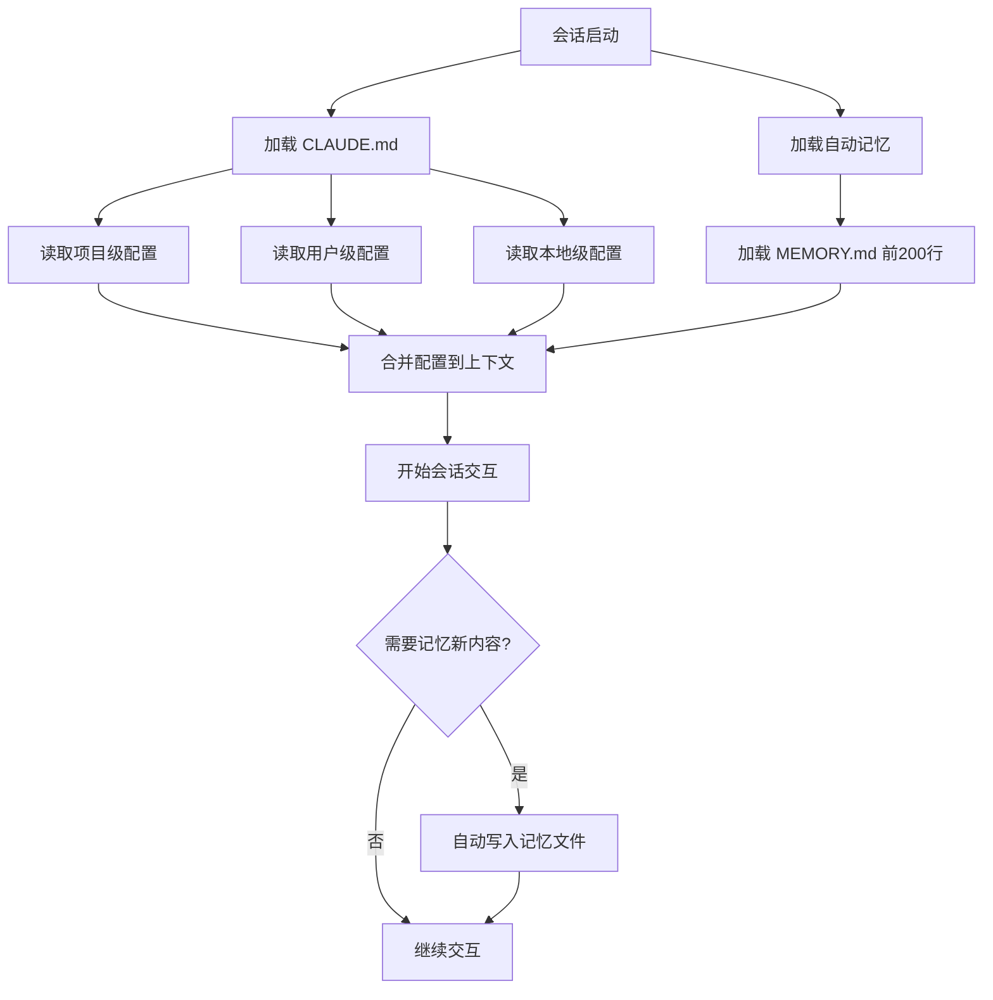

# Claude Code 内存配置文档

## 概述

Claude Code 的每个会话默认都会从全新的上下文窗口开始，为了实现跨会话的知识传递，系统提供了两套互补的记忆机制，帮助开发者持久化项目配置、工作流偏好以及自动积累的开发经验。这两套机制分别是由开发者手动维护的 `CLAUDE.md` 指令文件，以及由 Claude 自动维护的自动记忆系统，两者都会在每次会话启动时自动加载，为后续的开发交互提供持久的上下文支持。

## 两大记忆系统对比

Claude Code 的两个记忆系统各有侧重，适用于不同的场景，具体对比如下：

| CLAUDE.md (CLAUDE.md) 文件|自动记忆|
|---|---|---|
|**维护者**|开发者|Claude 自动维护|
|**内容类型**|手动编写的指令和规则|自动学习的模式和经验|
|**作用范围**|项目、用户或组织级|单个工作树|
|**加载方式**|每个会话完整加载|每个会话加载核心摘要（前 200 行或 25KB）|
|**适用场景**|编码标准、工作流、项目架构|构建命令、调试见解、个性化偏好|

当你需要主动指导 Claude 的行为时，使用 `CLAUDE.md` 文件；而自动记忆则可以让 Claude 从你的日常交互中自动学习，无需手动配置即可逐步适配你的开发习惯。

## [CLAUDE.md](CLAUDE.md) 文件概述

### 记忆系统工作流程图



`CLAUDE.md` 是一种纯文本的 Markdown 文件，用于为 Claude Code 提供持久化的指令。你可以为单个项目、个人工作流，甚至整个组织创建这类文件，Claude 会在每个会话启动时自动读取这些文件的内容，将其作为交互的上下文参考。

## 何时添加内容到 [CLAUDE.md](CLAUDE.md)

你可以将 `CLAUDE.md` 看作是记录那些需要反复向 Claude 解释的内容的地方，当出现以下场景时，就可以考虑将相关内容添加到文件中：

- Claude 第二次犯了同样的错误

- 代码审查中发现了 Claude 需要了解的代码库特定规则

- 你需要在聊天中重复输入和上一个会话相同的更正或澄清内容

- 新加入的队友需要相同的上下文才能提升开发效率

建议将文件内容保持为每个会话都需要的核心事实：比如构建命令、编码约定、项目布局、固定的行为规则等。如果内容是多步骤的流程，或者仅对代码库的一部分生效，建议将其拆分到技能配置或路径范围规则中，避免主文件过于臃肿。

## [CLAUDE.md](CLAUDE.md) 文件的位置与范围

`CLAUDE.md` 文件可以存放在多个不同的位置，不同的位置对应不同的作用范围，更具体的位置会优先于更广泛的位置生效，具体如下：

|范围|存储位置|作用|用例示例|共享对象|
|---|---|---|---|---|
|**托管策略**|• macOS: `/Library/Application Support/ClaudeCode/CLAUDE.md`<br>• Linux 和 WSL: `/etc/claude-code/CLAUDE.md`<br>• Windows: `C:\\Program Files\\ClaudeCode\\CLAUDE.md`|由 IT/DevOps 管理的组织范围指令|公司编码标准、安全策略、合规要求|组织内所有用户|
|**项目指令**|`./CLAUDE.md` 或 `./.claude/CLAUDE.md`|项目团队共享的指令|项目架构、编码标准、常见工作流|源代码控制下的团队成员|
|**用户指令**|`~/.claude/CLAUDE.md`|适用于所有项目的个人偏好|代码样式偏好、个人工具快捷方式|仅当前用户，所有项目生效|
|**本地指令**|`./CLAUDE.local.md`|个人项目特定偏好，可添加到 `.gitignore`|个人沙箱 URL、首选测试数据|仅当前用户，当前项目生效|

工作目录上方目录层次中的 `CLAUDE.md` 和 `CLAUDE.local.md` 文件会在启动时完整加载，而子目录中的文件则会在 Claude 读取对应目录的文件时按需加载。

## 快速生成项目 [CLAUDE.md](CLAUDE.md)

项目级的 `CLAUDE.md` 可以存放在项目根目录的 `./CLAUDE.md` 或者 `./.claude/CLAUDE.md` 中，你可以手动创建这个文件，添加适用于所有团队成员的指令，比如构建和测试命令、编码标准、架构决策、命名约定和常见工作流。

更高效的方式是使用 `/init` 命令自动生成初始文件，Claude 会自动分析你的代码库，创建包含构建命令、测试指令和项目约定的基础文件。如果文件已经存在，`/init` 会建议改进而不是覆盖原有内容。你也可以设置 `CLAUDE_CODE_NEW_INIT=1` 来启用交互式的多阶段配置流程，逐步完成文件的初始化。

## 编写有效的指令

由于 `CLAUDE.md` 的内容是作为上下文加载的，而非强制的配置，因此指令的编写方式会直接影响 Claude 遵循的可靠性，具体的最佳实践如下：

- **大小控制**：每个文件建议控制在 200 行以内，过长的文件会消耗更多的上下文空间，同时降低 Claude 对指令的遵守度。如果内容较多，可以使用路径范围规则来实现按需加载。

- **结构组织**：使用 Markdown 标题和项目符号来分组相关指令，结构化的内容比密集的段落更容易被 Claude 理解和遵循。

- **指令具体性**：编写足够具体、可验证的指令，避免模糊的描述。比如使用 "使用 2 空格缩进" 代替 "正确格式化代码"，使用 "提交前运行 `npm test`" 代替 "测试你的更改"。

- **规则一致性**：避免编写相互冲突的指令，否则 Claude 可能会随机选择其中一条执行。定期审查所有的指令文件，删除过时或冲突的内容。

## 导入外部文件

`CLAUDE.md` 支持使用 `@path/to/import` 语法导入其他文件，导入的文件会在启动时展开并加载到上下文中，支持相对路径和绝对路径，也支持递归导入，最大深度为 5 层。你可以用这个方式引入 README、package.json 或者其他的工作流指南：

```markdown
有关项目概述，请参阅 @README，有关此项目的可用 npm 命令，请参阅 @package.json。
# 其他指令
- git 工作流 @docs/git-instructions.md
```

对于不想提交到版本控制的个人偏好，你可以创建 `CLAUDE.local.md` 文件，它会和主文件一起加载，并且可以添加到 `.gitignore` 中，仅对当前用户生效。

如果你的项目已经为其他编码代理使用了 `AGENTS.md`，你可以创建一个简单的 `CLAUDE.md` 来导入它，实现两个工具的指令复用：

```markdown
@AGENTS.md
## Claude Code
对 `src/billing/` 下的更改使用 Plan Mode。
```

## [CLAUDE.md](CLAUDE.md) 文件加载机制

Claude Code 会从当前工作目录向上遍历目录树，检查每个目录是否存在 `CLAUDE.md` 和 `CLAUDE.local.md` 文件，所有找到的文件都会被合并到上下文中，而非相互覆盖。在每个目录中，`CLAUDE.local.md` 会在主文件之后加载，因此个人偏好会覆盖同层级的共享指令。

子目录中的文件不会在启动时加载，而是在 Claude 读取对应目录的文件时按需加载。如果你使用了 `--add-dir` 标志来访问外部目录，默认不会加载这些目录的记忆文件，你可以设置 `CLAUDE_CODE_ADDITIONAL_DIRECTORIES_CLAUDE_MD=1` 环境变量来启用跨目录的记忆加载：

```bash
CLAUDE_CODE_ADDITIONAL_DIRECTORIES_CLAUDE_MD=1 claude --add-dir ../shared-config
```

## 使用 .claude/rules/ 组织规则

对于较大的项目，你可以使用 `.claude/rules/` 目录来将指令组织为多个独立的文件，实现模块化的管理，让团队维护更加清晰。你可以在这个目录中按主题拆分文件，比如 `testing.md`、`api-design.md` 等，也可以创建子目录来进一步分类。

没有配置路径的规则会在启动时加载，和主项目指令的优先级相同，而配置了路径的规则则会按需加载，节省上下文空间。

## 路径范围规则

你可以为规则文件添加 YAML 前置配置，通过 `paths` 字段来限定规则的适用文件，这类规则仅在 Claude 处理匹配的文件时才会加载，避免无关的指令占用上下文。示例如下：

```markdown
---
paths:
- "src/api/**/*.ts"
---
# API 开发规则
- 所有 API 端点必须包括输入验证
- 使用标准错误响应格式
- 包括 OpenAPI 文档注释
```

你可以使用 glob 模式来匹配文件，支持多模式和大括号扩展：

```markdown
---
paths:
- "src/**/*.{ts,tsx}"
- "lib/**/*.ts"
- "tests/**/*.test.ts"
---
```

## 跨项目共享规则

`.claude/rules/` 目录支持符号链接，你可以维护一套通用的规则，然后通过符号链接共享到多个项目中，避免重复配置：

```bash
ln -s ~/shared-claude-rules .claude/rules/shared
ln -s ~/company-standards/security.md .claude/rules/security.md
```

你也可以在用户目录 `~/.claude/rules/` 中配置个人规则，这些规则会适用于你机器上的所有项目，用户级规则会在项目规则之前加载，因此项目规则可以覆盖个人偏好。

## 组织级集中配置

对于大型团队和组织，你可以部署集中化的组织范围指令，统一管理所有开发者的 Claude 配置。你可以在系统级的托管策略位置创建 `CLAUDE.md` 文件，通过配置管理工具分发到所有开发者的机器上，这个文件无法被个人设置排除，确保组织的标准始终生效。

在大型 monorepo 中，你可以使用 `claudeMdExcludes` 设置来跳过无关的指令文件，避免加载其他团队的配置：

```json
{
  "claudeMdExcludes": [
    "**/monorepo/CLAUDE.md",
    "/home/user/monorepo/other-team/.claude/rules/**"
  ]
}
```

## 自动记忆功能概述

自动记忆是 Claude Code 的自动化学习功能，它可以让 Claude 跨会话自动积累知识，无需你手动配置任何内容。Claude 会在开发过程中自动为自己记录笔记，包括常用的构建命令、调试的经验总结、架构笔记、代码样式偏好和工作流习惯，它会自动判断哪些信息在未来的对话中有用，仅保存有价值的内容。

自动记忆需要 Claude Code v2.1.59 或更高版本，你可以使用 `claude --version` 检查当前版本。

## 启用与禁用自动记忆

自动记忆默认是开启的，你可以通过多种方式切换它的状态：

1. 在会话中运行 `/memory` 命令，使用界面中的自动记忆开关进行切换

2. 在项目设置中添加配置项：

```json
{
  "autoMemoryEnabled": false
}
```

3. 通过环境变量禁用：设置 `CLAUDE_CODE_DISABLE_AUTO_MEMORY=1`

## 自动记忆的存储位置

每个项目都会有独立的记忆目录，默认路径为 `~/.claude/projects/<project>/memory/`，其中项目标识来自 git 仓库，因此同一个仓库的所有 worktree 和子目录会共享一套自动记忆。在 git 仓库外，则会使用项目根目录作为标识。

你可以在用户或本地设置中自定义存储路径：

```json
{
  "autoMemoryDirectory": "~/my-custom-memory-dir"
}
```

记忆目录的结构如下：

```plaintext
~/.claude/projects/<project>/memory/
├── MEMORY.md # 简洁索引，每个会话加载的核心内容
├── debugging.md # 调试相关的详细笔记
├── api-conventions.md # API 设计决策记录
└── ... # Claude 创建的其他主题文件
```

自动记忆是机器本地的，不会在不同机器或云环境之间共享。

## 自动记忆的工作原理

`MEMORY.md` 的前 200 行或前 25KB（以先到者为准）会在每次对话启动时加载，超出的内容不会在启动时加载，Claude 会自动将详细的笔记拆分到独立的主题文件中，保持核心索引的简洁。

当 Claude 需要访问详细的主题内容时，会使用标准的文件工具按需读取对应的文件。在交互过程中，你可能会看到 "Writing memory" 或 "Recalled memory" 的提示，这代表 Claude 正在更新或读取你的记忆文件。

## 使用 /memory 管理记忆

`/memory` 是 Claude Code 提供的记忆管理命令，它可以列出当前会话加载的所有 `CLAUDE.md`、本地指令和规则文件，同时提供自动记忆的开关，以及打开记忆文件夹的快捷入口。你可以直接选择对应的文件，在编辑器中打开并编辑它们。

当你告诉 Claude "记住某个内容" 时，比如 "总是使用 pnpm 而不是 npm"，Claude 会自动将其保存到自动记忆中。如果你想要将内容持久化到项目的 `CLAUDE.md` 中，可以直接要求 Claude"将其添加到 [CLAUDE.md](CLAUDE.md)"，或者通过 `/memory` 命令手动编辑文件。

## 常见问题与故障排除

### Claude 不遵循我的 [CLAUDE.md](CLAUDE.md)

`CLAUDE.md` 的内容是作为用户消息传递的，而非系统级的强制配置，因此 Claude 会尝试遵循，但无法保证严格执行，尤其是模糊或冲突的指令。你可以通过以下步骤调试：

1. 运行 `/memory` 验证文件是否被正确加载，如果文件未列出，说明 Claude 没有找到它

2. 检查文件是否存放在正确的加载位置

3. 将指令修改得更加具体，避免模糊的描述

4. 检查是否存在跨文件的冲突指令，删除冲突的内容

### 我不知道自动记忆保存了什么

运行 `/memory` 命令，然后选择打开自动记忆文件夹，就可以浏览所有的记忆文件，所有内容都是纯文本的 Markdown，你可以直接读取、编辑或删除。

### 我的 [CLAUDE.md](CLAUDE.md) 太大了

超过 200 行的文件会消耗过多的上下文，降低指令的遵守度。你可以使用路径范围规则，将仅对特定文件生效的指令拆分出去，实现按需加载，或者修剪掉不是每个会话都需要的内容。

### 在 /compact 后指令似乎丢失了

项目根目录的 `CLAUDE.md` 会在压缩操作后自动重新加载，但子目录中的嵌套指令文件不会自动重新注入，它们会在 Claude 下次读取对应目录的文件时重新加载。如果指令在压缩后消失，说明它可能只是临时的对话指令，或者来自尚未重新加载的嵌套文件，你可以将其添加到根目录的 `CLAUDE.md` 中来实现持久化。


## 总结

Claude Code 提供两套互补的记忆机制：CLAUDE.md 用于手动维护项目规范、编码标准等核心指令，自动记忆则让 Claude 从日常交互中自动学习构建经验。两者在会话启动时自动加载，实现跨会话知识传递。

**核心要点**：
- CLAUDE.md 控制在 200 行以内，保持简洁聚焦
- 使用路径范围规则实现按需加载，节省上下文
- 自动记忆前 200 行在会话启动时加载
- 通过 /memory 命令管理所有记忆文件

**实操建议**：项目启动时使用 /init 自动生成 CLAUDE.md 基础文件，逐步补充核心约定；让 Claude 自动积累构建命令、调试经验等知识，减少重复提示成本。
