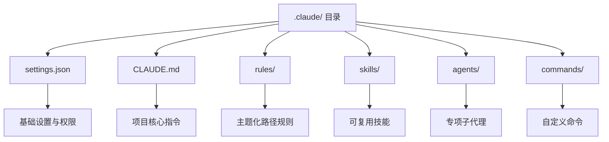

# Claude Code 官方 .claude 目录配置指南

.claude 目录配置结构概览：


## 一、.claude 目录核心定位
.claude 目录是 Claude Code 的**核心配置载体**，用于统一管理项目指令、工具权限、自定义能力、会话规则与持久记忆，是实现 AI 编码行为标准化、团队协作配置共享、个人偏好隔离的核心入口。Claude Code 启动会话时会自动读取该目录下的配置文件，无需手动重复注入项目规则与指令，大幅提升编码协作效率。

绝大多数日常场景仅需编辑 **CLAUDE.md** 与 **settings.json** 两个核心文件，其余扩展模块（skills、rules、agents 等）按需启用即可，无需全量配置。

## 二、双层作用域：项目级与全局级
Claude Code 采用**项目级+全局级**双层配置作用域，兼顾团队共享与个人定制，两者配置自动合并生效，优先级遵循项目优先、本地覆盖规则。
1. **项目级配置**
   存储于代码仓库根目录的 `.claude/` 文件夹，可提交至 Git 共享给团队成员，统一项目编码规范、工具命令、架构约束，确保团队内 Claude 行为一致。
2. **全局级配置**
   存储于用户主目录 `~/.claude`（Windows 系统对应 `%USERPROFILE%.claude`），属于个人专属配置，作用于所有项目，用于存放个人偏好、全局技能、插件数据等。

若配置环境变量 `CLAUDE_CONFIG_DIR`，所有 `~/.claude` 路径将自动指向该自定义目录，满足个性化路径管理需求。

## 三、标准目录与文件结构
## 3.1 项目根目录完整结构
```
your-project/
├── CLAUDE.md                # 项目核心指令（会话自动加载）
├── .mcp.json                # 项目级 MCP 外部工具配置
├── .worktreeinclude         # 工作树同步忽略文件配置
└── .claude/                 # 项目级配置主目录
    ├── settings.json        # 项目基础设置
    ├── settings.local.json  # 本地个人覆盖配置（Git 忽略）
    ├── rules/               # 主题化路径门控规则
    ├── skills/              # 可复用自定义技能
    ├── commands/            # 快捷自定义命令
    ├── output-styles/       # 响应格式化规则
    ├── agents/              # 专项子代理定义
    └── agent-memory/        # 子代理持久内存
```

## 3.2 全局 ~/.claude 目录核心结构
```
~/.claude/
├── settings.json        # 全局默认配置
├── rules/               # 全局通用规则
├── skills/              # 全局复用技能
├── agents/              # 全局子代理
├── plugins/             # 已安装插件数据
├── history.jsonl        # 历史提示记录（向上箭头回忆）
├── stats-cache.json     # 令牌用量统计
└── projects/            # 各项目会话运行数据
```

## 四、核心配置文件详解
## 4.1 CLAUDE.md：项目上下文总入口
CLAUDE.md 是**每次会话启动必加载**的核心指令文件，相当于 Claude 的项目“入职手册”，决定其对项目的基础认知与行为范式。
- **加载时机**：会话初始化时自动载入上下文
- **核心用途**：声明技术栈、构建/测试/格式化命令、编码规范、架构约束、团队约定
- **编写规范**：建议控制在 200 行内，过长文件会降低 Claude 遵循度；专项任务规则建议拆分至 skills 或 rules，避免占用全局上下文
- **快捷操作**：会话内执行 `/memory` 可直接编辑；也可存放于 `.claude/CLAUDE.md`，保持项目根目录整洁

**示例（TypeScript+React 项目）**
```markdown
# Project conventions
## Commands
- Build: `npm run build`
- Test: `npm test`
- Lint: `npm run lint`
## Stack
- TypeScript strict mode
- React 19 纯函数组件
## Rules
- 仅具名导出，禁用默认导出
- 测试文件与源码同级：foo.ts → foo.test.ts
- API 路由统一返回 { data, error } 结构
```

## 4.2 settings.json 与 settings.local.json
**settings.json** 是 Claude Code 的核心控制文件，支持项目级与全局级配置，用于管控工具权限、执行钩子、环境变量、模型默认参数。
- 核心配置项：`permissions`（工具调用权限）、`hooks`（工具调用前后脚本）、`env`（会话环境变量）
  **settings.local.json** 为**项目级本地覆盖文件**，自动被 Git 忽略，用于存放个人本地偏好，不影响团队共享配置。

## 4.3 辅助配置文件
- **CLAUDE.local.md**：项目私人偏好配置，与 CLAUDE.md 同步加载，需手动创建并加入 `.gitignore`
- **.mcp.json**：项目级 MCP 服务器配置，用于对接外部工具链，仅支持项目级作用域
- **managed-settings.json**：企业托管系统级配置，优先级最高，用户无法覆盖

## 五、扩展配置模块使用
## 5.1 rules/：主题化路径规则
存放主题化规则文件，支持**路径门控**，仅当访问匹配路径时加载，避免全局上下文冗余，适用于代码规范、API 设计、测试规则等专项约束。

## 5.2 skills/：自定义可复用技能
自定义技能模块，通过 `/技能名` 快捷调用，适合封装高频提示模板、专项操作流程（如安全审查、代码重构），支持项目级与全局级共享。

## 5.3 agents/：专项子代理
定义具备独立提示与工具集的子代理，适用于代码评审、安全审计、文档生成等专项任务，搭配 `agent-memory/` 实现跨会话持久记忆。

## 5.4 output-styles/：响应格式化
自定义 Claude 响应的输出格式与风格，统一代码注释、文档结构、回复排版，满足团队输出规范要求。

## 六、配置优先级与生效规则
配置生效遵循**从高到低**的优先级顺序，避免多配置冲突：
1. 企业托管设置（managed-settings.json）
2. 会话 CLI 标志（如 `--permission-mode`、`--settings`）
3. 高优先级环境变量
4. 项目级 settings.local.json
5. 项目级 settings.json
6. 全局级 settings.json
7. 系统默认配置

若配置未生效，可通过官方调试文档查看检查命令与症状对照表，定位权限、钩子、文件加载异常问题。

## 七、应用数据管理与安全规范
## 7.1 数据存储与自动清理
`~/.claude` 会自动存储会话记录、文件快照、调试日志等运行数据，**默认超过 30 天启动时自动删除**，可通过 `cleanupPeriodDays` 调整保留时长。
- **自动清理路径**：projects/（会话记录）、file-history/（文件快照）、plans/（计划文件）、debug/（调试日志）等
- **永久保留路径**：history.jsonl（提示历史）、stats-cache.json（用量统计），需手动删除

## 7.2 数据安全注意事项
所有会话记录与历史文件**以纯文本未加密形式存储**，仅依赖操作系统文件权限保护，敏感信息存在泄露风险：
1. 缩短 `cleanupPeriodDays` 减少敏感数据留存时间
2. 通过权限规则禁止 Claude 读取 `.env` 等凭证文件
3. 设置 `CLAUDE_CODE_SKIP_PROMPT_HISTORY` 关闭会话记录写入

## 7.3 手动清理影响
可随时删除应用数据路径，不影响新会话，但会丢失对应功能：
- 删除 `~/.claude/projects/`：丢失历史会话恢复、倒回能力
- 删除 `~/.claude/history.jsonl`：丢失向上箭头提示回忆功能
- 删除 `~/.claude/file-history/`：丢失文件检查点恢复能力

**禁止删除** `~/.claude.json`、`settings.json`、`plugins/`，会导致认证信息、配置偏好、插件数据丢失。

## 八、配置最佳实践
1. **最小化核心配置**：优先使用 CLAUDE.md + settings.json 满足基础需求，复杂逻辑拆分至 rules/skills 模块
2. **作用域严格分离**：团队共享规则放项目级 .claude/，个人偏好放全局 ~/.claude
3. **Git 配置规范**：提交项目级配置文件，忽略 *.local.json、本地缓存目录
4. **权限最小化**：仅开放必要工具调用权限，禁止读取/修改敏感文件
5. **轻量化规则设计**：使用路径门控规则按需加载，减少全局上下文占用

.claude 目录是 Claude Code 工程化落地的核心，合理配置可彻底消除重复提示、统一团队 AI 编码行为，实现高效、可控、标准化的 AI 辅助开发流程。