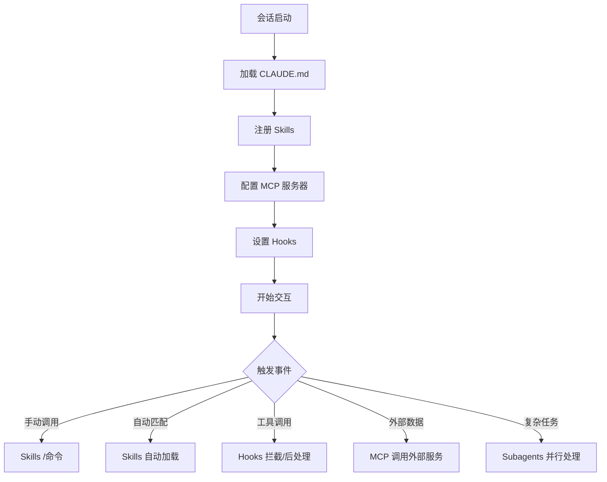

# Claude Code 扩展选型与配置手册

Claude Code 内置的文件操作、搜索、执行等基础能力已经足够完成大多数编码任务，但当你需要"AI 始终遵循团队规范"、"自动连接数据库查询数据"、"编辑代码后自动格式化"等个性化需求时，就需要扩展层能力。Claude Code 提供六大核心扩展模块（CLAUDE.md、Skills、Subagents、Agent teams、MCP、Hooks）和打包分发层（Plugins），本手册帮你理清各扩展的选型逻辑与配置要点，在控制上下文成本的同时，实现工作流的优化与定制。

## 一、扩展功能基础认知

Claude Code 的扩展层核心目标是自定义模型知识、连接外部服务、自动化工作流，所有扩展功能均插入代理循环的不同环节，按需发挥作用。核心扩展包括 CLAUDE.md、Skills、Subagents、Agent teams、MCP、Hooks 六大模块，Plugins 则作为打包分发层，整合各类扩展功能，方便跨项目复用与分享。

初次使用扩展功能时，建议从 CLAUDE.md 入手，先定义项目核心约定，再根据实际需求逐步添加其他扩展，避免盲目配置导致的上下文冗余与功能冲突。

## 二、核心扩展功能详解（含选型依据）

Claude Code 扩展功能协同工作流程如下：

各扩展功能定位、作用及适用场景存在显著差异，以下结合实际开发需求，详细解析每个扩展的核心价值、选型条件及基础配置方向。

### 2.1 CLAUDE.md：全局持久上下文配置

CLAUDE.md 是每个 Claude Code 会话都会自动加载的持久上下文文件，核心作用是定义项目全局约定，确保模型在整个会话过程中遵循统一规则，无需重复提示。

「选型依据」：当需要模型始终遵守特定规则、掌握项目核心约定时，优先使用 CLAUDE.md。适用场景包括：项目编码规范、构建命令、项目结构说明、“禁止执行”类规则（如禁止硬编码密钥）等。

「配置要点」：

- 内容需简洁聚焦，建议控制在 200 行以内，避免占用过多上下文；若内容过多，可将参考性内容迁移至 Skills 或拆分为 .claude/rules/ 目录下的文件。

- 支持通过 @path 导入外部文件，可整合项目已有的规范文档，减少重复编写。

- 加载规则：会话启动时自动加载，所有级别（托管、用户、项目）的 CLAUDE.md 内容会累加，子目录中的文件在进入该目录工作时加载；规则冲突时，更具体的说明优先。

「示例」：配置内容可包含“使用 pnpm，而不是 npm；提交前必须运行测试；前端代码禁止使用 var 声明变量”等核心约定。

### 2.2 Skills：可复用知识与工作流扩展

Skills 是最灵活的扩展模块，本质是包含知识、工作流或操作说明的 Markdown 文件，可通过 /name 命令手动调用，也可由模型在相关任务中自动加载，支持在当前对话或 Subagents 隔离上下文中运行。

「选型依据」：当需要可复用的参考材料、可重复执行的工作流时，选择 Skills。适用场景包括：API 文档、代码审查清单、部署工作流、测试脚本（如 /tdd 单元测试、/refactor-clean 清理废弃代码）等。

「配置要点」：

- 分类管理：建议按功能创建目录结构，如 ~/.claude/skills/ 下分别创建 pmx-guidelines.md（项目模式）、coding-standards.md（编码规范）、tdd-workflow/（多文件工作流）等。

- 加载控制：默认情况下，会话启动时仅加载 Skill 描述，使用时加载完整内容；若技能有副作用（如修改文件），可在 frontmatter 中设置 disable-model-invocation: true，隐藏至手动调用，降低上下文成本。

- 内置技能：Claude Code 自带 /simplify（代码简化）、/batch（批量操作）、/debug（调试）等技能，可直接使用，无需额外配置。

「示例」：创建 /deploy 技能，包含部署清单、命令步骤及异常处理说明，调用后可自动执行项目部署流程；创建 API 文档技能，包含接口端点、请求参数、返回格式等参考信息。

### 2.3 Subagents：隔离式任务执行扩展

Subagents 是在隔离上下文环境中运行的独立执行单元，核心作用是处理特定任务，仅向主会话返回结果摘要，不占用主上下文资源，适合并行处理或上下文隔离需求。

「选型依据」：当需要处理上下文密集型任务（如读取大量文件）、并行任务，或需隔离主会话上下文时，选择 Subagents。适用场景包括：批量文件分析、专项研究、代码审查、构建错误修复等。

「配置要点」：

- 职责聚焦：为每个 Subagent 明确单一职责，限制可用工具列表，避免功能冗余；推荐配置 planner（功能规划）、code-reviewer（代码审查）、security-reviewer（安全分析）等专项子代理。

- 技能预加载：可在 Subagent 配置中通过 skills: 字段预加载特定技能，无需主会话继承，加载时会将技能完整内容纳入子代理上下文。

- 成本优势：上下文与主会话隔离，仅返回摘要，令牌成本较低，可避免主会话上下文膨胀。

「示例」：创建研究类 Subagent，配置预加载文献分析技能，让其读取数十篇技术文档后，仅向主会话返回核心结论，无需展示中间读取过程。

### 2.4 Agent teams：多会话协同扩展

Agent teams 是协调多个独立 Claude Code 会话的扩展，各会话（队友）可点对点通信、共享任务列表，实现自我协调，适合复杂协作类任务。需注意，该功能目前为实验性，默认禁用。

「选型依据」：当需要多角色协作、竞争假设调试、并行代码审查（如分别检查安全性、性能、测试覆盖率）时，选择 Agent teams；若仅需单一任务隔离执行，优先使用 Subagents（成本更低）。

「配置要点」：

- 适用场景：新功能开发（多队友分工负责不同模块）、多维度代码审查、带有竞争假设的研究任务。

- 成本说明：每个队友对应一个独立 Claude 实例，令牌成本较高，非必要不启用。

- 过渡场景：当并行 Subagents 遇到上下文限制，或需要子代理之间相互通信时，可升级为 Agent teams。

### 2.5 MCP：外部服务连接协议

MCP（Model Context Protocol）的核心作用是将 Claude Code 与外部服务连接，实现外部数据访问或操作，是模型与外部系统交互的核心桥梁。

「选型依据」：当需要模型操作外部服务（如查询数据库、发布 Slack 消息、控制浏览器、对接 GitHub/Vercel）时，必须使用 MCP；需配合 Skills 使用，确保模型掌握外部服务的使用方法。

「配置要点」：

- 权限控制：全局配置建议控制在 20-30 个，单个项目仅启用 10 个以内，总工具数不超过 80 个，避免占用过多上下文（过多 MCP 会导致有效上下文窗口大幅缩减）。

- 常用配置：支持通过命令行或配置文件添加 MCP 服务，如 GitHub、Supabase、Vercel 等，示例配置为 {"github": {"command": "npx", "args": ["-y", "@modelcontextprotocol/server-github"]}}。

- 可靠性管理：MCP 连接可能中途无声失败，若发现模型无法使用已配置的 MCP 工具，可通过 /mcp 命令检查连接状态，断开未主动使用的服务器。

「示例」：配置 MCP 连接数据库，同时创建对应 Skill，包含数据库架构、查询模式、表结构说明，让模型可通过自然语言查询数据库并返回结果。

### 2.6 Hooks：事件触发式自动化扩展

Hooks 是在特定生命周期事件中自动运行的确定性脚本，完全独立于代理循环，不占用上下文资源（除非返回额外输出），核心作用是实现无 LLM 依赖的自动化操作。

「选型依据」：当需要实现事件驱动的自动化（如文件编辑后 lint 检查、工具执行前后的预处理/后处理）时，选择 Hooks；适用场景包括：代码格式化、日志记录、权限请求通知、长任务提醒等。

「配置要点」：

- 支持事件类型：PreToolUse（工具执行前）、PostToolUse（工具执行后）、UserPromptSubmit（用户提交消息时）、Stop（响应结束时）等，可根据需求配置对应事件的脚本。

- 实操示例：配置 PostToolUse 钩子，当编辑 .ts/.tsx 文件后，自动执行 prettier --write 和 tsc --noEmit 命令，实现代码自动格式化与类型检查；配置 PreToolUse 钩子，当执行 npm/pnpm 命令时，提醒用户使用 tmux。

- 便捷工具：可使用 /hookify 插件，通过自然语言描述自动化需求，自动生成 Hook 脚本，降低配置门槛。

### 2.7 Plugins：扩展打包与分发层

Plugins 并非独立扩展功能，而是将 Skills、Hooks、Subagents、MCP 服务器捆绑为单个可安装单元的打包层，核心价值是实现扩展的跨项目复用与市场分发。

「选型依据」：当需要在多个仓库中重用相同扩展配置，或需将自定义扩展分发给他人时，选择 Plugins；单个项目的临时扩展无需打包为 Plugin。

「配置要点」：

- 命名空间隔离：Plugin 中的 Skills 会带有命名空间（如 /my-plugin:review），避免与其他扩展冲突。

- 推荐插件：官方提供 typescript-lsp（TS 智能提示）、pyright-lsp（Python 类型检查）、hookify（Hook 快速生成）等插件，可通过 marketplace 安装，示例命令为 claude plugin marketplace add https://github.com/mixedbread-ai/mgrep。

## 三、相似扩展功能对比（快速选型指南）

各扩展功能定位清晰后，实际开发中容易混淆的是"相似功能该选哪个"——以下对比明确选型边界。

实际开发中，部分扩展功能定位相似，易混淆，以下通过对比明确选型边界，提升配置效率。

### 3.1 CLAUDE.md vs Skills

|对比维度|CLAUDE.md|Skills|
|---|---|---|
|加载方式|会话启动自动加载，全局生效|按需加载，手动调用或自动匹配|
|核心作用|定义全局“必须遵守”的规则|提供可复用的知识与可触发工作流|
|是否触发工作流|否|是，通过 /name 命令触发|
|适用场景|项目编码规范、构建命令|API 文档、部署工作流、代码审查|

### 3.2 Skills vs Subagents

|对比维度|Skills|Subagents|
|---|---|---|
|本质|可复用的知识/工作流文件|隔离的独立执行单元|
|核心优势|上下文共享，可跨场景复用|上下文隔离，不占用主会话资源|
|适用场景|参考材料、可重复工作流|批量文件处理、并行任务、专项研究|

### 3.3 Subagents vs Agent teams

|对比维度|Subagents|Agent teams|
|---|---|---|
|上下文|隔离，结果返回主会话|完全独立，各队友自有上下文|
|通信方式|仅向主代理报告结果|队友间点对点直接通信|
|成本|较低，仅返回摘要|较高，每个队友为独立实例|
|适用场景|单一专注任务，仅需结果|复杂协作，需多角色讨论|

### 3.4 MCP vs Skills

|对比维度|MCP|Skills|
|---|---|---|
|本质|外部服务连接协议|知识/工作流参考文件|
|核心作用|提供外部服务访问能力|教导模型如何使用外部服务|
|示例|Slack 集成、数据库查询|数据库查询模式、Slack 消息格式|

## 四、扩展功能组合使用指南

单一扩展无法满足复杂需求，以下四种常用组合模式覆盖多数开发场景。

单一扩展功能无法满足复杂开发需求，合理组合各类扩展，可实现工作流的全面优化。以下是四种常用组合模式，覆盖多数开发场景。

### 4.1 CLAUDE.md + Skills：全局规则+按需参考

「组合逻辑」：CLAUDE.md 定义全局核心约定，Skills 提供按需加载的参考材料与工作流，既保证全局一致性，又避免上下文冗余。

「示例」：CLAUDE.md 中配置“遵循团队 API 约定”，创建 API 风格指南 Skill，当模型需要编写 API 代码时，自动加载该 Skill，获取详细规范；创建 /deploy 工作流 Skill，手动调用执行部署操作。

### 4.2 Skill + MCP：外部连接+规范使用

「组合逻辑」：MCP 提供外部服务连接能力，Skill 定义外部服务的使用规范、操作流程，确保模型正确使用外部工具，避免操作失误。

「示例」：通过 MCP 连接团队 Slack 与数据库，创建 /post-to-slack Skill（包含消息格式规则）和数据库操作 Skill（包含表结构、查询模式），模型可通过 Skill 调用 MCP，实现自动发消息、查数据。

### 4.3 Skill + Subagents：并行任务+规范执行

「组合逻辑」：Skill 定义任务流程与规范，Subagents 按流程并行执行任务，实现高效分工，同时保证执行质量。

「示例」：创建 /audit  Skill，定义安全、性能、风格三类审查规范，调用该 Skill 后，自动生成三个 Subagents，分别负责三类审查任务，各自在隔离上下文执行，最终向主会话返回汇总结果。

### 4.4 Hook + MCP：自动化触发+外部操作

「组合逻辑」：Hook 监听特定事件，触发 MCP 执行外部操作，实现全自动化工作流，无需手动干预。

「示例」：配置 PostToolUse Hook，当模型修改核心代码文件时，自动通过 MCP 向团队 Slack 发送通知，告知文件修改内容与修改人，实现代码变更实时同步。

## 五、配置注意事项与上下文成本控制

### 5.1 配置注意事项

- 分层优先级：Skills 与 Subagents 按名称覆盖，优先级为（Skills：托管 > 用户 > 项目；Subagents：托管 > CLI 标志 > 项目 > 用户 > Plugin）；MCP 按名称覆盖，优先级为本地 > 项目 > 用户；Hooks 所有注册实例均会触发，无优先级冲突。

- 避免过度配置：不建议启用所有扩展，仅保留当前项目必需的功能，减少上下文噪音与成本。

- 编辑器适配：推荐使用 Zed 编辑器（轻量快速、集成 Agent 面板），或 VSCode/Cursor，配合终端运行 Claude Code，提升操作效率。

### 5.2 上下文成本控制

每个扩展都会消耗模型上下文，过度消耗会导致上下文窗口满溢、模型效率下降，以下是各扩展的成本控制要点：

|扩展功能|上下文成本|控制方法|
|---|---|---|
|CLAUDE.md|每个请求均消耗，成本较高|控制在 200 行以内，拆分冗余内容|
|Skills|默认低（仅加载描述），使用时升高|启用 disable-model-invocation: true，手动调用控制加载|
|MCP 服务器|每个请求均消耗|仅启用必需服务，断开未使用服务器|
|Subagents|与主会话隔离，不消耗主上下文|明确职责，避免创建过多子代理|
|Hooks|零成本（除非返回额外输出）|无需额外控制，合理配置触发事件即可|

## 六、总结

扩展选型的核心原则是”先核心后扩展、先简单后复杂”——从 CLAUDE.md 入手定义项目基本规则，再根据实际痛点逐步添加 Skills（可复用工作流）、MCP（外部服务连接）、Hooks（事件自动化）等扩展，避免盲目配置导致上下文浪费。每个扩展都会消耗上下文资源，配置时需权衡”功能收益”与”上下文成本”，仅保留当前项目必需的扩展。
