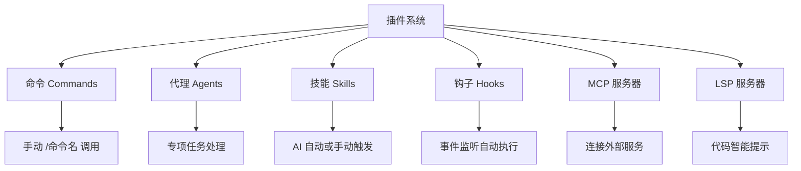

# Claude Code 插件使用教程

Claude Code 作为一款强大的AI编程辅助工具，其插件系统是实现功能扩展、适配个性化开发需求的核心支撑。插件系统采用标准化架构设计，支持通过自定义命令（Commands）、代理（Agents）、技能（Skills）、钩子（Hooks）等组件，对接外部服务与工具，大幅提升AI编程的自动化、定制化水平。本文基于 Claude Code 官方插件参考文档，以实战为核心，从插件认知、安装管理、组件配置、调试排错、最佳实践五个维度，结合具体实操案例、表格对比、代码块展示，帮助新手快速上手，助力开发者熟练运用插件优化开发流程，所有操作均可直接复制落地。


Claude Code 插件系统架构如下：


## 一、前言

用Claude Code写代码，是不是总觉得功能不够用？要么适配不了你的技术栈，要么高频操作重复繁琐，浪费大量时间？

不用慌——Claude Code插件系统，就是为解决这个问题而来。无需修改平台核心代码，简单配置就能扩展专属功能，适配你的个性化开发需求。而这篇教程，全程不聊废话、只讲实战，不管你是零基础新手，还是想提升效率的进阶开发者，跟着操作就能快速上手，每一步都有可直接复制的代码和清晰步骤，帮你少踩坑、省时间，快速用插件解锁Claude Code的全部潜力。

## 二、插件核心认知（实战前置）

### 2.1 插件核心定位

Claude Code 插件是一套基于标准化协议的功能扩展组件，本质是通过特定目录结构与配置文件，向Claude Code 平台注入自定义能力，实现“按需扩展、即装即用”。核心优势的是：无需复杂编译部署，多数场景仅需配置JSON或Markdown文件即可完成开发，适配个人开发、团队协作等多种场景，且不影响平台原有功能。

### 2.2 六大核心组件详解（实战重点）

Claude Code 插件支持六种核心组件，各组件分工明确、协同工作，覆盖交互扩展、自动化处理、外部服务对接等全场景。以下为实战中最常用的组件说明，用表格清晰呈现，方便快速查阅：

|组件名称|核心作用（实战场景）|调用方式|配置难度|
|---|---|---|---|
|命令（Commands）|添加自定义斜杠命令，快捷调用高频操作（如代码格式化、日志查看）|手动输入“/命令名”调用|★☆☆☆☆|
|代理（Agents）|专项任务处理（如安全审查、性能测试），提供专业能力支持|手动调用或AI自动触发|★★☆☆☆|
|技能（Skills）|AI自主调用，实现任务自动化（如PDF解析、代码语法检查）|AI根据上下文自动触发|★★☆☆☆|
|钩子（Hooks）|监听平台事件，自动执行预设操作（如工具使用后格式化代码）|自动触发，无需手动操作|★★★☆☆|
|MCP服务器|对接外部服务（数据库、API），实现AI与外部系统协同|作为标准工具直接调用|★★★☆☆|
|LSP服务器|提供代码智能能力（语法提示、跳转定义），适配多编程语言|配置后自动生效|★★★☆☆|

实战建议：新手优先掌握「命令」「代理」「技能」三个组件，上手难度低、落地快；进阶用户可学习「钩子」「MCP/LSP服务器」，实现更复杂的自动化与外部对接。

## 三、插件安装与CLI管理（实战核心）

Claude Code 提供CLI（命令行界面）工具，用于插件的全生命周期管理，是实战中最常用的操作方式。以下命令均经过实测，可直接复制执行，配套详细说明与表格对比，避免踩坑。

### 3.1 核心CLI命令（实战必记）

前置条件：确保已安装Claude Code 客户端，且配置好环境变量，终端输入`claude` 可验证是否安装成功。核心命令整理如下，涵盖安装、卸载、启用、禁用、更新全流程：

```bash
# 1. 安装插件（核心命令）
# 默认安装到user范围（个人全局）
claude plugin install <插件名>
# 指定市场安装
claude plugin install <插件名>@<市场名>
# 指定安装范围（常用场景）
claude plugin install <插件名> --scope <范围>

# 2. 卸载插件
claude plugin uninstall <插件名> [--scope <范围>]
# 别名（更简洁，实战常用）
claude plugin remove <插件名>
claude plugin rm <插件名>

# 3. 启用/禁用插件（临时开关，不删除文件）
claude plugin enable <插件名> [--scope <范围>]
claude plugin disable <插件名> [--scope <范围>]

# 4. 更新插件
claude plugin update <插件名> [--scope <范围>]

# 5. 调试与验证（实战排错必用）
# 查看插件加载详情
claude --debug
# 验证插件清单合法性
claude plugin validate
```

### 3.2 安装范围详细说明（实战场景适配）

插件安装范围决定可用范围与共享方式，实战中需根据个人/团队需求选择，避免配置混乱。具体对比如下表：

|安装范围|配置文件路径|适用场景（实战重点）|共享方式|
|---|---|---|---|
|user（默认）|~/.claude/settings.json|个人全局使用，如常用的代码格式化、日志查看插件|仅当前用户可见，不共享|
|project|项目根目录/.claude/settings.json|团队协作，如项目专属的代码审查、部署脚本插件|可通过Git版本控制，团队共享|
|local|项目根目录/.claude/settings.local.json|项目本地临时使用，如个人调试用的工具插件|Git忽略，不共享|
|managed|managed-settings.json|企业级场景，管理员统一部署（如安全审计插件）|管理员管控，用户仅可使用|

### 3.3 实战操作示例（直接复制执行）

```bash
# 示例1：安装formatter插件（个人全局，user范围）
claude plugin install formatter

# 示例2：安装formatter插件（团队共享，project范围）
claude plugin install formatter --scope project

# 示例3：禁用user范围的formatter插件（临时关闭）
claude plugin disable formatter

# 示例4：更新local范围的formatter插件
claude plugin update formatter --scope local

# 示例5：卸载project范围的formatter插件
claude plugin uninstall formatter --scope project
```

### 3.4 安装注意事项（实战避坑）

- 安装时确保网络通畅，自定义市场安装需提前配置市场地址；

- 同一插件可在不同范围重复安装，配置相互独立（如user和project范围可各装一个formatter）；

- 卸载前确认插件未被使用，避免影响正在进行的开发任务；

- 更新插件前，建议备份配置文件（如settings.json），防止配置丢失。

## 四、核心组件基础配置与实操（实战重点）

六大核心组件的配置的是实战核心，本节将每个组件的配置步骤、示例代码、实操注意事项整理清楚，代码块可直接复制使用，相似配置用表格对比，降低上手难度。所有组件配置文件均需放在插件根目录下，路径遵循相对路径规则（禁止绝对路径）。

### 4.1 命令（Commands）配置（新手首选）

作用：添加自定义斜杠命令，快捷调用高频操作，配置最简单，实战中最常用。

1.  配置位置：插件根目录/commands/（默认目录，自定义路径可在plugin.json中配置）；

2.  文件格式：Markdown文件，需包含前置元数据（用---分隔）；

3.  实战配置示例（创建“/code-format”代码格式化命令，可直接复制使用）：

```markdown
---
name: code-format
description: 自动格式化代码，支持Python、TypeScript、Java等语言
parameters: [{"name": "code", "type": "string", "required": true, "description": "需要格式化的代码"}]
---
# 代码格式化命令
## 功能说明
自动格式化输入的代码，规范代码缩进、空格、换行，支持多种编程语言，提升代码可读性。

## 使用方法（实战步骤）
1.  输入“/code-format”，在参数中粘贴需要格式化的代码；
2.  点击提交，系统自动返回格式化后的代码。
```

4.  实操验证：安装插件后，在Claude Code 输入框输入`/code-format`，粘贴代码提交，即可看到格式化结果。

### 4.2 代理（Agents）配置（专项任务必备）

作用：处理专项任务（如安全审查、性能测试），配置后可手动/自动调用，实战中可大幅提升专项任务效率。

1.  配置位置：插件根目录/agents/（默认目录，可通过plugin.json自定义）；

2.  文件格式：Markdown文件，前置元数据需包含description（代理专长）和capabilities（代理能力）；

3.  实战配置示例（安全审查代理，可直接复制使用）：

```markdown
---
description: 专注于代码安全审查，检测代码中的安全漏洞、敏感信息泄露等问题
capabilities: ["检测SQL注入漏洞", "检测敏感信息泄露", "检测代码权限漏洞", "提供安全修复建议"]
---
# 安全审查代理
## 代理角色
本代理专注于代码安全领域，可快速识别各类常见的代码安全漏洞，提供专业修复建议，降低代码安全风险。

## 功能（实战场景）
- 检测SQL注入漏洞：识别代码中未过滤的用户输入，避免恶意SQL语句执行；
- 检测敏感信息泄露：查找代码中硬编码的密码、密钥、手机号等敏感信息；
- 检测代码权限漏洞：检查代码中权限控制不严格的问题，避免越权操作；
- 提供安全修复建议：针对检测到的漏洞，给出具体、可落地的修复方案。

## 实操示例
输入：“请审查以下Python代码，检测是否存在安全漏洞，并给出修复建议：[此处粘贴代码]”
代理将自动检测代码中的安全问题，并返回详细的审查报告与修复方案。
```

4.  调用方式：安装插件后，代理会出现在“/agents”界面（手动调用）；Claude 检测到任务涉及安全审查时，会自动调用。

### 4.3 技能（Skills）配置（自动化提升）

作用：AI自主调用，无需手动操作，实战中可提升任务自动化程度（如自动解析PDF、检查代码语法）。

1.  配置位置：插件根目录/skills/（默认目录，可通过plugin.json自定义）；

2.  目录结构（实战标准，必须严格遵循）：

```plaintext
skills/
├── pdf-processor/  # PDF解析技能（自定义技能名称，kebab-case格式）
│   ├── SKILL.md     # 技能核心配置（必需）
│   └── scripts/     # 支持脚本（可选，复杂技能可用）
└── code-reviewer/  # 代码审查技能
    └── SKILL.md
```

3.  实战配置示例（PDF解析技能，SKILL.md文件，可直接复制）：

```markdown
---
name: pdf-processor
description: 解析PDF文件中的文本、代码片段，提取关键信息，支持批量解析
capabilities: ["PDF文本提取", "PDF代码提取", "批量PDF解析"]
---
# PDF解析技能
## 技能说明
本技能可自动解析PDF文件中的文本内容和代码片段，支持单个/批量解析，提取内容可直接用于后续编辑、分析。

## 触发条件（实战重点）
当Claude 检测到用户输入包含PDF文件路径、PDF内容，或任务需求为“解析PDF”“提取PDF中的代码”时，自动触发。
```

4.  实操注意：技能安装后自动被平台发现，无需手动启用，AI会根据上下文自主调用。

### 4.4 钩子（Hooks）配置（自动化工作流）

作用：监听平台事件，自动执行预设操作，实战中可实现工作流自动化（如工具使用后自动格式化代码）。

1.  配置位置：插件根目录/hooks/hooks.json（默认），或在plugin.json中内联配置；

2.  核心事件与操作类型（实战常用，表格整理）：

|常用事件|事件说明（实战场景）|常用操作类型|
|---|---|---|
|PostToolUse|Claude 成功使用工具后触发（如写完代码后）|command（执行脚本）|
|SessionStart|会话开始时触发（如打开Claude Code 时）|command、prompt|
|UserPromptSubmit|用户提交提示时触发（如输入指令后）|agent（调用代理）|

3.  实战配置示例（监听PostToolUse事件，自动格式化代码，可直接复制）：

```json
{
  "hooks": {
    "PostToolUse": [
      {
        "matcher": "Write|Edit",  // 匹配“写入”或“编辑”工具操作
        "hooks": [
          {
            "type": "command",
            "command": "${CLAUDE_PLUGIN_ROOT}/scripts/format-code.sh"  // 执行格式化脚本
          }
        ]
      }
    ]
  }
}
```

4.  实操注意事项（避坑重点）：

- 脚本路径必须使用`${CLAUDE_PLUGIN_ROOT}` 环境变量，确保插件在不同安装位置都能正常运行；

- 脚本需添加执行权限，终端执行`chmod +x script.sh`（替换script.sh为你的脚本名称）；

- 事件名称区分大小写（如PostToolUse不能误写为postToolUse），否则无法触发。

### 4.5 MCP服务器配置（外部服务对接）

作用：对接外部工具与服务（如数据库、API），实战中可实现AI直接操作外部系统，提升协同效率。

1.  配置位置：插件根目录/.mcp.json（默认），或在plugin.json中内联配置；

2.  实战配置示例（对接数据库MCP服务器，可直接复制修改）：

```json
{
  "mcpServers": {
    "plugin-database": {  // 服务器名称，自定义（kebab-case格式）
      "command": "${CLAUDE_PLUGIN_ROOT}/servers/db-server",  // 数据库服务器执行命令
      "args": ["--config", "${CLAUDE_PLUGIN_ROOT}/config.json"],  // 命令参数
      "env": {
        "DB_PATH": "${CLAUDE_PLUGIN_ROOT}/data"  // 环境变量，指定数据库路径
      }
    }
  }
}
```

3.  实操说明：启用插件后，MCP服务器自动启动，在Claude Code 工具包中显示为标准工具，可直接调用，与平台原有工具无缝集成。

### 4.6 LSP服务器配置（代码智能提升）

作用：提供代码智能能力（语法提示、跳转定义、查找引用），适配多编程语言，实战中可大幅提升代码编写效率。

1.  配置位置：插件根目录/.lsp.json（默认），或在plugin.json中内联配置；

2.  必需配置项：`command`（LSP二进制文件路径）、`extensionToLanguage`（文件后缀映射）；

3.  实战配置示例（Go语言LSP服务器，可直接复制使用）：

```json
{
  "go": {
    "command": "gopls",  // Go语言LSP服务器二进制文件（需提前安装）
    "args": ["serve"],  // 命令参数
    "extensionToLanguage": {
      ".go": "go"  // .go文件映射到go语言
    }
  }
}
```

4.  常用LSP插件安装（实战必装，表格整理）：

|编程语言|LSP服务器名称|安装命令（直接复制执行）|
|---|---|---|
|Python|pyright-lsp|pip install pyright 或 npm install -g pyright|
|TypeScript/JavaScript|typescript-lsp|npm install -g typescript-language-server typescript|
|Rust|rust-analyzer|参考rust-analyzer官方安装文档（需适配系统）|
|Go|gopls|go install golang.org/x/tools/gopls@latest|

5.  实操避坑：LSP插件仅配置连接方式，不包含LSP服务器本身，需单独安装；若出现“Executable not found in $PATH”错误，检查LSP服务器是否安装，或是否配置环境变量。

### 4.7 插件清单（plugin.json）配置（必需配置）

plugin.json是插件的核心配置文件，位于插件根目录的.claude-plugin/目录下，`name`字段为必填项，其他字段可根据需求补充，实战中需确保配置正确，否则插件无法加载。

1.  实战标准配置（可直接复制修改，替换占位符）：

```json
{
  "name": "plugin-name",  // 插件唯一标识符（kebab-case格式，无空格，如code-format-plugin）
  "version": "1.2.0",  // 语义化版本（实战建议遵循MAJOR.MINOR.PATCH）
  "description": "简短的插件描述（如：代码格式化插件，支持多语言）",
  "author": {  // 可选，作者信息
    "name": "作者名称",
    "email": "author@example.com",
    "url": "https://github.com/author"
  },
  "homepage": "https://docs.example.com/plugin",  // 可选，文档URL
  "repository": "https://github.com/author/plugin",  // 可选，源代码URL
  "license": "MIT",  // 可选，许可证
  "keywords": ["keyword1", "keyword2"],  // 可选，发现标签
  "commands": ["./custom/commands/special.md"],  // 可选，自定义命令路径
  "agents": "./custom/agents/",  // 可选，自定义代理路径
  "skills": "./custom/skills/",  // 可选，自定义技能路径
  "hooks": "./config/hooks.json",  // 可选，自定义钩子路径
  "mcpServers": "./mcp-config.json",  // 可选，自定义MCP配置路径
  "lspServers": "./.lsp.json"  // 可选，自定义LSP配置路径
}
```

2.  关键说明（实战必看）：

- `name`字段：唯一标识符，必须用kebab-case格式（如deployment-tools），无空格、特殊字符；

- 自定义路径：补充默认目录，不替换默认目录（如commands/默认目录和自定义路径会同时加载）；

- 所有自定义路径必须以`./`开头，且相对于插件根目录。

### 4.8 插件标准目录结构（实战规范）

为确保插件正常加载，实战中需遵循以下标准目录结构，避免因目录混乱导致插件无法加载：

```plaintext
插件根目录/
├── .claude-plugin/           # 元数据目录（必需）
│   └── plugin.json          # 插件清单（必需）
├── commands/                 # 命令文件目录（默认）
│   ├── status.md            # 自定义命令文件
│   └── logs.md
├── agents/                   # 代理文件目录（默认）
│   ├── security-reviewer.md # 安全审查代理
│   └── performance-tester.md
├── skills/                   # 技能目录（默认）
│   ├── code-reviewer/
│   │   └── SKILL.md         # 技能核心配置
│   └── pdf-processor/
│       └── SKILL.md
├── hooks/                    # 钩子配置目录（默认）
│   └── hooks.json           # 钩子配置文件
├── .mcp.json                # MCP服务器配置（可选）
├── .lsp.json                # LSP服务器配置（可选）
└── scripts/                 # 钩子和实用脚本目录（可选）
```

## 五、调试与常见问题排查（实战排错）

实战中难免遇到插件加载失败、组件无法调用等问题，本节整理核心调试方法和高频问题，用表格呈现排查方案，帮助快速解决故障，避免耽误开发进度。

### 5.1 核心调试方法（实战必用）

```bash
# 方法1：查看插件加载详情（核心排错命令）
claude --debug
# 说明：启动Claude Code 并输出调试日志，可查看插件加载状态、组件注册情况、错误信息

# 方法2：验证插件清单合法性（快速排查配置错误）
claude plugin validate
# 说明：在插件根目录执行，若清单有错误（如JSON语法、必填项缺失），会提示具体错误信息

# 方法3：手动测试组件（排查脚本/命令问题）
# 示例：手动执行钩子脚本，验证是否能正常运行
bash ${CLAUDE_PLUGIN_ROOT}/scripts/format-code.sh
```

### 5.2 高频问题排查（实战避坑，表格整理）

|常见问题|核心原因（实战高频）|解决方案（直接落地）|
|---|---|---|
|插件未加载|1. plugin.json无效（语法错误、name缺失）；2. 目录结构错误；3. 缓存异常|1. 执行claude plugin validate验证清单；2. 核对标准目录结构；3. 删除缓存，重新安装|
|命令/代理/技能未出现|1. 组件目录放错位置；2. 配置文件格式错误；3. 插件未启用|1. 将组件目录移至插件根目录；2. 检查Markdown元数据完整性；3. 执行claude plugin enable <插件名>|
|钩子未触发|1. 事件名称大小写错误；2. 脚本无执行权限；3. 路径错误|1. 核对事件名称（如PostToolUse）；2. 执行chmod +x 脚本名；3. 使用${CLAUDE_PLUGIN_ROOT}配置路径|
|MCP服务器启动失败|1. 路径未用${CLAUDE_PLUGIN_ROOT}；2. 服务器未安装；3. 参数错误|1. 统一使用环境变量配置路径；2. 安装对应服务器；3. 核对命令和参数|
|LSP报错“Executable not found in $PATH”|1. LSP服务器未安装；2. 未配置环境变量|1. 执行对应安装命令（参考4.6表格）；2. 配置环境变量，确保二进制文件在PATH中|
|路径错误，无法引用文件|1. 使用绝对路径；2. 路径未以./开头；3. 引用插件外文件|1. 改用相对路径（./开头）；2. 用符号链接引用外部文件（ln -s 目标路径 链接名）|

### 5.3 插件缓存机制说明（实战避坑）

Claude Code 会将插件复制到缓存目录（而非就地使用），这是很多路径问题的核心原因，实战中需注意：

- 安装插件时，平台会递归复制插件文件到缓存目录，市场插件复制source指定路径，本地插件复制包含plugin.json的根目录；

- 插件无法引用缓存目录外的文件，若需引用，可创建符号链接（如`ln -s /path/to/shared-utils ./shared-utils`）；

- 缓存异常时，可删除缓存目录（路径可通过claude --debug查看），重新安装插件。

## 六、总结与最佳实践（实战提升）

### 6.1 教程总结

本文以实战为核心，详细讲解了Claude Code 插件的安装管理、组件配置、调试排错全流程，用表格梳理相似内容、用代码块呈现可直接复制的配置与命令，覆盖新手到进阶的所有核心需求。实战中，新手可先掌握命令、代理、技能的配置，快速落地；进阶用户可学习钩子、MCP/LSP服务器，实现更复杂的自动化与外部对接。

### 6.2 实战最佳实践（避坑+效率提升）

- 路径规范：所有路径用相对路径（./开头），钩子、脚本中统一使用`${CLAUDE_PLUGIN_ROOT}` 环境变量，避免路径错误；

- 版本管理：遵循语义化版本（MAJOR.MINOR.PATCH），更新插件前备份配置，预发布版本（如2.0.0-beta.1）测试稳定后再正式发布；

- 权限控制：钩子、MCP脚本仅授予最小执行权限，不硬编码敏感信息（密码、密钥），通过环境变量管理；

- 调试流程：配置完成后，先执行claude plugin validate验证清单，再用claude --debug查看加载日志，故障优先查看调试日志；

- 团队协作：团队共享插件安装到project范围，配置文件纳入Git版本控制；个人临时插件安装到local范围，避免影响团队配置。

通过遵循以上实战最佳实践，可有效提升插件的稳定性、可维护性，充分发挥Claude Code 插件系统的扩展能力，助力开发者提升编程效率，实现个性化、自动化的AI编程体验。

