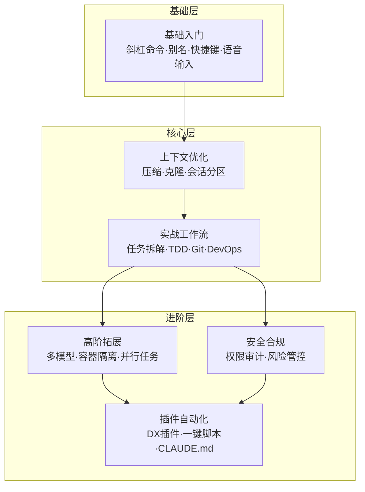
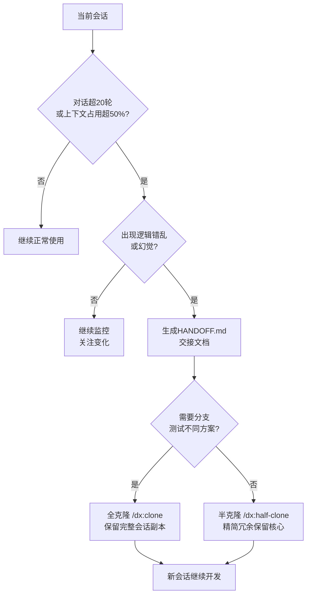
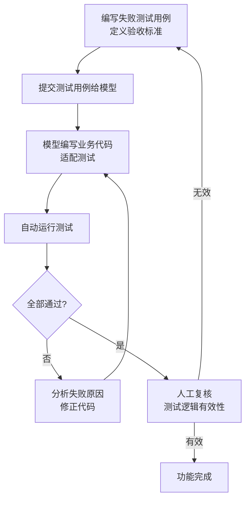

# Claude Code 使用技巧：从入门到高阶的全方位提效指南

你是否遇到过这类场景——Claude Code 会话越用越卡、指令被遗忘、模型答非所问？明明拥有最强的编码能力，却因为用法不当，连一半的效率都没发挥出来。这些问题的根源不是大模型不行，而是上下文管理、工作流规范和权限配置没有跟上。

本文基于官方规范与大量实战经验，从**基础提速、上下文管理、开发工作流、高阶拓展、安全避坑、自动化插件**六大维度，汇总可以直接上手的高效技巧，覆盖新手入门到高阶工程化场景，帮你全方位榨干 Claude Code 的每一分能力。

**图1：文章六大维度架构总览**



## 一、基础入门：零成本快速提升日常操作效率

基础操作是高效使用 Claude Code 的核心，掌握内置命令、终端配置、输入技巧，可直接降低日常操作成本，适配绝大多数轻量化编码场景。

### 1.1 掌握核心内置斜杠命令

Claude Code 内置大量斜杠指令，无需额外配置，输入 `/` 即可唤起，以下为高频刚需命令：

- **/usage**：实时查看模型 token 用量、速率限制及重置时间，精准管控资源，避免会话超限中断，支持手动刷新实时数据。

- **/stats**：生成可视化使用统计，包含活跃天数、会话数量、常用模型、最长会话时长等数据，适配个人使用复盘。

- **/chrome**：一键开启/关闭原生浏览器集成，实现网页元素点击、页面读取、截图等自动化操作。

- **/mcp**：管理模型上下文协议（MCP）服务器，查看、配置已连接的浏览器、文档、运维工具。

- **/clear**：清空当前会话上下文，快速重置对话，解决上下文冗余导致的模型卡顿、幻觉问题。

- **/plan**（Mac `Shift+Tab` / Windows/Linux`Shift+Tab`）：进入规划模式，让模型先梳理完整任务方案，再执行编码，大幅降低复杂任务出错概率。

### 1.2 自定义终端别名，一键启动常用功能

通过配置 Shell 别名，简化高频启动命令，适配 Zsh、Bash 等终端，长期使用可节省大量输入时间。编辑 `~/.zshrc` 或 `~/.bashrc`，添加以下配置：

```bash
alias c='claude'                # 快速启动 Claude Code
alias ch='claude --chrome'      # 带浏览器集成启动
alias cs='claude --dangerously-skip-permissions' # 免权限校验启动
alias gb='github'               # 快速唤起 GitHub 操作
alias co='code'                 # 快速打开 VS Code
```

配置后执行 `source ~/.zshrc` 生效，同时支持会话续连快捷键：`c -c` 继续上次对话、`c -r` 查看历史会话。

### 1.3 输入框高效编辑快捷键

Claude Code 输入框适配终端通用快捷键，熟练使用可大幅提升编辑速度：

- 光标导航：Mac `Cmd+A` 跳转行首、`Cmd+E` 跳转行尾、`Option+左右箭头` 按词跳转；Windows/Linux `Ctrl+A` 跳转行首、`Ctrl+E` 跳转行尾、`Alt+左右箭头` 按词跳转

- 快速删除：Mac `Option+Delete` 删除上一个单词、`Cmd+Delete` 删除光标前全部内容；Windows/Linux `Ctrl+W` 删除上一个单词、`Ctrl+U` 删除光标前全部内容

- 多行输入：全平台输入 `\` + 回车快速换行，无需额外配置

- 外部编辑：Mac `Cmd+G`、Windows/Linux `Ctrl+G` 唤起外部编辑器，适合粘贴超长文本、编写复杂提示词

### 1.4 语音输入，告别手动打字

相较于手动输入，语音交互效率提升数倍，适合编写需求、描述复杂任务。可使用 **superwhisper、MacWhisper** 等本地语音转写工具，本地模型无需联网、隐私性强，且 Claude 可自动识别转写误差，容错率极高。

实操技巧：佩戴耳机轻声录入，避免环境噪音干扰，支持飞机、办公室等公共场景使用；新版 Claude Code 已内置语音模式，可按需开启，本地模型响应速度更优。

## 二、核心优化：上下文精细化管理，杜绝模型卡顿幻觉

上下文溢出、冗余是 Claude Code 出错、卡顿、遗忘指令的核心原因。Claude Opus 4.5 200k 的上下文窗口看似充足，但长期对话、大量文件读取、日志输出会快速占满空间，导致模型性能骤降。做好上下文管理是提升使用稳定性的关键。

### 2.1 精简系统提示词，释放50%上下文空间

默认状态下，Claude Code 系统提示词+工具定义占用约 19k token（10% 上下文），通过官方适配补丁可精简至 9k token，释放近一半 overhead 空间，且保留全部核心功能。

优化方案：裁剪冗余示例、重复描述，同时开启 **MCP 工具懒加载**，避免未使用的工具定义常驻上下文，配置如下：

```json
{
  "env": {
    "ENABLE_TOOL_SEARCH": "true",
    "DISABLE_AUTOUPDATER": "1"
  }
}
```

注：关闭自动更新可防止版本更新覆盖精简补丁，可手动按需更新版本。

### 2.2 主动压缩上下文，维持会话稳定性

放弃自动压缩，采用手动精准管控，避免模型盲目总结丢失关键信息：

- 触发时机：对话超20轮、上下文占用超50%、模型开始出现逻辑错乱、幻觉问题时

- 精准压缩：压缩前让模型生成 `HANDOFF.md` 交接文档，记录任务目标、已完成进度、踩坑问题、下一步计划

- 工具赋能：通过 DX 插件的 `/dx:handoff` 命令，一键自动生成交接文档，实现会话无缝衔接

**图3：上下文压缩决策流程**



### 2.3 会话克隆与半克隆，灵活分支迭代

面对多方案调试、需求迭代场景，无需新建会话，通过会话克隆实现分支测试，保留原始对话记录：

- **全克隆（/dx:clone）**：完整复制当前会话，从零分支测试新方案，不影响原有进度

- **半克隆（/dx:half-clone）**：保留会话后半段有效内容，清空冗余历史，精简上下文同时延续当前任务

进阶配置：添加钩子脚本，当上下文占用超85%时，自动触发半克隆，全程无感优化会话状态；可配合 Mac `Cmd+Shift+Tab`、Windows/Linux `Ctrl+Shift+Tab` 快速切换会话核对进度。

### 2.4 会话分区：新任务必开新会话

遵循「一事一会话」原则，不同业务需求、不同研发任务强制分开会话，避免上下文交叉干扰。历史会话可通过 `~/.claude/projects/` 目录检索，支持 Bash 命令关键词搜索历史对话，无需担心记录丢失。

## 三、实战工作流：适配全场景研发编码

结合软件工程最佳实践，优化编码、测试、Git 协作、运维调试全流程，让 Claude Code 适配正式项目研发，而非仅用于简单脚本编写。

### 3.1 复杂任务拆解，拒绝一次性交付

模型无法一次性处理超复杂需求，直接交付易出现逻辑漏洞、代码遗漏。核心技巧：将大任务拆解为多层级子任务，从「整体直达」改为「分步迭代」：

1. 让模型拆分需求，输出分步执行方案

2. 逐个子任务开发、测试、验证

3. 全部子任务完成后，统一整合优化

该模式适配架构改造、功能迭代、多文件重构等复杂场景，大幅降低返工概率。

### 3.2 TDD 测试驱动开发，杜绝无效编码

让 Claude Code 遵循「先测试、后编码」的 TDD 流程，从根源减少 Bug，提升代码健壮性：

1. 先编写失败的测试用例，定义功能验收标准

2. 提交测试用例，让模型编写业务代码适配测试

3. 自动运行测试，修复报错，直至全部用例通过

4. 人工复核测试逻辑，避免无效测试用例

同时强制开启「自我校验」，指令模板：`完成功能后，运行测试、检查边界情况、验证无回归问题，输出校验报告`。

**图2：TDD 测试驱动开发工作流**



### 3.3 Git 与 GitHub 高效协作

Claude Code 可全程接管 Git 日常操作，简化分支管理、提交、PR 评审流程：

- 自动生成规范 commit 信息，支持批量提交、拉取、合并代码

- 通过 GitHub CLI 快速创建草稿 PR，人工复核后正式提交，降低风险

- 使用 Git worktrees 实现多分支并行开发，不同分支独立目录运行，杜绝代码冲突

- 关闭自动署名：配置 settings.json 移除 commit、PR 中的 `Co-Authored-By` 标识

### 3.4 DevOps 自动化运维调试

依托 DX 插件 `/dx:gha` 命令，一键分析 GitHub Actions 报错日志，自动定位失败原因、排查 flaky 用例、识别问题提交、输出修复方案，解决人工排查日志繁琐低效的问题。

长任务优化：针对 Docker 构建、CI 流水线等耗时任务，采用**手动指数退避**策略，按1分钟、2分钟、4分钟间隔轮询状态，比持续输出日志更节省 token。

## 四、高阶拓展：突破原生限制，解锁全能能力

通过多模型联动、容器隔离、子任务并行等高阶玩法，突破 Claude Code 原生网络、权限、并发限制，适配科研、批量自动化、高危实验等复杂场景。

### 4.1 多模型兜底，解决网络访问限制

Claude 原生无法访问 Reddit 等部分境外站点，可配置 **Gemini CLI 兜底技能**，当 Claude 无法拉取网页内容时，自动调用 Gemini 完成网页抓取、内容解析、信息汇总，实现全网资源无障碍获取。该技能可通过 DX 插件一键安装，无需复杂配置。

### 4.2 容器隔离运行，规避权限风险

高危实验、长期无人值守任务，推荐通过 **SafeClaw** 搭建容器化会话，核心优势：完全隔离主机环境、秒级启停、多会话并行、会话数据持久化，可安全开启 `--dangerously-skip-permissions` 权限，无需逐行审批操作。

高阶玩法：本地 Claude 管控容器内 Claude 子代理，通过 tmux 实现指令下发、结果采集，搭建全自动无人值守研发工作流。

### 4.3 终端多标签并行 multitask

采用「级联多标签」工作法，固定标签分工：语音转录常驻标签、容器运维标签、项目开发标签、文档编写标签，按从旧到新顺序迭代处理任务，同时管控3-4个核心任务，兼顾效率与秩序，避免多任务混乱。

### 4.4 后台子代理，并行处理长任务

耗时调研、批量代码检查、日志分析等任务，可交给后台子代理运行，不占用当前会话。全平台支持 `Ctrl+B`（Mac/Windows/Linux）将当前任务后台运行，支持自定义子代理数量、运行模型（Opus/Sonnet/Haiku）、前后台模式，实现多任务并行处理，最大化利用算力。

## 五、安全合规：规避高危操作，保护本地环境

Claude Code 拥有本地文件、命令行操作权限，误配置、误指令可能导致文件删除、数据丢失，必须做好权限管控与风险审计。

### 5.1 风险命令审计

使用 **cc-safe** 工具扫描项目配置，自动识别高危授权命令，包括 `rm -rf`、`sudo`、`curl | sh`、`git reset --hard` 等，提前规避误删目录、篡改系统文件等致命问题。

快速安装使用：

```bash
npm install -g cc-safe
npx cc-safe .
```

### 5.2 权限精细化管控

全局配置只读权限，允许会话读取历史记录，同时禁止高危写入、删除权限，避免模型自主执行危险操作，配置示例：

```json
{
  "permissions": {
    "allow": ["Read(~/.claude)"]
  }
}
```

### 5.3 关闭无效自动能力

默认关闭自动上下文压缩、自动提示建议，避免模型自主篡改会话状态，完全由人工掌控会话节奏，提升稳定性。

## 六、插件与自动化：一键配置，复用高效工作流

通过官方插件与一键脚本，批量落地所有优化配置，无需手动逐一调试，快速复刻专业级使用环境。

### 6.1 必装 DX 全能插件

DX 插件整合本文绝大多数高阶技巧，一键集成各类实用技能，是提升效率的核心插件：

- `/dx:clone` / `/dx:half-clone`：会话克隆与精简

- `/dx:handoff`：自动生成任务交接文档

- `/dx:gha`：GitHub 运维报错分析

- `/dx:reddit-fetch`：跨模型网页资源抓取

- `/dx:review-claudemd`：智能优化 CLAUDE.md 配置

安装命令：

```bash
claude plugin marketplace add ykdojo/claude-code-tips
claude plugin install dx@ykdojo
```

### 6.2 一键全套配置脚本

执行官方一键脚本，自动完成别名配置、插件安装、权限优化、系统提示词精简、自动更新关闭等全部配置，可按需跳过无需项：

```bash
bash <(curl -s https://raw.githubusercontent.com/ykdojo/claude-code-tips/main/scripts/setup.sh)
```

### 6.3 配置 CLAUDE.md，固化个人工作规范

CLAUDE.md 是全局/项目级默认提示词，可固化个人编码规范、交互规则，避免重复指令：

- 精简原则：只保留高频通用规则，避免冗余占用上下文

- 定期复盘：通过插件分析历史会话，淘汰失效规则、新增适配新场景的规范

- 分层配置：全局通用规则写入 `~/.claude/CLAUDE.md`，项目专属规则写入项目目录下的 `CLAUDE.md`

## 七、长期进阶：持续精进的核心方法

1. **千万 token 训练法则**：高频使用、多场景实操是掌握 Claude Code 的核心，通过大量实战积累模型交互直觉，适配不同任务的指令风格。

2. **持续跟进新版本特性**：通过 `/release-notes` 查看更新日志，及时掌握官方新功能、新优化。

3. **知识沉淀与共享**：总结个人踩坑经验、专属工作流，通过社区交流获取新技巧，双向迭代优化使用方式。

4. **精准把控抽象层级**：非核心项目可轻量化快速迭代，核心代码需逐行复核、深挖逻辑，平衡「高效速搭」与「严谨研发」。

## 八、总结

Claude Code 的高效使用核心不在于堆砌技巧，而在于**标准化工作流 + 精细化上下文管理 + 安全可控的自动化**。三条主线贯穿始终：

1. **基础层**：掌握斜杠命令、终端别名、输入快捷键，降低日常操作摩擦
2. **核心层**：做好上下文分区、压缩与克隆，杜绝卡顿幻觉；采用 TDD 和任务拆解提升代码质量
3. **进阶层**：通过多模型联动、容器隔离、插件自动化，解锁全场景研发能力

建议先从基础命令和上下文管理入手，解决 80% 的日常痛点；再逐步接入插件自动化和容器隔离，解决高阶工程化需求。后续可以持续关注官方更新日志（`/release-notes`），结合社区经验双向迭代。
