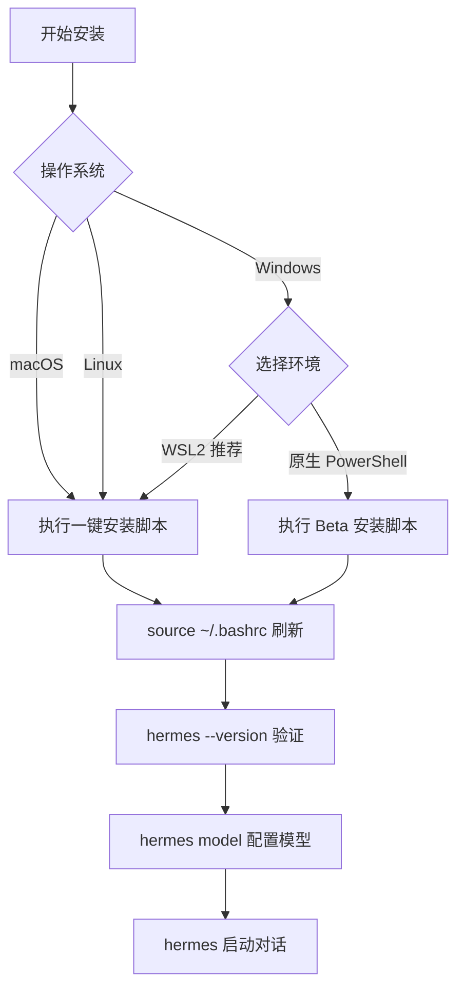

# Hermes Agent 安装教程


你是否遇到过这些问题——AI 智能体装了一堆，但每次对话都"失忆"？换了模型就得重新配置？想接入飞书/钉钉却无从下手？Hermes Agent 正是为解决这些痛点而生。它是一款开源自进化 AI 智能体，支持持久记忆、技能自动沉淀、200 + 模型一键切换，可接入飞书 / 钉钉等 15 + 平台。本文从环境准备、多平台安装、配置验证到更新卸载，提供全流程实操指南，适配国内网络环境，兼顾新手与进阶用户。

## 一、核心优势与同类工具对比

安装前先明确 Hermes Agent 定位，区别于主流 AI 工具：

### 1. Hermes Agent 核心特点

- ✅ 自进化闭环：基于 GEPA 引擎，自动提炼技能、优化能力

- ✅ 全模型兼容：支持国产（智谱、Kimi）+ 海外（OpenAI、Cla）+ 本地（Ollama）模型

- ✅ 多平台网关：一键接入飞书、钉钉、企业微信

- ✅ 安全沙箱：支持 Docker/SSH 隔离执行，保障安全

### 2. 与同类工具关键对比

|对比维度|Hermes Agent|Claude Code|OpenAI Codex|OpenClaw（龙虾）|
|---|---|---|---|---|
|核心定位|通用自进化 Agent（全场景）|专用编码 Agent（仅代码）|轻量编码 Agent（仅代码）|多平台网关 Agent（连接优先）|
|模型兼容性|200 + 模型（零锁定）|仅 Claude 系列|仅 OpenAI 系列|多模型但生态弱|
|记忆能力|三层持久记忆（跨会话）|会话记忆（无长期）|会话记忆（无长期）|基础文件记忆|
|技能机制|自动生成 + 优化|手动配置|手动配置|静态技能|
|国内适配|原生支持飞书 / 钉钉|无国内适配|无国内适配|支持微信 / QQ|

**选型建议**：

- 选 Hermes Agent：需全场景、长期记忆、不锁定模型

- 选 Claude Code：专注复杂代码开发

- 选 OpenClaw：优先多平台接入、无需自进化

## 二、系统与环境准备

### 1. 支持系统

- ✅ 完全支持：macOS、Linux（Ubuntu/Debian/Fedora）、Windows WSL2（推荐）

- ⚠️ Beta 支持：Windows 原生 PowerShell（兼容性一般）

- ❌ 不支持：Windows 原生 CMD、32 位系统

### 2. 基础依赖（仅需手动装 Git）

- Git（必需，2.0+ 版本）

- 自动安装：Python 3.11、Node.js v22、uv、ripgrep、ffmpeg

### 3. 国内网络提示

安装脚本默认走**国内镜像加速**，优先直连国内链路，精简外网依赖。

### 4. 依赖检查

```bash
git --version  # 输出版本即正常
```

**图1：Hermes Agent 多平台安装流程**



掌握了系统环境和依赖检查，接下来进入核心环节——根据你的操作系统选择对应的一键安装方式。

## 三、多平台一键安装（国内镜像，推荐）

### 1. macOS / Linux / WSL2（最稳）

```bash
curl -fsSL https://res1.hermesagent.org.cn/install.sh | bash
```

安装完成后刷新环境：

```bash
source ~/.bashrc  # bash 用户
```

### 2. Windows 原生 PowerShell（Beta）

以普通身份打开 PowerShell，执行：

```powershell
irm https://res1.hermesagent.org.cn/install.ps1 | iex
```

安装后**关闭并重启 PowerShell** 生效。

### 3. Android / Termux

```bash
curl -fsSL https://res1.hermesagent.org.cn/install.sh | bash
```

自动适配 Termux 环境，精简桌面依赖。

### 4. 验证安装

```bash
hermes --version  # 输出版本（v0.14+）成功
hermes doctor     # 自动检测依赖/配置问题
```

安装验证通过后，还需要配置大模型才能开始对话。以下是安装后必须完成的基础配置。

## 四、安装后基础配置

### 1. 配置大模型（必做）

```bash
hermes model  # 交互式选择模型提供商
```

#### 国内模型（无海外网络）

- 智谱 GLM：设置 `ZHIPUAI_API_KEY`

- Kimi：设置 `KIMI_API_KEY`

- 阿里云通义千问：设置 `DASHSCOPE_API_KEY`

#### 本地模型（Ollama）

1. 安装 Ollama 并启动模型（如 Llama3）

2. 选择「Custom Endpoint」，输入 `http://localhost:11434/v1`

### 2. 配置文件说明

所有配置在 `~/.hermes/` 目录：

- `config.yaml`：主配置（工具 / 网关）

- `.env`：存储 API Key（权限设 600）

- `memories/`：持久记忆文件

- `skills/`：自动 / 手动技能

### 3. 首次启动对话

```text
hermes                    # 进入交互式会话
❯ 你好，帮我总结 Hermes 功能
```

以上是标准安装流程，满足多数场景。如果你需要从源码构建或生产环境部署，可以参考以下进阶安装方式。

## 五、进阶安装（手动 / Docker）

### 1. 手动安装（开发者）

```bash
git clone --recurse-submodules https://github.com/NousResearch/hermes-agent.git
cd hermes-agent

uv venv --python 3.11
source .venv/bin/activate  # Linux/macOS

uv pip install -e ".[all]"

echo 'export PATH="$HOME/.local/bin:$PATH"' >> ~/.bashrc
source ~/.bashrc
```

### 2. Docker 部署（生产环境）

```bash
docker pull nousresearch/hermes-agent:latest

docker run -d \
  --name hermes \
  --restart unless-stopped \
  -v ~/.hermes:/opt/data \
  -e OPENROUTER_API_KEY=你的密钥 \
  nousresearch/hermes-agent gateway run
```

## 六、更新与卸载

### 1. 一键更新

```bash
hermes update  # 拉取最新代码、更新依赖、重启网关
```

### 2. 卸载

```bash
hermes uninstall  # 可选择保留配置文件
```

### 3. 手动清理

```bash
rm -rf ~/.local/bin/hermes
rm -rf ~/.hermes
rm -rf 安装目录/hermes-agent
```

## 七、常见问题排查

**问题1：hermes: command not found**
执行 `source ~/.bashrc`，或检查 `~/.local/bin` 是否加入 PATH。

**问题2：依赖下载失败（国内）**
切换网络，关闭代理 / VPN，或用清华镜像：

```bash
pip config set global.index-url https://pypi.tuna.tsinghua.edu.cn
```

**问题3：Windows PowerShell 编码错误**
管理员身份执行：

```powershell
reg add "HKLM\SYSTEM\CurrentControlSet\Control\Nls\CodePage" /v ACP /t REG_SZ /d 65001 /f
```

**问题4：WSL2 网络问题（本地模型连不上）**
用 WSL2 的 Windows 主机 IP 连接（如 `http://192.168.1.100:11434`）。

## 八、总结

Hermes Agent 安装核心是**国内镜像 + 环境适配**，新手优先用 WSL2 + 一键脚本，省心稳定。安装后配置国产模型即可直接使用，无需海外网络。后续可进阶配置消息网关、自定义技能、接入 MCP 工具，打造专属 AI 助手。
