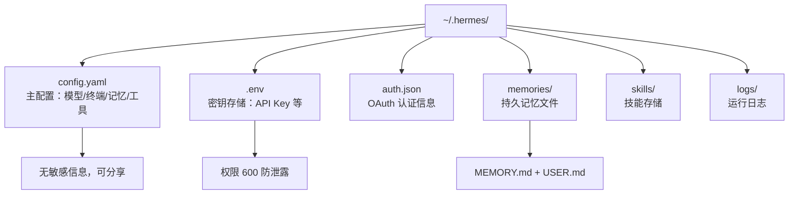
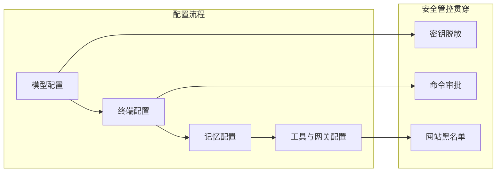

# Hermes Agent 配置教程：从基础到进阶


你是否遇到过这样的困境——AI 工具的配置项多到让人眼花缭乱，不知道该从何下手？或者刚配好模型，发现终端环境又不对，折腾半天还没跑通一个对话？Hermes Agent 的配置遵循"新手向导化、进阶模块化"原则，核心围绕 **模型选择、执行环境、记忆能力、工具集成** 四大模块。所有配置集中在 `~/.hermes/` 目录，支持交互式向导与手动编辑两种方式，兼顾新手易用性与进阶灵活性。本文从快速配置、核心模块详解、常用示例、问题排查四方面，带你完成全流程配置。

## 一、配置基础：文件与核心命令

### 1.1 配置文件结构

Hermes 所有配置默认存储在用户目录下的 `.hermes` 文件夹，核心文件分工明确：

```text
~/.hermes/
├── config.yaml       # 主配置（模型、终端、记忆、工具等，无密钥）
├── .env              # 密钥存储（API Key、令牌等，权限设为 600 防泄露）
├── auth.json         # OAuth 认证信息（如 Nous Portal、GitHub）
├── memories/          # 持久记忆文件（MEMORY.md、USER.md）
├── skills/            # 自动/手动技能存储
└── logs/              # 运行日志（密钥自动脱敏）
```

**图1：~/.hermes/ 配置目录架构**



### 1.2 核心配置命令（新手首选）

无需手动编辑文件，通过 `hermes config` 系列命令快速管理：

```bash
hermes config show

hermes config edit

hermes config set 配置键 配置值
hermes config set model deepseek/deepseek-chat
hermes config set terminal.backend docker
hermes config set DEEPSEEK_API_KEY sk-xxx  # 自动存入 .env

hermes config check

hermes config migrate
```

### 1.3 快速配置向导（setup）

新手推荐直接用一体化向导，10 分钟完成全配置：

```bash
hermes setup
```

向导会依次引导：**选择模型 → 配置终端后端 → 启用工具 → 接入消息平台（飞书 / 钉钉）**，全程交互式选择，无需手动写配置。

**图2：核心配置模块关联总览**



## 二、核心模块配置详解

### 2.1 模型配置（最关键）

Hermes 支持 **主模型（核心推理）+ 辅助模型（侧任务）** 分离配置，支持 200+ 模型，国产 / 海外 / 本地全覆盖。

#### 2.1.1 主模型配置（3 种方式）

1. **交互式选择（推荐）**

```bash
hermes model
```

2. **命令行快速设置**

```bash
hermes config set model deepseek/deepseek-chat
hermes config set DEEPSEEK_API_KEY sk-xxx

hermes config set model anthropic/claude-sonnet-4
hermes config set ANTHROPIC_API_KEY sk-ant-xxx

hermes config set model ollama/llama3
hermes config set OPENAI_BASE_URL http://localhost:11434/v1
```

3. **手动编辑 config.yaml**

```yaml
model:
  default: deepseek/deepseek-chat  # 默认主模型
  provider: deepseek                # 提供商
```

#### 2.1.2 辅助模型配置（进阶）

辅助模型用于**图像分析、网页摘要、对话压缩、技能搜索**等轻量任务，用低成本模型节省主模型开销：

```yaml
auxiliary:
  vision:
    provider: openai
    model: gpt-4o-mini
  compression:
    provider: deepseek
    model: deepseek-v4-flash
  web_extract:
    provider: google
    model: gemini-2.5-flash
```

### 2.2 终端后端配置（执行环境）

控制 Hermes 命令 / 代码的执行位置，支持 7 种后端，兼顾安全与灵活性。

#### 常用后端配置

1. **本地执行（默认，新手）**

```yaml
terminal:
  backend: local  # 直接在当前机器执行，无隔离
  timeout: 300    # 命令超时（秒）
```

2. **Docker 沙箱（安全推荐）**

```yaml
terminal:
  backend: docker
  docker_image: nousresearch/hermes-sandbox:latest  # 官方安全镜像
  docker_volumes:  # 挂载本地目录（项目/数据）
    - "~/projects:/workspace"
    - "~/data:/data:ro"  # 只读挂载
  container_memory: 5120  # 内存限制（MB）
```

3. **SSH 远程（服务器执行）**

```yaml
terminal:
  backend: ssh
  ssh_host: 192.168.1.100  # 远程服务器IP
  ssh_user: ubuntu
  ssh_key: ~/.ssh/id_rsa    # 私钥路径
```

### 2.3 记忆配置（自进化核心）

Hermes 支持**三层持久记忆**，跨会话保存用户偏好、项目背景，配置如下：

```yaml
memory:
  memory_enabled: true          # 启用持久记忆
  user_profile_enabled: true    # 启用用户画像
  memory_char_limit: 2200       # 记忆文件上限（字符）
  user_char_limit: 1375         # 用户画像上限（字符）
  retrieval_threshold: 0.7      # 记忆检索相似度阈值
```

### 2.4 工具与网关配置

#### 2.4.1 工具启用 / 禁用

控制 Hermes 可用工具（终端、文件、搜索、浏览器等）：

```bash
hermes tools
```

#### 2.4.2 消息网关（接入飞书 / 钉钉）

一键接入国内主流平台，实现跨平台对话：

```bash
hermes gateway setup
```

飞书配置示例（`.env` 存储密钥）：

```text
FEISHU_APP_ID=cli_xxx
FEISHU_APP_SECRET=xxx
FEISHU_VERIFICATION_TOKEN=xxx
```

### 2.5 安全配置（必做）

保障命令执行、密钥安全，支持**命令审批、密钥脱敏、网站黑名单**：

```yaml
security:
  credential_redaction: true
  website_blocklist:
    enabled: true
    domains:
      - "*.local"
      - "192.168.0.0/16"
approvals:
  mode: manual
  timeout: 30
```

## 三、常用配置示例（开箱即用）

### 3.1 新手基础配置（国产模型 + 本地执行）

```yaml
model:
  default: deepseek/deepseek-chat
  provider: deepseek

terminal:
  backend: local
  timeout: 300

memory:
  memory_enabled: true
  user_profile_enabled: true

compression:
  enabled: true
  threshold: 0.8

DEEPSEEK_API_KEY=sk-xxx
```

### 3.2 进阶安全配置（Docker + 飞书 + 智能审批）

```yaml
model:
  default: zhipu/glm-4.5-air
  provider: zhipu

terminal:
  backend: docker
  docker_image: nousresearch/hermes-sandbox:latest
  docker_volumes:
    - "~/projects:/workspace"

memory:
  memory_enabled: true
  user_profile_enabled: true

approvals:
  mode: smart
  auto_approve_threshold: 0.2

ZHIPUAI_API_KEY=xxx
FEISHU_APP_ID=cli_xxx
FEISHU_APP_SECRET=xxx
```

## 四、配置验证与问题排查

### 4.1 验证配置生效

```text
hermes config show

hermes
❯ 帮我查询磁盘空间（测试终端工具）
❯ 总结2026大模型趋势（测试搜索+模型）

hermes doctor
```

### 4.2 常见问题排查

1. **模型调用失败（API Error）**

    - 检查 `.env` 密钥是否正确

    - 执行 `hermes config check` 补全配置

    - 国内模型确认无海外网络限制

2. **Docker 后端启动失败**

    - 确认 Docker 已启动：`docker info`

    - 检查镜像是否存在：`docker images | grep hermes-sandbox`

3. **飞书网关无响应**

    - 确认飞书应用权限（`im:message:read` 等）

    - 重启网关：`hermes gateway restart`

4. **记忆不生效**

    - 检查 `memory_enabled: true`

    - 查看 `~/.hermes/memories/` 是否生成文件

## 五、配置更新与迁移

### 5.1 配置更新

升级后自动检测并补全新增配置：

```bash
hermes update  # 升级并自动迁移配置
hermes config migrate  # 手动补全缺失配置
```

### 5.2 从 OpenClaw 迁移

一键迁移 OpenClaw 配置（记忆、技能、密钥）：

```bash
hermes claw migrate
```

## 六、总结

Hermes Agent 配置遵循 **“新手向导化、进阶模块化”** 原则，核心是**模型选择 + 执行环境 + 安全管控**。新手用 `hermes setup` 快速上手，进阶用户可手动编辑 `config.yaml` 定制记忆、网关、安全等模块。配置完成后，可通过 `hermes` 命令启动对话，验证工具与记忆能力，后续可按需扩展技能、接入 MCP 工具，打造专属 AI 助手。
