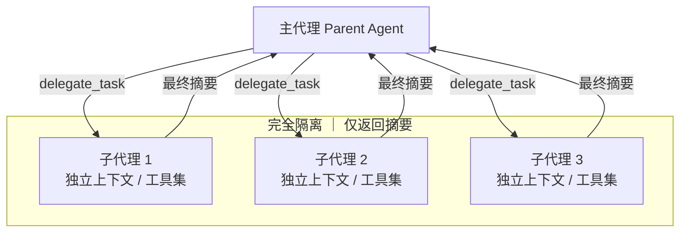
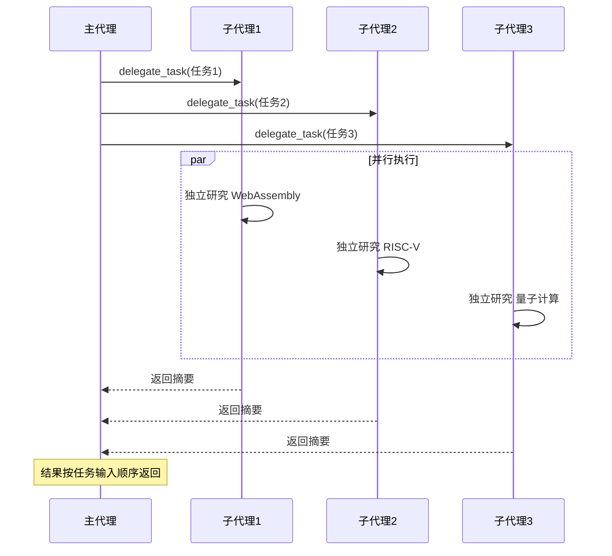

# Hermes Agent SubAgent 子代理使用教程


一个大型项目同时遇到代码 bug、文档错误和性能瓶颈，难道要逐一排队处理？如果能把不同任务同时交给多个 "AI 助手" 并行处理就好了。SubAgent（子代理）就是 Hermes Agent 为此提供的核心能力——通过 `delegate_task` 工具可将复杂、并行或隔离的任务委派给独立子代理执行，实现 **上下文隔离、并行处理、主会话轻量化**，大幅提升多任务处理效率与复杂问题解决能力。本文从核心原理、基础用法、并行任务、高级配置、实战场景到最佳实践，带你全面掌握 SubAgent 委派用法。

## 一、SubAgent 核心原理

### 1.1 什么是 SubAgent 委派

SubAgent 是**独立隔离的轻量级 Agent 实例**，通过 `delegate_task` 工具由主代理（父代理）创建，拥有独立上下文、终端会话与受限工具集，任务完成后仅将**最终摘要**返回给主代理，不污染主会话历史。

### 1.2 核心价值

- ✅ **上下文完全隔离**：子代理无父代理会话历史，避免上下文膨胀与干扰。

- ✅ **并行任务处理**：默认支持 3 个子代理并发，大幅提升多任务效率。

- ✅ **轻量化主会话**：仅返回关键结果，减少主会话 Token 消耗。

- ✅ **模型成本优化**：子代理可指定廉价模型，降低复杂任务推理成本。

- ✅ **风险隔离**：子代理独立执行，错误 / 异常不影响主代理。

### 1.3 关键特性

- **无记忆继承**：子代理完全 “空白”，仅继承父代理的 API 密钥与凭证配置。

- **工具集受限**：可自定义子代理可用工具，禁止递归委派、内存修改等高风险操作。

- **深度限制**：默认仅支持 1 级委派（父→子），防止无限递归。

- **中断传播**：主代理中断时，所有活跃子代理同步终止。

图1：SubAgent 委派架构图



从架构图可以看出，子代理完全隔离于主代理。下面从最基础的单个任务委派开始，掌握 SubAgent 的核心用法。

## 二、基础用法：单个任务委派

单个任务委派适用于**复杂调试、代码审查、单主题研究**等独立任务，子代理串行执行。

### 2.1 核心语法

```text
delegate_task(
    goal="任务目标（清晰具体）",
    context="任务上下文（完整背景、约束、依赖）",
    toolsets=["可用工具集"]
)
```

### 2.2 实操示例：代码调试委派

将测试失败调试任务委派给子代理，隔离执行环境：

```text
delegate_task(
    goal="调试 test_foo.py 第42行断言失败问题",
    context="项目路径：~/myproject，Python 3.11。错误：assertEqual 预期200实际500，接口/api/health 响应异常",
    toolsets=["terminal", "file"]
)
```

### 2.3 关键注意：上下文必须完整

子代理无父代理历史，**必须传递所有必要信息**，避免模糊描述：

- ❌ 错误：`goal="修复接口错误"`（无上下文，子代理无法执行）

- ✅ 正确：`goal="修复/api/health接口500错误" + 完整错误日志/项目信息`

单个任务委派解决了独立问题，而当需要同时处理多个不相关的任务时，并行委派能大幅提升效率。

## 三、高级用法：并行批量委派

并行批量委派支持**最多 3 个子代理同时执行**，适用于多主题研究、多文件重构、多模块审查等并行场景。

### 3.1 核心语法

```text
delegate_task(tasks=[
    {"goal="任务1", "context="上下文1", "toolsets=["工具集1"]},
    {"goal="任务2", "context="上下文2", "toolsets=["工具集2"]},
    {"goal="任务3", "context="上下文3", "toolsets=["工具集3"]}
])
```

### 3.2 实操示例：并行技术研究

同时委派 3 个子代理，分别研究 WebAssembly、RISC-V、量子计算 2025 进展：

```text
delegate_task(tasks=[
    {
        "goal": "研究2025年WebAssembly浏览器与非浏览器支持情况",
        "context": "重点：主流浏览器兼容性、Node.js/wasmtime运行时、语言支持（Rust/Go）",
        "toolsets": ["web"]
    },
    {
        "goal": "研究2025年RISC-V服务器与嵌入式 adoption 现状",
        "context": "重点：服务器芯片厂商、嵌入式生态、软件适配（Linux/RTOS）",
        "toolsets": ["web"]
    },
    {
        "goal": "研究2025年量子计算纠错与实际应用进展",
        "context": "重点：纠错技术突破、金融/材料应用、头部厂商路线",
        "toolsets": ["web"]
    }
])
```

### 3.3 并行任务特性

- **并发限制**：默认最大 3 个，可通过 `delegation.max_concurrent_children` 配置调整。

- **结果排序**：按任务输入顺序返回，与完成时间无关。

- **进度实时显示**：CLI 树状视图展示各子代理工具调用与完成状态。

图2：并行任务执行时序图



并行执行让效率倍增，但要想充分发挥 SubAgent 的潜力，还需要按需调整模型、工具集、超时等配置。

## 四、子代理配置与优化

### 4.1 自定义子代理模型

为子代理指定廉价 / 轻量模型，降低成本、提升速度：

```yaml
# ~/.hermes/config.yaml
delegation:
  model: "google/gemini-flash-2.0"  # 子代理专用模型
  provider: "openrouter"              # 模型提供商
```

### 4.2 工具集精细化控制

子代理默认禁止高风险工具，可按需配置可用工具集：

|工具集|适用场景|
|---|---|
|`\["terminal", "file"\]`|代码调试、文件编辑、构建任务|
|`\["web"\]`|研究、文档查询、事实核查|
|`\["file"\]`|只读代码审查、配置分析|
|`\["terminal"\]`|系统运维、进程管理|

**默认禁止工具**：`delegation`（递归）、`memory`（内存修改）、`send_message`（跨平台推送）。

### 4.3 迭代与超时控制

- **最大迭代**：限制子代理工具调用次数（默认 50），避免无限循环：

```text
delegate_task(
    goal="快速检查配置文件",
    context="查看~/config.yaml语法正确性",
    toolsets=["file"],
    max_iterations=10  # 限制10轮内完成
)
```

- **超时时间**：默认 600 秒（10 分钟），超时自动终止：

```yaml
delegation:
  child_timeout_seconds: 300  # 5分钟超时
```

### 4.4 嵌套委派（高级）

默认子代理不可递归委派，可通过 `role="orchestrator"` 开启二级委派（最多 3 层）：

```text
delegate_task(
    goal="统筹代码审查与修复",
    context="管理3个子代理：审查、修复、测试",
    toolsets=["terminal", "file"],
    role="orchestrator"  # 允许二级委派
)
```

配置优化完成后，将 SubAgent 应用到实际开发中，才能真正体现其价值。

## 五、实战场景示例

### 5.1 代码审查 + 修复（串行）

委派子代理审查认证模块并修复安全漏洞：

```text
delegate_task(
    goal="审查并修复Flask认证模块安全问题",
    context="项目路径：~/webapp，文件：src/auth/login.py/jwt.py。重点：SQL注入、JWT验证、密码处理，修复后执行pytest测试",
    toolsets=["terminal", "file"]
)
```

### 5.2 多文件重构（串行）

委派子代理批量替换 Python 项目 `print` 为日志模块：

```text
delegate_task(
    goal="重构src目录所有Python文件，替换print为logging",
    context="使用logging模块，按日志级别替换，不修改测试文件，重构后执行pytest验证",
    toolsets=["terminal", "file"]
)
```

### 5.3 系统巡检（并行）

并行委派 3 个子代理，分别检查 CPU、内存、磁盘状态：

```text
delegate_task(tasks=[
    {"goal": "检查服务器CPU使用率，超过90%告警", "context": "Linux系统，top命令", "toolsets":["terminal"]},
    {"goal": "检查内存占用，超过85%告警", "context": "free -h命令", "toolsets":["terminal"]},
    {"goal": "检查磁盘使用率，超过80%告警", "context": "df -h命令", "toolsets":["terminal"]}
])
```

通过实战可以看到，SubAgent 擅长需要推理的复杂任务，这与单纯的代码执行工具有本质区别。

## 六、SubAgent 与 execute_code 区别

|特性|SubAgent（delegate_task）|代码执行（execute_code）|
|---|---|---|
|**推理能力**|完整 LLM 推理，支持多步决策|仅执行脚本，无推理|
|**上下文**|独立会话，支持复杂背景|无会话，仅脚本执行|
|**并行性**|最多 3 个并发|单个执行|
|**适用场景**|需判断、推理的复杂任务|机械式脚本任务|
|**成本**|较高（LLM 调用）|较低（仅执行）|

理解了 SubAgent 与代码执行的定位差异后，最后总结几项最佳实践，帮你用得更加得心应手。

## 七、最佳实践与注意事项

### 7.1 最佳实践

1. **上下文完整化**：传递目标、背景、约束、依赖，避免模糊描述。

2. **模型分层**：简单任务用廉价模型，复杂任务用高性能模型。

3. **工具集最小化**：仅授予必要工具，降低安全风险。

4. **并行分组**：同类任务并行，避免跨类型干扰。

5. **结果精简**：子代理返回摘要，减少主会话冗余。

### 7.2 注意事项

1. **无记忆继承**：子代理完全空白，不继承父代理会话。

2. **不可递归**：默认禁止子代理再委派，避免无限循环。

3. **中断同步**：主代理中断时，所有子代理终止。

4. **结果汇总**：仅最终摘要返回，中间过程不污染主会话。

5. **安全隔离**：子代理独立执行，错误不影响主代理。

## 八、总结

SubAgent 委派是 Hermes Agent 多任务处理的核心能力，通过**上下文隔离、并行执行、成本优化**，可高效处理复杂调试、并行研究、批量重构等场景。合理配置模型、工具集与迭代限制，结合完整上下文传递，能最大化发挥子代理价值，大幅提升任务处理效率与主会话轻量化。


