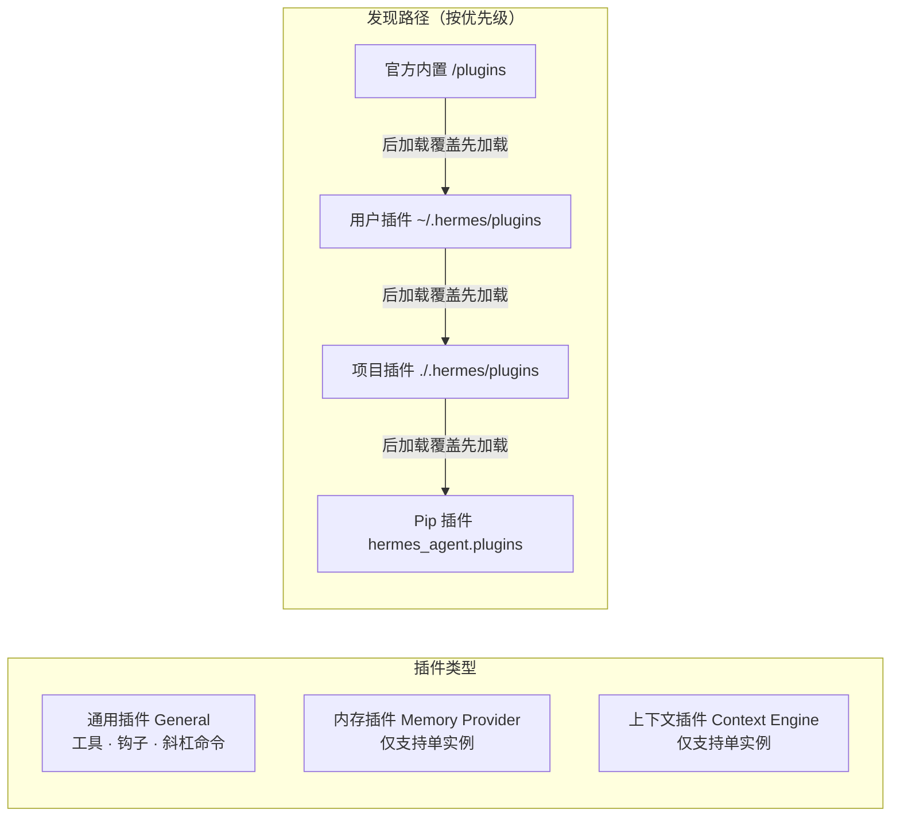

# Hermes Agent 插件使用教程


项目需求总在变，Agent 功能却”锁死”在框架里，改源码又怕升级时被覆盖？Hermes Agent 的插件系统正是为此而生——它是 **模块化扩展核心能力** 的关键机制，无需修改框架源码，即可自定义工具、事件钩子、命令与集成能力。插件遵循 **”低侵入、高兼容、可插拔”** 设计，支持用户自定义、项目专属、官方内置三类插件，覆盖工具扩展、流程自动化、第三方集成等全场景。本文从核心概念、插件管理、开发入门、内置插件、最佳实践五方面，带你全面掌握插件使用与开发。

## 一、插件核心概念

### 1.1 什么是插件

插件是 Hermes 的**扩展模块**，以独立目录形式存在，通过标准化配置与代码，向 Agent 注入自定义能力，完全解耦于核心框架，升级 / 替换不影响主程序运行。

### 1.2 插件类型

Hermes 插件分为三类，各司其职：

- **通用插件（General）**：自定义工具、钩子、斜杠命令，可组合启用。

- **内存插件（Memory Provider）**：替换 / 增强内置记忆系统，**仅支持单实例**。

- **上下文插件（Context Engine）**：替换内置上下文压缩能力，**仅支持单实例**。

### 1.3 插件发现路径

插件按优先级扫描，**后加载覆盖同名先加载插件**：

1. **官方内置**：框架自带插件（`/plugins`），默认禁用。

2. **用户插件**：个人专属（`~/.hermes/plugins`），全局生效。

3. **项目插件**：项目目录（`./.hermes/plugins`），需手动开启权限。

4. **Pip 插件**：通过 `hermes_agent.plugins` 入口点分发。

### 1.4 启用机制

插件**默认禁用**，需手动加入允许列表（`plugins.enabled`）才会加载。

图1：插件类型与发现路径图



理解了插件类型与发现机制后，接下来看看如何用 CLI 命令管理这些插件。

## 二、插件管理（CLI 命令）

Hermes 提供统一 CLI，实现插件全生命周期管理。

### 2.1 查看插件

```bash
# 交互式面板（空格勾选启用/禁用）
hermes plugins

# 列表模式（显示启用/禁用状态）
hermes plugins list
```

### 2.2 启用 / 禁用插件

```bash
# 启用单个插件
hermes plugins enable 插件名

# 禁用单个插件（加入拒绝列表）
hermes plugins disable 插件名
```

### 2.3 安装 / 更新 / 卸载

```bash
# 从 Git 安装（自动提示启用）
hermes plugins install 仓库名/插件名

# 安装并自动启用
hermes plugins install 仓库名/插件名 --enable

# 更新插件
hermes plugins update 插件名

# 卸载插件
hermes plugins remove 插件名
```

### 2.4 配置文件管理

插件状态持久化于 `~/.hermes/config.yaml`：

```yaml
plugins:
  enabled:    # 允许列表（启用的插件）
    - hello-world
    - disk-cleanup
  disabled:   # 拒绝列表（强制禁用）
    - noisy-plugin
```

配置管理是基础，但如果内置插件不满足需求，你可以自己动手开发一个插件。

## 三、插件开发入门（极简示例）

### 3.1 目录结构

最小插件仅需 4 个文件：

```text
~/.hermes/plugins/hello-world/
├── plugin.yaml   # 插件元数据
├── __init__.py   # 注册入口
├── schemas.py    # 工具模型（可选）
└── tools.py      # 工具逻辑
```

### 3.2 编写配置（plugin.yaml）

```yaml
name: hello-world
version: "1.0.0"
description: 极简示例插件（打招呼工具+日志钩子）
```

### 3.3 注册入口（**init**.py）

```python
import json

def register(ctx):
    # 1. 注册工具：hello_world
    tool_schema = {
        "name": "hello_world",
        "description": "向指定用户打招呼",
        "parameters": {
            "type": "object",
            "properties": {"name": {"type": "string", "description": "用户名"}},
            "required": ["name"]
        }
    }

    def handle_hello(params, **kwargs):
        name = params.get("name", "World")
        return json.dumps({"success": True, "greeting": f"Hello, {name}!"})

    ctx.register_tool(
        name="hello_world",
        toolset="hello-world",
        schema=tool_schema,
        handler=handle_hello,
        description="向用户打招呼"
    )

    # 2. 注册钩子：日志所有工具调用
    def log_tool_call(tool_name, params, result, **kwargs):
        print(f"[插件日志] 工具：{tool_name}，参数：{params}")

    ctx.register_hook("post_tool_call", log_tool_call)
```

### 3.4 启用测试

```bash
# 启用插件
hermes plugins enable hello-world

# 重启 Hermes 生效
hermes restart

# 调用工具
hermes chat "调用 hello_world 工具，name=Hermes"
```

自己动手开发了插件，再看看 Hermes 自带的几个实用插件，开箱即用。

## 四、官方内置插件

Hermes 自带实用内置插件，开箱即用。

### 4.1 disk-cleanup（磁盘清理）

**功能**：自动追踪并清理会话临时文件（测试脚本、缓存、日志）。

```bash
# 启用
hermes plugins enable disk-cleanup

# 手动清理
/disk-cleanup quick
```

### 4.2 observability/langfuse（可观测性）

**功能**：对接 Langfuse，追踪 LLM 调用、工具执行、会话链路。

```bash
# 交互式配置（推荐）
hermes tools → Langfuse → 输入密钥

# 启用
hermes plugins enable observability/langfuse
```

### 4.3 google_meet（会议助手）

**功能**：自动加入 Google Meet、实时转录、生成纪要。

```bash
# 启用并授权
hermes plugins enable google_meet
```

内置插件覆盖了常见需求，但如果要深度定制，就需要了解插件提供的核心扩展能力。

## 五、插件核心能力开发

### 5.1 自定义工具

通过 `ctx.register_tool` 注册自定义工具，支持参数校验、结果返回。

### 5.2 事件钩子

支持全生命周期钩子，拦截 / 增强 Agent 行为：

- `pre_tool_call`：工具执行前（拦截危险操作）

- `post_tool_call`：工具执行后（日志 / 统计）

- `pre_llm_call`：LLM 推理前（注入上下文）

- `on_session_end`：会话结束（清理资源）

### 5.3 斜杠命令

注册自定义会话命令，CLI / 网关均可调用：

```python
ctx.register_command(
    name="mycmd",
    handler=mycmd_handler,
    description="自定义命令"
)
```

掌握了插件的开发方式，最后总结几项最佳实践，帮你构建健壮的插件生态。

## 六、最佳实践

1. **权限控制**：项目插件需手动开启 `HERMES_ENABLE_PROJECT_PLUGINS=true`，仅信任仓库启用。

2. **命名规范**：插件名小写 + 连字符，避免冲突。

3. **精简设计**：单一插件聚焦单一能力，避免功能臃肿。

4. **安全优先**：插件钩子拦截高危工具（`rm -rf`、`sudo`）。

5. **版本管理**：插件标注版本，更新前测试兼容性。

## 七、总结

Hermes 插件系统以**模块化、低侵入、高扩展**为核心，覆盖自定义工具、事件钩子、第三方集成等场景，官方内置插件开箱即用，自定义插件开发极简。通过统一 CLI 管理，结合安全启用机制，可灵活扩展 Agent 能力，适配个性化、项目专属、复杂集成等各类需求，是 Hermes 生态扩展的核心基石。


