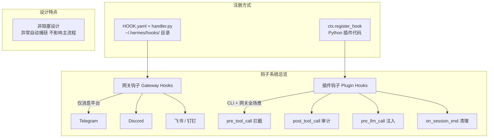

# Hermes Agent Hooks 钩子使用教程


写了一个安全过滤逻辑，不知道往哪塞？每次 Agent 执行工具调用都想记录日志，难道要改框架源码？Hermes Agent Hooks（钩子）就是为解决这类问题而生的 **生命周期回调系统**，允许在智能体运行的关键节点注入自定义逻辑，实现日志审计、安全拦截、消息告警、上下文注入等扩展能力。本文从钩子类型、核心事件、开发流程、实战示例到最佳实践，带你全面掌握 Hooks 用法，灵活扩展 Agent 功能。

## 一、钩子系统总览

Hermes 提供**两套独立钩子系统**，覆盖网关与全会话场景，均为**非阻塞设计**—— 钩子报错不会导致 Agent 崩溃，仅记录日志。

### 1.1 网关钩子（Gateway Hooks）

- **运行环境**：仅网关（Telegram/Discord/ 飞书等消息平台）生效。

- **注册方式**：`~/.hermes/hooks/` 目录下创建 `HOOK.yaml` + `handler.py`。

- **核心场景**：网关启动、会话管理、命令监控、消息告警。

### 1.2 插件钩子（Plugin Hooks）

- **运行环境**：CLI + 网关全场景生效。

- **注册方式**：Python 插件中通过 `ctx.register_hook()` 代码注册。

- **核心场景**：工具拦截、LLM 上下文注入、会话生命周期管理。

### 1.3 核心价值

- ✅ **无侵入扩展**：无需修改 Agent 核心代码，按需注入逻辑。

- ✅ **全链路可控**：覆盖会话启动、工具调用、LLM 推理、会话结束全流程。

- ✅ **高稳定性**：钩子异常自动捕获，不影响主流程。

- ✅ **灵活适配**：支持日志、告警、安全、集成等多场景扩展。

图1：钩子系统架构图



清楚了钩子的整体架构，先从网关钩子入手，看它如何在消息平台中发挥作用。

## 二、网关钩子（Gateway Hooks）

网关钩子仅在消息平台网关运行，适合监控网关级事件、发送平台告警。

### 2.1 目录结构

每个网关钩子为独立目录，存放于 `~/.hermes/hooks/`：

```text
~/.hermes/hooks/
└── task-alert/          # 钩子名称
    ├── HOOK.yaml         # 事件配置
    └── handler.py        # 逻辑处理
```

### 2.2 配置文件（HOOK.yaml）

声明监听的事件，支持单事件 / 多事件 / 通配符：

```yaml
name: task-alert
description: 长任务执行告警
events:
  - agent:step  # 监听工具调用迭代事件
```

### 2.3 处理脚本（\[handler.py\](handler.py)）

实现钩子逻辑，需固定 `handle` 函数，支持同步 / 异步：

```python
import os
import httpx
from datetime import datetime

# 从环境变量读取 Telegram 配置
BOT_TOKEN = os.getenv("TELEGRAM_BOT_TOKEN")
CHAT_ID = os.getenv("TELEGRAM_HOME_CHANNEL")
THRESHOLD = 10  # 超过10步触发告警

async def handle(event_type: str, context: dict):
    # 获取当前迭代次数
    iteration = context.get("iteration", 0)
    if iteration == THRESHOLD and BOT_TOKEN and CHAT_ID:
        # 构造告警消息
        tools = ", ".join(context.get("tool_names", []))
        msg = f"⚠️ 任务执行超过{iteration}步，最近工具：{tools}"
        # 发送 Telegram 告警
        async with httpx.AsyncClient() as client:
            await client.post(
                f"https://api.telegram.org/bot{BOT_TOKEN}/sendMessage",
                json={"chat_id": CHAT_ID, "text": msg}
            )
```

### 2.4 常用网关事件

|事件|触发时机|核心上下文|
|---|---|---|
|`gateway:startup`|网关启动|激活平台列表|
|`session:start`|新会话创建|用户 ID、会话 ID|
|`agent:start`|Agent 开始处理消息|消息内容、用户信息|
|`agent:step`|工具调用迭代|迭代次数、工具列表|
|`agent:end`|Agent 处理完成|最终响应、会话信息|
|`command:*`|任意斜杠命令|命令名称、参数|

### 2.5 实战示例：启动自检钩子

创建 `boot-check` 钩子，网关启动时自动执行自检：

1. **创建 HOOK.yaml**

```yaml
name: boot-check
description: 网关启动自检
events:
  - gateway:startup
```

2. **创建 \[handler.py\](handler.py)**

```python
import subprocess
from pathlib import Path

BOOT_FILE = Path.home() / ".hermes/BOOT.md"

def handle(event_type: str, context: dict):
    if not BOOT_FILE.exists():
        return
    # 执行自检脚本
    subprocess.run(["hermes", "chat", "--quiet", BOOT_FILE.read_text()])
```

3. **创建自检文件（~/.hermes/\[BOOT.md\](BOOT.md)）**

```text
1. 检查定时任务状态：hermes cron list
2. 发送启动通知到飞书
```

4. **生效**：重启网关 `hermes gateway restart`

网关钩子专注于消息平台场景，而插件钩子则覆盖 CLI 和网关的全会话场景。

## 三、插件钩子（Plugin Hooks）

插件钩子基于 Python 插件开发，CLI / 网关全场景生效，适合工具拦截、上下文注入。

### 3.1 注册方式

在插件 `register()` 函数中，通过 `ctx.register_hook()` 注册钩子：

```python
def register(ctx):
    # 注册工具调用前钩子
    ctx.register_hook("pre_tool_call", warn_dangerous_tool)
    # 注册LLM推理前钩子
    ctx.register_hook("pre_llm_call", inject_memory)
    # 注册会话结束钩子
    ctx.register_hook("on_session_end", cleanup_session)
```

### 3.2 核心插件钩子

#### 1. `pre_tool_call`（工具调用前）

- **触发时机**：每次工具执行前。

- **核心用途**：安全拦截、工具审计。

- **回调示例**：

```python
def warn_dangerous_tool(tool_name: str, **kwargs):
    # 拦截危险工具
    if tool_name in ["terminal", "write_file"]:
        print(f"⚠️ 即将执行高危工具：{tool_name}")
```

#### 2. `pre_llm_call`（LLM 推理前）

- **触发时机**：每轮对话推理前。

- **核心用途**：注入记忆、安全护栏。

- **回调示例**：

```python
def inject_memory(**kwargs):
    # 注入用户偏好
    return {"context": "用户偏好简洁回答，使用Python开发"}
```

#### 3. `on_session_start`（会话开始）

- **触发时机**：新会话创建时。

- **核心用途**：初始化会话状态。

#### 4. `on_session_end`（会话结束）

- **触发时机**：会话结束时。

- **核心用途**：清理资源、同步会话数据。

### 3.3 实战示例：工具审计钩子

注册 `post_tool_call` 钩子，记录所有工具调用：

```python
import json
from datetime import datetime

# 工具调用后回调
def audit_tool(tool_name: str, args: dict, result: str, **kwargs):
    log = {
        "time": datetime.now().isoformat(),
        "tool": tool_name,
        "args": args,
        "result": result[:200]  # 截断结果
    }
    # 写入日志
    with open("tool-audit.log", "a") as f:
        f.write(json.dumps(log) + "\n")

# 插件注册
def register(ctx):
    ctx.register_hook("post_tool_call", audit_tool)
```

插件钩子覆盖了核心场景，但 Hermes 还提供了 Shell 钩子、优先级控制等高级能力。

## 四、高级用法

### 4.1 Shell 钩子（无代码）

无需 Python 开发，通过配置文件注册 Shell 脚本钩子：

```yaml
# ~/.hermes/config.yaml
hooks:
  post_tool_call:
    - matcher: "terminal"  # 匹配终端工具
      command: "~/scripts/audit-terminal.sh"  # 脚本路径
```

### 4.2 钩子优先级

- **插件钩子 > Shell 钩子 > 网关钩子**。

- 同类型钩子按目录名 / 注册顺序执行。

### 4.3 错误处理

- 钩子异常自动捕获，仅记录日志，不影响主流程。

- `pre_llm_call` 钩子可注入上下文，其他钩子返回值忽略。

回顾了全部用法后，最后总结几项最佳实践，帮你科学地运用钩子系统。

## 五、最佳实践

1. **网关钩子**：专注网关级事件（启动、会话、平台告警）。

2. **插件钩子**：优先使用插件钩子，覆盖全场景。

3. **轻量逻辑**：钩子逻辑保持精简，避免耗时操作。

4. **安全优先**：`pre_tool_call` 拦截高危工具，防止误操作。

5. **日志审计**：关键事件（工具调用、命令执行）添加日志钩子。

## 六、总结

Hermes Hooks 钩子系统是 Agent 扩展的核心能力，网关钩子适配消息平台，插件钩子覆盖全场景，支持日志、告警、安全、集成等多场景扩展。通过简单配置或 Python 插件，即可无侵入注入自定义逻辑，灵活适配复杂业务需求。合理运用钩子，可大幅增强 Agent 的可控性与扩展性，打造个性化智能体。


