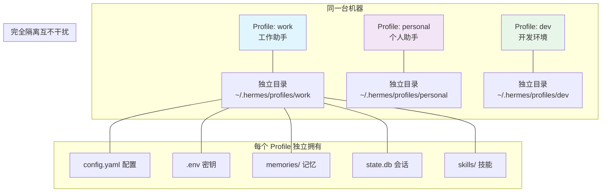
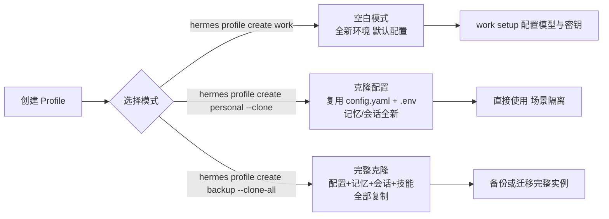

# Hermes Agent Profiles：多实例配置教程


## 一、什么是 Profiles（多配置）

你是否希望工作助手和个人助手"各过各的"，互不干扰？或者在同一个机器上同时运行飞书、钉钉、Telegram 三个机器人，彼此数据完全隔离？**Profiles（配置文件）** 就是 Hermes Agent 为此设计的核心隔离能力，允许在同一台机器上运行 **多个完全独立的 Agent 实例**，每个实例拥有专属配置、密钥、记忆、会话与技能，互不干扰。

简单来说：**一个 Profile = 一个独立的 AI 助手**，可分别用于工作、个人、开发、客户等不同场景，数据与权限完全隔离。

### 1.1 Profile 隔离核心

每个 Profile 对应独立目录（默认路径 `~/.hermes/profiles/\[配置名\]`），包含：

- 独立配置：`config.yaml`（模型、工具、网关设置）

- 独立密钥：`.env`（API Key、机器人令牌）

- 独立记忆：`memories/`（\[MEMORY.md\](MEMORY.md)、\[USER.md\](USER.md)）

- 独立会话：`state.db`（SQLite 会话数据库）

- 独立技能：`skills/`（自动 / 手动技能）

图1：Profile 隔离概念图



### 1.2 核心价值

- ✅ **场景隔离**：工作 / 个人 / 开发分开，数据不混淆

- ✅ **多机器人**：同时运行飞书、钉钉、Telegram 独立机器人

- ✅ **权限隔离**：不同 Profile 使用不同 API 密钥，避免权限泄露

- ✅ **快速切换**：一键切换不同角色 / 场景，无需重新配置

了解了隔离原理与核心价值，接下来动手创建你的第一个 Profile。

## 二、快速上手：创建与使用 Profile

### 2.1 创建 Profile（3 种模式）

#### （1）空白 Profile（全新环境）

```bash
# 创建名为 "work" 的空白配置
hermes profile create work
```

生成独立目录，默认配置，后续通过 `work setup` 配置模型与密钥。

#### （2）克隆配置（复用默认设置）

```bash
# 克隆默认 Profile 的配置/密钥，记忆/会话全新
hermes profile create personal --clone
```

复用 `config.yaml` 与 `.env`，适合快速创建同模型、不同场景的 Profile。

#### （3）完整克隆（备份 / 复制实例）

```bash
# 克隆默认 Profile 的所有数据（配置+记忆+会话+技能）
hermes profile create backup --clone-all
```

完整复制实例，适合备份或复制已有上下文的 Agent。

图2：Profile 创建流程



### 2.2 切换 Profile（3 种方式）

#### （1）临时切换（单次命令）

```bash
# 使用 "work" Profile 执行命令
hermes -p work chat
hermes --profile personal model
```

#### （2）设为默认（全局生效）

```bash
# 设 "work" 为默认 Profile
hermes profile use work

# 后续命令默认使用 work
hermes chat
hermes gateway start
```

#### （3）别名快捷切换（推荐）

创建别名后直接用简称操作：

```bash
# 为 work 创建别名 "w"
hermes profile alias work w

# 使用别名
w chat
w gateway start
```

### 2.3 验证 Profile 状态

```bash
# 查看当前 Profile
hermes profile

# 列出所有 Profile
hermes profile list

# 查看 Profile 详情（配置/记忆/会话）
hermes profile show work
```

掌握了创建和切换方法，日常使用中还需要对 Profile 进行各种管理操作。

## 三、核心操作：管理 Profile

### 3.1 列出与查看

```bash
# 列出所有 Profile（名称/别名/会话数/最后使用）
hermes profile list

# 查看 Profile 详细配置
hermes profile show work
```

### 3.2 重命名与别名

```bash
# 重命名 Profile
hermes profile rename work dev-team

# 设置/修改别名
hermes profile alias dev-team dt
```

### 3.3 导出与导入（备份 / 迁移）

#### （1）导出 Profile

```bash
# 导出 work 为压缩包（含配置+记忆+会话）
hermes profile export work --output ~/backup/work.tar.gz
```

#### （2）导入 Profile

```bash
# 导入备份包（恢复实例）
hermes profile import ~/backup/work.tar.gz
```

### 3.4 删除 Profile

```bash
# 删除指定 Profile（需确认）
hermes profile delete work

# 强制删除（无需确认）
hermes profile delete work --yes
```

⚠️ 无法删除默认 Profile（`~/.hermes`）。

命令管理掌握之后，来看看几个真实场景下的多实例配置方案。

## 四、场景化配置：多实例实战

### 4.1 场景 1：工作 vs 个人隔离

- **工作 Profile**：使用企业模型，接入公司飞书，存储工作记忆

```bash
hermes profile create work
work setup  # 配置智谱/DeepSeek 企业密钥
work gateway setup  # 接入公司飞书
```

- **个人 Profile**：使用个人模型，接入私人微信，存储生活记忆

```bash
hermes profile create personal --clone
personal setup  # 配置 Kimi 个人密钥
personal gateway setup  # 接入个人微信
```

### 4.2 场景 2：多机器人并行

同时运行飞书、钉钉、Telegram 独立机器人，互不冲突：

```bash
# 飞书机器人
hermes profile create feishu
feishu gateway setup

# 钉钉机器人
hermes profile create ding
ding gateway setup

# Telegram 机器人
hermes profile create tg
tg gateway setup
```

### 4.3 场景 3：开发 vs 生产

- **开发 Profile**：本地模型（Ollama），调试工具，测试记忆

```bash
hermes profile create dev
dev config set model ollama/llama3
```

- **生产 Profile**：云端模型，正式网关，生产记忆

```bash
hermes profile create prod
prod config set model anthropic/claude-sonnet
```

场景化配置展示了 Profile 的灵活运用，接下来深入看看每个 Profile 的配置文件细节。

## 五、Profile 配置详解

每个 Profile 拥有独立配置文件，可单独修改：

### 5.1 核心配置文件

- 配置：`~/.hermes/profiles/work/config.yaml`

- 密钥：`~/.hermes/profiles/work/.env`

- 个性：`~/.hermes/profiles/work/SOUL.md`

### 5.2 常用配置修改

```bash
# 修改 work 的模型
work config set model deepseek/deepseek-chat

# 修改 work 的终端后端（Docker 沙箱）
work config set terminal.backend docker

# 编辑 work 的个性描述
echo "你是专业的开发助手" > ~/.hermes/profiles/work/SOUL.md
```

### 5.3 网关独立配置

每个 Profile 可配置独立网关令牌，避免冲突：

```bash
# 编辑 work 的飞书密钥
nano ~/.hermes/profiles/work/.env
# 写入：FEISHU_APP_ID=xxx
```

配置详解让你可以精细调整每个 Profile，最后总结一些最佳实践和注意事项。

## 六、最佳实践与注意事项

### 6.1 最佳实践

1. **按场景命名**：`work`/`personal`/`dev`，清晰易识别

2. **合理克隆**：同模型场景用 `--clone`，备份用 `--clone-all`

3. **别名快捷化**：为常用 Profile 设置短别名，提升效率

4. **定期备份**：重要 Profile 定期导出，防止数据丢失

5. **权限隔离**：不同场景使用不同 API 密钥，降低泄露风险

### 6.2 注意事项

1. **完全隔离**：Profile 间配置、记忆、会话**互不共享**

2. **网关独立**：每个 Profile 网关为独立进程，令牌不冲突

3. **默认保护**：默认 Profile 无法删除，避免误操作

4. **更新同步**：`hermes update` 会同步所有 Profile 的技能

## 七、总结

Profiles 是 Hermes Agent 的**多实例核心能力**，通过环境隔离实现场景化 AI 助手，兼顾数据安全与使用灵活性。无论是工作 / 个人隔离、多机器人并行，还是开发 / 生产分离，Profiles 都能一键创建、快速切换，让一个机器同时运行多个专属 AI 助手。

下一步可结合**网关配置、技能定制**，为每个 Profile 打造专属能力，充分释放多实例价值。

