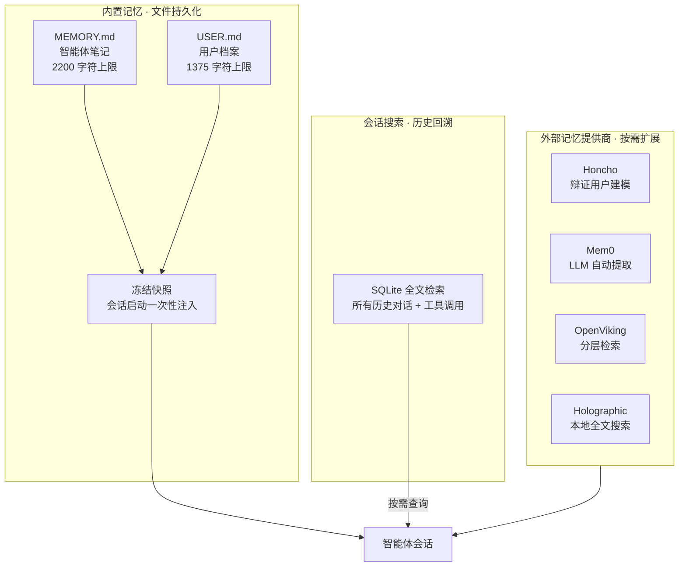

# Hermes Agent 记忆使用教程

每次对话都要重新交代一遍项目背景和个人偏好，这种重复让人不胜其烦。Hermes Agent 记忆（Memory）系统是实现**跨会话持久化、个性化交互**的核心能力，分为**内置文件记忆**与**外部记忆提供商**两部分。内置记忆开箱即用，轻量高效；外部记忆提供语义搜索、知识图谱等高级能力，可按需扩展。本文从核心原理、基础用法、高级配置到最佳实践，带你全面掌握记忆系统使用。

## 一、记忆系统核心原理

Hermes 采用**双文件内置记忆 + 可扩展外部记忆**架构，兼顾轻量易用与高级能力。

### 1.1 内置双文件记忆

默认在 `~/.hermes/memories/` 生成两个文件，各司其职：

- **\[MEMORY.md\](MEMORY.md)（智能体笔记）**：存储环境事实、项目配置、工具经验、任务进度，**2200 字符上限**（约 800 token）。

- **\[USER.md\](USER.md)（用户档案）**：存储用户偏好、技术背景、沟通风格、工作习惯，**1375 字符上限**（约 500 token）。

### 1.2 冻结快照注入机制

会话启动时，记忆以**冻结快照**形式一次性注入系统提示，会话内不再变更，兼顾性能与一致性：

```text
══════════════════════════════════════════════
MEMORY (智能体笔记) [67% — 1474/2200 chars]
══════════════════════════════════════════════
项目路径：~/code/hermes，技术栈：Go+React
环境：Ubuntu22.04，已安装Docker
§
USER PROFILE（用户档案）[42% — 577/1375 chars]
══════════════════════════════════════════════
职业：全栈开发，偏好简洁回答
技术栈：Go/Python/React，编辑器：VSCode
```

### 1.3 内置记忆 vs 会话搜索

- **内置记忆**：关键核心信息，会话必加载，**固定 token 成本**。

- **会话搜索**：所有历史对话（含工具调用）存 SQLite，支持全文检索，**按需查询**。

**图1：记忆系统架构**



## 二、内置记忆基础用法

无需额外配置，开箱即用，支持增删改查与容量管理。

### 2.1 记忆操作（对话直接执行）

#### 1. 添加记忆（add）

```text
请记住：我当前项目是Hermes文档站，技术栈VitePress+Vue3，部署在Vercel
```

#### 2. 替换记忆（replace）

通过**子字符串匹配**定位并更新：

```text
把记忆中"部署在Vercel"更新为"部署在阿里云"
```

#### 3. 删除记忆（remove）

```text
删除记忆中关于旧项目的内容
```

### 2.2 查看记忆文件

```bash
# 查看智能体笔记
cat ~/.hermes/memories/MEMORY.md

# 查看用户档案
cat ~/.hermes/memories/USER.md
```

### 2.3 容量管理

- **容量上限**：\[MEMORY.md\](MEMORY.md)（2200 字符）、\[USER.md\](USER.md)（1375 字符）。

- **超量处理**：记忆使用率超 80% 时，**合并冗余条目**，避免添加失败。

- **清理示例**：

```text
压缩MEMORY.md，删除已完成任务条目，保留项目核心信息
```

### 2.4 会话搜索（历史回溯）

```text
搜索我们之前讨论的Hermes部署方案
```

自动检索所有会话，返回摘要与原文链接。

## 三、外部记忆提供商（高级能力）

Hermes 支持**8 种外部记忆插件**，叠加内置记忆，提供语义搜索、知识图谱、自动提取等能力。

### 3.1 快速启用

```bash
# 交互式配置（推荐）
hermes memory setup

# 查看当前记忆状态
hermes memory status

# 禁用外部记忆
hermes memory off
```

### 3.2 主流提供商对比

|提供商|核心能力|存储方式|适用场景|
|---|---|---|---|
|**Honcho**|辩证用户建模、会话摘要|云端|多智能体协作、用户对齐|
|**OpenViking**|分层检索、自动事实提取|自托管|隐私优先、知识管理|
|**Mem0**|服务端 LLM 提取、自动去重|云端|长期对话、免手动管理|
|**Holographic**|本地全文搜索、信任评分|本地 SQLite|离线使用、高级检索|

### 3.3 配置示例（以 Mem0 为例）

1. 安装依赖并获取 API 密钥：

```bash
pip install mem0ai
```

2. 配置密钥：

```bash
echo "MEM0_API_KEY=your-key" >> ~/.hermes/.env
```

3. 启用提供商：

```bash
hermes memory setup  # 选择mem0
```

## 四、记忆配置与最佳实践

### 4.1 基础配置（config.yaml）

```yaml
memory:
  memory_enabled: true        # 启用内置记忆
  user_profile_enabled: true  # 启用用户档案
  memory_char_limit: 2200     # 智能体笔记上限
  user_char_limit: 1375       # 用户档案上限
  provider: mem0              # 外部提供商（可选）
```

### 4.2 最佳实践

#### 1. 记忆内容筛选

✅ **应保存**：项目配置、环境信息、用户偏好、关键决策。
❌ **应忽略**：琐碎对话、易搜索事实、大段代码 / 日志。

#### 2. 容量维护

- 使用率超 80% 时，**合并相似条目**。

- 定期清理已完成任务、过时配置。

#### 3. 安全规范

- 禁止存储**明文密钥、密码、敏感数据**。

- 记忆内容自动扫描注入攻击，拦截恶意内容。

## 五、常见问题排查

1. **记忆不生效**：确认 `memory_enabled: true`，重启会话。

2. **添加失败（超量）**：清理冗余条目后重试。

3. **外部记忆连接失败**：检查 API 密钥、网络连接，重启提供商。

4. **会话搜索无结果**：确认会话已保存，关键词精准。

## 六、总结

Hermes 记忆系统以**内置文件记忆为基础、外部提供商为扩展**，兼顾轻量易用与高级能力。日常对话用内置记忆即可满足个性化需求；长期知识管理、语义检索可启用外部提供商。合理维护记忆容量、规范内容质量，能显著提升交互连贯性与实用性。
