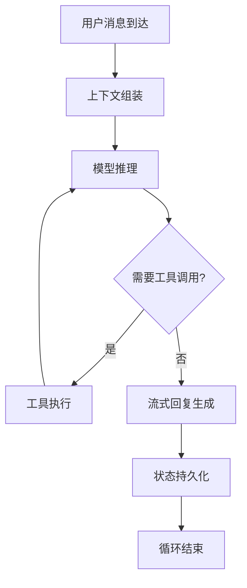

# OpenClaw 智能体运行时：设计原则与核心机制解析

OpenClaw 智能体运行时（Agent Runtime）是基于 **pi-mono** 派生的嵌入式智能体执行环境，作为 OpenClaw 系统的 "决策大脑"，承担用户意图理解、任务规划、工具调用与状态管理的核心职能。它通过单一工作区目录统一管理所有上下文与工具执行，以嵌入式方式深度集成于 Gateway 网关，实现会话全生命周期的精细化控制。本文基于官方概念文档，完整拆解智能体运行时的设计原则、核心机制、工作流程与最佳实践。

## 一、架构总览与核心定位

### 1.1 嵌入式集成架构

OpenClaw 智能体运行时采用**嵌入式而非独立进程**的集成模式，通过 pi SDK 直接导入并实例化 `AgentSession`，而非以子进程或 RPC 方式运行。这种设计带来三大核心优势：

- **会话全生命周期控制**：Gateway 统一管理会话创建、暂停、恢复与销毁，确保状态一致性

- **零开销工具注入**：原生支持消息渠道、沙箱执行、文件系统等系统级工具的无缝集成

- **实时事件响应**：直接接入 Gateway 事件循环，消除进程间通信延迟，实现毫秒级响应

### 1.2 核心拓扑关系

```Plain Text
用户消息 → Gateway → 会话路由 → Agent Runtime → 工具执行 → 结果返回
              ↑             ↓              ↓
        控制平面API    工作区持久化    模型提供者(OpenAI/Anthropic/Ollama)
```

- **单进程单运行时**：每台主机的 Gateway 进程内嵌一个智能体运行时，统一管理所有会话

- **多会话并行**：支持 `main` 主会话（常驻）与 `side` 子会话（临时沙箱）的并行管理

- **状态收敛**：运行时是会话状态的唯一事实源，所有上下文变更均通过运行时统一处理

## 二、工作区机制：智能体的 "数字工作间"

### 2.1 工作区核心概念

工作区（Workspace）是智能体运行时的**唯一工作目录（cwd）**，路径通过 `agents.defaults.workspace` 配置，默认位于 `~/.openclaw/workspace`。它承担三大核心职责：

- **上下文存储**：保存智能体的记忆、角色设定与操作指令

- **工具执行环境**：所有文件读写、脚本执行均限定在工作区内，保障系统安全

- **状态持久化**：对话历史、执行记录、模型输出等数据的持久化存储

### 2.2 标准工作区目录结构

```Plain Text
workspace/
├── AGENTS.md       # 操作指令 + 记忆系统（智能体行动指南）
├── SOUL.md         # 角色设定、边界、语气（智能体人格核心）
├── TOOLS.md        # 工具使用说明与权限声明
├── MEMORY.md       # 长期记忆库（自动更新）
├── logs/           # 执行日志目录（按日期归档）
├── data/           # 工具执行产生的数据文件
└── .openclaw/      # 系统配置与状态文件（自动维护）
```

### 2.3 工作区初始化与引导

- 推荐使用 `openclaw setup` 自动创建配置文件与初始化工作区文件

- 引导文件注入规则：

    - `AGENTS.md`：默认包含智能体操作指令模板与记忆管理规则

    - `SOUL.md`：预设通用人格模板，用户可自定义角色、语气与能力边界

    - `TOOLS.md`：列出可用工具及使用权限说明

- 禁用自动引导：设置 `agents.defaults.skipBootstrap: true` 可跳过工作区文件自动创建

## 三、智能体循环：决策执行的核心闭环

智能体循环（Agent Loop）是将用户消息转化为实际操作与回复的**原子执行单元**，遵循严格的串行化执行原则（每个会话同一时间仅运行一个循环）。完整流程如下：

### 3.1 标准循环流程



### 3.2 关键环节详解

1. **上下文组装**（Context Assembly）

    - 核心输入：用户消息 + [SOUL.md](SOUL.md)（人格） + [AGENTS.md](AGENTS.md)（指令） + [TOOLS.md](TOOLS.md)（工具） + 对话历史 + 系统提示词

    - 上下文压缩：自动截取最近对话与相关记忆，控制上下文窗口大小，平衡性能与准确性

2. **模型推理**（Model Inference）

    - 支持多模型提供商：OpenAI、Anthropic、Gemini、Ollama（本地部署）等

    - 动态模型选择：根据任务类型（代码生成、创意写作、数据分析）自动匹配最优模型

    - 流式输出：推理结果实时推送，无需等待完整响应

3. **工具执行**（Tool Execution）

    - 核心工具集：文件读写、系统执行、网络请求等默认内置

    - 技能扩展：通过 `agents.list[].skills` 配置启用额外技能，非空列表不会与默认值合并

    - 安全沙箱：所有工具执行均限定在工作区内，支持 `side` 会话隔离危险操作

4. **状态持久化**（Persistence）

    - 对话历史：以 JSONL 格式写入日志文件，支持历史回溯与分析

    - 记忆更新：自动更新 [MEMORY.md](MEMORY.md)，保留关键信息与长期记忆

    - 执行记录：完整记录工具调用参数、结果与耗时，便于问题排查

## 四、会话管理与并发控制

### 4.1 会话类型与生命周期

| 会话类型 | 特点 | 典型场景 | 生命周期 |
| --- | --- | --- | --- |
| `main` 主会话 | 常驻内存，加载完整人格 | 日常对话、任务执行 | 从 Gateway 启动到关闭 |
| `side` 子会话 | 临时沙箱，轻量级隔离 | 危险操作、多任务并行 | 任务完成后自动销毁 |

### 4.2 并发控制机制

- **会话级串行**：同一会话的消息按顺序执行，避免状态冲突

- **消息处理策略**：

    - 运行中消息：自动排队等待当前循环结束

    - 紧急消息：支持注入当前循环（需显式配置）

    - 批量消息：收集后合并处理，提升效率

- **资源限制**：可配置最大并发会话数与每个会话的最大执行时间，防止资源耗尽

## 五、技能系统：智能体的能力扩展

### 5.1 技能核心概念

技能是智能体的**能力扩展模块**，通过模块化设计实现功能按需启用，遵循最小权限原则。核心特点：

- **原子性**：每个技能专注单一功能，降低复杂度与安全风险

- **可组合性**：支持技能链式调用，实现复杂任务拆解

- **权限控制**：精细粒度的权限管理，明确限定技能可访问的资源

### 5.2 技能配置与管理

1. **配置方式**

    ```json
    {
      "agents": {
        "defaults": {
          "skills": ["file.read", "http.request", "code.execute"]
        },
        "list": [
          {
            "name": "dev-agent",
            "skills": ["git", "docker", "code.review"] // 覆盖默认值，非合并
          }
        ]
      }
    }
    ```

2. **常用命令**

    ```bash
    # 列出所有可用技能
    openclaw skills list
    
    # 启用/禁用技能
    openclaw skills enable code.execute
    openclaw skills disable http.request
    
    # 检查技能状态
    openclaw skills status
    ```

### 5.3 自定义技能开发

1. **技能开发规范**

    - 实现 `Skill` 接口，包含 `name`、`description`、`parameters`、`execute` 方法

    - 严格定义输入输出格式，便于模型理解与调用

    - 内置错误处理与回滚机制，保障系统稳定性

2. **技能注入流程**

    - 将技能文件放置在 `~/.openclaw/skills` 目录

    - 配置文件中启用技能

    - Gateway 重启后自动加载，无需修改核心代码

## 六、安全沙箱与权限控制

### 6.1 多层安全防护

1. **工作区隔离**：所有文件操作限制在工作区内，禁止访问系统目录

2. **权限最小化**：默认禁用高危操作（如系统命令执行），需显式启用

3. **会话隔离**：`side` 会话运行在独立沙箱，即使被攻击也不会影响主会话

4. **操作审计**：完整记录所有工具调用与系统交互，支持事后追溯

### 6.2 安全配置最佳实践

```json
{
  "agents": {
    "defaults": {
      "workspace": "/path/to/safe/workspace",
      "skills": ["file.read", "http.get"], // 仅启用必要技能
      "sandbox": {
        "enabled": true,
        "restrictNetwork": true, // 限制网络访问
        "restrictFs": true       // 限制文件系统访问
      }
    }
  }
}
```

## 七、与 Gateway 的深度集成

### 7.1 事件驱动交互

智能体运行时通过 Gateway 事件循环实现双向通信：

- **输入事件**：接收用户消息、定时任务、系统指令等

- **输出事件**：发送流式回复、工具执行结果、状态更新等

- **生命周期管理**：Gateway 统一控制会话创建、暂停、恢复与销毁

### 7.2 消息路由机制

```Plain Text
消息渠道(WhatsApp/Telegram) → Gateway → 会话路由 → Agent Runtime → 响应生成 → Gateway → 消息渠道
```

- 基于会话 ID 路由消息，确保上下文一致性

- 支持多渠道消息聚合，同一智能体可同时处理多个平台消息

- 消息优先级控制：支持紧急消息插队处理

## 八、性能优化与监控

### 8.1 性能优化策略

1. **上下文压缩**：

    - 自动截断历史对话，保留最近 5-10 轮关键信息

    - 记忆摘要：定期生成记忆摘要，减少上下文窗口占用

2. **模型选择优化**：

    - 简单任务使用轻量级模型（如 GPT-3.5），复杂任务使用高级模型（如 GPT-4）

    - 本地模型优先：在隐私敏感场景使用 Ollama 部署的本地模型

3. **缓存机制**：

    - 工具执行结果缓存：相同参数调用直接返回缓存结果

    - 模型推理缓存：重复查询自动命中缓存，降低 API 成本

### 8.2 监控与调试

1. **日志监控**

    ```bash
    # 实时查看智能体执行日志
    tail -f ~/.openclaw/logs/agent.log
    
    # 过滤工具调用记录
    grep "tool.call" ~/.openclaw/logs/agent.log
    ```

2. **健康检查**

    ```bash
    # 深度健康检查
    openclaw doctor --deep
    
    # 检查智能体运行状态
    openclaw agent status
    ```

3. **性能分析**

    - 内置性能分析工具，记录每个环节耗时（上下文组装、模型推理、工具执行）

    - 生成性能报告，帮助定位瓶颈并优化

## 九、最佳实践与常见问题

### 9.1 工作区管理最佳实践

1. **定期备份**：工作区包含所有智能体状态，建议每日备份

2. **版本控制**：对 [AGENTS.md](AGENTS.md)、[SOUL.md](SOUL.md) 等核心文件使用 Git 管理，便于回滚

3. **清理策略**：定期清理日志与临时文件，避免磁盘空间耗尽

### 9.2 常见问题解决

1. **智能体响应慢**

    - 检查模型选择：复杂任务是否使用了轻量级模型

    - 优化上下文：减少历史对话长度，启用记忆摘要

    - 检查工具执行：是否有耗时过长的工具调用

2. **工具调用失败**

    - 检查权限：是否启用了对应技能

    - 检查参数：是否符合工具要求格式

    - 检查工作区：是否有足够的读写权限

3. **记忆丢失**

    - 确认 [MEMORY.md](MEMORY.md) 文件是否存在并可写

    - 检查配置：是否禁用了记忆持久化功能

    - 检查工作区路径：是否配置正确

## 十、总结

OpenClaw 智能体运行时以**嵌入式架构**、**工作区机制**与**串行化智能体循环**为核心，构建了一个安全、可控、可扩展的智能体执行环境。它通过与 Gateway 的深度集成，实现了会话全生命周期管理与多渠道消息统一处理，同时支持技能扩展与安全沙箱隔离，为构建个性化 AI 助理提供了坚实基础。无论是日常对话、任务自动化还是复杂决策支持，OpenClaw 智能体运行时都能提供高效、可靠的执行能力，是 OpenClaw 系统的核心竞争力之一。
