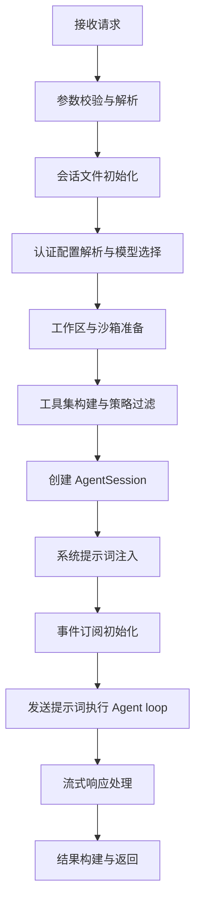

# OpenClaw Pi 集成架构设计

OpenClaw Pi 集成是将 **pi-coding-agent** 生态（pi-ai、pi-agent-core、pi-tui）深度嵌入 OpenClaw 网关消息架构的核心设计，通过**嵌入式 SDK 调用**而非子进程/RPC 模式，实现对 AI 智能体全生命周期的精细化控制，支持多渠道消息投递、自定义工具注入、会话持久化与故障转移，构建了一套高性能、可扩展的 AI 智能体运行环境。

## 一、架构概览与核心设计原则

### 1.1 架构定位

OpenClaw Pi 集成是 OpenClaw 网关的**智能体运行时核心**，负责将自然语言输入转换为工具执行、内容生成与消息回复，是连接消息渠道层与大模型能力层的关键桥梁。

### 1.2 核心设计原则

| 原则 | 说明 |
| --- | --- |
| **嵌入式集成** | 直接导入 pi SDK 并实例化 `AgentSession`，避免进程间通信开销 |
| **完全控制** | 接管会话生命周期、事件处理、工具执行全流程 |
| **多维度适配** | 支持渠道、上下文、提供商、模型的差异化配置 |
| **安全优先** | 沙箱隔离、工具权限控制、认证轮换机制保障运行安全 |
| **弹性扩展** | 模块化设计支持自定义工具、扩展插件、故障转移 |
| **流式优先** | 原生支持分块回复、实时反馈、Thinking 过程可视化 |

### 1.3 依赖关系与版本约束

OpenClaw 对 pi 生态包有明确的版本依赖，确保兼容性与稳定性：

```json
{
  "@mariozechner/pi-agent-core": "0.70.2",
  "@mariozechner/pi-ai": "0.70.2",
  "@mariozechner/pi-coding-agent": "0.70.2",
  "@mariozechner/pi-tui": "0.70.2"
}
```

| 包名 | 核心作用 |
| --- | --- |
| `pi-ai` | LLM 抽象层，提供 `Model` 接口、流式传输、消息类型定义 |
| `pi-agent-core` | Agent 循环核心、工具执行框架、`AgentMessage` 类型系统 |
| `pi-coding-agent` | 高层 SDK，包含 `createAgentSession`、`SessionManager`、`AuthStorage` |
| `pi-tui` | 终端 UI 组件，支持 OpenClaw 本地交互式模式 |

---

## 二、核心组件与文件结构

### 2.1 整体文件结构

```Plain Text
src/agents/
├── pi-embedded-runner.ts       # 嵌入式智能体主入口
├── pi-embedded-runner/         # 运行时核心模块
│   ├── run.ts                  # 主函数 runEmbeddedPiAgent()
│   ├── run/                    # 单次运行逻辑
│   ├── abort.ts                # 任务终止处理
│   ├── compact.ts              # 会话压缩逻辑
│   ├── extensions.ts           # 扩展加载
│   ├── model.ts                # 模型解析
│   └── system-prompt.ts        # 系统提示词构建器
├── pi-embedded-subscribe.ts    # 会话事件订阅
├── pi-embedded-block-chunker.ts # 流式分块处理器
├── pi-tools.ts                 # OpenClaw 工具集
├── pi-tool-definition-adapter.ts # 工具定义适配器
├── pi-hooks/                   # 自定义 pi 扩展钩子
│   ├── compaction-safeguard.ts # 压缩保护扩展
│   └── context-pruning.ts      # 上下文裁剪扩展
├── model-auth.ts               # 认证配置管理
├── system-prompt.ts            # 系统提示词构建
└── sandbox.ts                  # 沙箱集成模块
```

### 2.2 关键组件说明

1. **嵌入式运行器**（pi-embedded-runner）：智能体启动与执行核心，负责会话初始化、参数解析、结果构建

2. **事件订阅器**（pi-embedded-subscribe）：监听 pi 会话事件，实现流式输出与工具执行跟踪

3. **工具系统**（pi-tools + 适配器）：自定义工具集与 pi 工具定义的桥接层

4. **会话管理**（SessionManager + 缓存）：会话持久化与高效访问控制

5. **认证系统**（model-auth + auth-profiles）：多账户轮换与故障转移机制

6. **扩展钩子**（pi-hooks）：实现压缩保护、上下文裁剪等增强功能

7. **流式处理器**（pi-embedded-block-chunker）：管理分块回复与标签处理

---

## 三、核心集成流程详解

### 3.1 智能体启动流程（runEmbeddedPiAgent）

主流程入口为 `runEmbeddedPiAgent()`，完整流程如下：



核心代码示例：

```typescript
const result = await runEmbeddedPiAgent({
  sessionId: "user-123",
  sessionKey: "main:feishu:ou_xxx",
  sessionFile: "/path/to/session.jsonl",
  workspaceDir: "/path/to/workspace",
  config: openclawConfig,
  prompt: "帮我分析这个数据文件",
  provider: "anthropic",
  model: "claude-sonnet-4-6",
  timeoutMs: 120_000,
  onBlockReply: async (payload) => {
    await sendToFeishu(payload.text, payload.mediaUrls);
  },
});
```

### 3.2 会话创建与初始化

在 `runEmbeddedAttempt()` 中完成会话创建，使用 pi SDK 的核心接口：

```typescript
import { createAgentSession, SessionManager } from "@mariozechner/pi-coding-agent";

// 1. 会话管理器初始化
const sessionManager = SessionManager.open(params.sessionFile);
prewarmSessionFile(params.sessionFile); // 缓存预热

// 2. 资源加载器配置
const resourceLoader = new DefaultResourceLoader({
  cwd: resolvedWorkspace,
  agentDir,
  settingsManager,
  additionalExtensionPaths,
});
await resourceLoader.reload();

// 3. 创建 AgentSession
const { session } = await createAgentSession({
  cwd: resolvedWorkspace,
  agentDir,
  authStorage: params.authStorage,
  modelRegistry: params.modelRegistry,
  model: params.model,
  thinkingLevel: mapThinkingLevel(params.thinkLevel),
  tools: builtInTools,
  customTools: allCustomTools,
  sessionManager,
  settingsManager,
  resourceLoader,
});

// 4. 系统提示词注入
applySystemPromptOverrideToSession(session, systemPromptOverride);
```

### 3.3 事件订阅机制

通过 `subscribeEmbeddedPiSession()` 订阅 pi 会话的核心事件，实现实时响应与状态跟踪：

```typescript
const subscription = subscribeEmbeddedPiSession({
  session: activeSession,
  runId: params.runId,
  onToolResult: handleToolResult,
  onReasoningStream: handleReasoning,
  onBlockReply: handleBlockReply,
  onAgentEvent: handleAgentEvent,
});
```

订阅的关键事件类型：

| 事件类别 | 具体事件 | 用途 |
| --- | --- | --- |
| 消息流 | `message_start`/`message_update`/`message_end` | 流式文本与思维过程输出 |
| 工具执行 | `tool_execution_start`/`tool_execution_end` | 工具调用状态跟踪 |
| 会话生命周期 | `turn_start`/`turn_end`/`agent_start`/`agent_end` | 会话状态管理 |
| 压缩机制 | `compaction_start`/`compaction_end` | 上下文压缩监控 |

### 3.4 提示词发送与 Agent Loop

完成初始化后，发送用户提示并启动 pi 的 Agent 循环：

```typescript
// 图像注入（仅当前轮次）
const imageResult = await processImagesInPrompt(prompt);

// 执行 Agent loop
await session.prompt(effectivePrompt, { images: imageResult.images });
```

**关键特性**：

- 图像注入为**提示词局部**，仅在当前轮次传递，不重新扫描历史轮次

- Agent loop 自动处理 LLM 调用、工具执行、多轮对话

- 支持 Thinking 模式，输出中间推理过程

---

## 四、工具架构与扩展机制

### 4.1 工具流水线设计

OpenClaw 实现了多层级的工具处理流程，确保安全性与一致性：

```Plain Text
基础工具(pi) → 自定义替换 → OpenClaw工具 → 渠道工具 → 策略过滤 → Schema标准化 → Abort封装
```

1. **基础工具替换**：用 `exec`/`process` 替换默认 bash 工具，增强安全性

2. **OpenClaw 核心工具**：消息、浏览器、画布、会话管理、cron、网关操作等

3. **渠道特定工具**：针对飞书、Discord、Telegram 等渠道的定制操作

4. **策略过滤**：根据配置、沙箱、群组权限控制工具可用性

5. **Schema 标准化**：适配不同大模型的工具参数格式要求

6. **Abort 封装**：确保所有工具支持任务终止信号

### 4.2 工具定义适配器

解决 pi-agent-core 与 pi-coding-agent 的工具签名差异：

```typescript
export function toToolDefinitions(tools: AnyAgentTool[]): ToolDefinition[] {
  return tools.map((tool) => ({
    name: tool.name,
    description: tool.description ?? "",
    parameters: tool.parameters,
    execute: async (toolCallId, params, onUpdate, _ctx, signal) => {
      // 适配不同的 execute 签名
      return await tool.execute(toolCallId, params, signal, onUpdate);
    },
  }));
}
```

### 4.3 工具拆分策略

通过 `splitSdkTools()` 确保所有工具通过 `customTools` 传递，便于统一管理：

```typescript
export function splitSdkTools(options: { tools: AnyAgentTool[]; sandboxEnabled: boolean }) {
  return {
    builtInTools: [], // 禁用默认工具，完全使用自定义工具集
    customTools: toToolDefinitions(options.tools),
  };
}
```

---

## 五、会话管理与上下文优化

### 5.1 会话存储机制

OpenClaw 使用 **JSONL 格式的树状会话文件**，通过 id/parentId 维护对话历史，支持分支与回溯：

```typescript
// 会话文件路径
const sessionFile = path.join(agentDir, "sessions", `${sessionId}.jsonl`);
const sessionManager = SessionManager.open(sessionFile);
```

**会话缓存优化**：通过 `session-manager-cache.ts` 缓存 `SessionManager` 实例，避免重复文件解析，提升性能。

### 5.2 历史记录控制与上下文裁剪

1. **渠道差异化限制**：

    ```typescript
    // 私信保留更多历史，群组限制历史长度
    const maxTurns = isGroup ? 10 : 30;
    limitHistoryTurns(session, maxTurns);
    ```

2. **自动压缩机制**：

    - 触发条件：检测到上下文溢出错误（如 `context length exceeded`）

    - 处理逻辑：`compactEmbeddedPiSessionDirect()` 合并历史轮次，保留关键信息

    - 压缩保护：通过 `compaction-safeguard` 扩展确保重要信息不丢失

3. **缓存 TTL 裁剪**：
   通过 `context-pruning` 扩展实现基于时间的上下文清理，优先保留近期活跃内容。

---

## 六、认证与模型解析系统

### 6.1 多账户认证轮换

OpenClaw 实现了**认证配置存储 + 失败轮换**机制，提升可用性：

```typescript
// 1. 加载认证配置
const authStore = ensureAuthProfileStore(agentDir);
const profileOrder = resolveAuthProfileOrder({ cfg, store: authStore, provider });

// 2. 失败轮换逻辑
await markAuthProfileFailure({ store, profileId, reason });
const rotated = await advanceAuthProfile();
```

**核心优势**：

- 支持同一提供商多个 API 密钥配置

- 失败后自动切换到下一个可用配置

- 带冷却机制，避免无效重试

### 6.2 模型解析与故障转移

```typescript
import { resolveModel } from "./pi-embedded-runner/model.js";

const { model, error, authStorage, modelRegistry } = resolveModel(
  provider,
  modelId,
  agentDir,
  config,
);

// 故障转移触发
if (fallbackConfigured && isFailoverErrorMessage(errorText)) {
  throw new FailoverError(errorText, {
    reason: "rate_limit",
    provider,
    model: modelId,
  });
}
```

支持的故障转移场景：认证失败、速率限制、配额耗尽、超时等。

---

## 七、流式传输与分块回复

### 7.1 分块处理机制

`EmbeddedBlockChunker` 负责将流式文本分割为适合消息渠道的离散块：

```typescript
const blockChunker = new EmbeddedBlockChunker({
  maxBlockSize: 1000,
  coalesceDelayMs: 50,
});
```

### 7.2 标签处理与内容提取

1. **Thinking/Final 标签剥离**：

    ```typescript
    const { text, thinking } = stripBlockTags(chunk, state);
    ```

2. **回复指令解析**：
   支持提取特殊指令如 `[[media:url]]`、`[[voice]]`、`[[reply:id]]`，实现富媒体回复与引用功能。

### 7.3 流式输出优化

- **合并小分块**：通过 `coalesceDelayMs` 合并快速连续的小输出块，减少消息投递次数

- **实时反馈**：`onBlockReply` 回调实时推送处理结果到消息渠道

- **错误恢复**：支持中途错误时的平滑回退与重新尝试

---

## 八、沙箱集成与安全控制

### 8.1 沙箱隔离机制

启用沙箱模式后，工具执行与文件操作受到严格限制：

```typescript
const sandbox = await resolveSandboxContext({
  config: params.config,
  sessionKey: sandboxSessionKey,
  workspaceDir: resolvedWorkspace,
});

if (sandboxRoot) {
  // 使用沙箱隔离的文件工具
  tools = replaceFileToolsWithSandboxed(tools, sandboxRoot);
  // Exec 工具在容器中运行
  tools = replaceExecWithSandboxed(tools, sandboxConfig);
}
```

### 8.2 安全增强特性

| 安全机制 | 实现方式 |
| --- | --- |
| 路径限制 | 所有文件操作限于沙箱根目录 |
| 命令限制 | 仅允许预定义的安全命令集 |
| 网络隔离 | 可选限制外部网络访问 |
| 权限控制 | 基于用户/群组的工具权限过滤 |

---

## 九、与 Pi CLI 的关键差异

| 对比维度 | Pi CLI | OpenClaw 嵌入式集成 |
| --- | --- | --- |
| 调用方式 | 独立进程/RPC | 直接 SDK 实例化 `AgentSession` |
| 工具集 | 默认编码工具 | 自定义 OpenClaw 工具 + 渠道工具 |
| 系统提示词 | 固定 [AGENTS.md](AGENTS.md) | 动态生成（渠道/上下文/沙箱感知） |
| 会话存储 | `~/.pi/agent/sessions/` | `~/.openclaw/agents/<agentId>/sessions/` |
| 认证机制 | 单一凭证 | 多配置轮换 + 故障转移 |
| 事件处理 | TUI 渲染 | 回调驱动（适配消息渠道） |
| 扩展加载 | 磁盘加载 | 编程方式 + 磁盘路径双重加载 |
| 上下文管理 | 基础压缩 | 智能裁剪 + 缓存 TTL + 压缩保护 |

---

## 十、扩展机制与最佳实践

### 10.1 自定义扩展钩子

OpenClaw 支持通过扩展钩子增强 pi 功能：

1. **压缩保护扩展**：防止关键信息在压缩中丢失

    ```typescript
    setCompactionSafeguardRuntime(sessionManager, { maxHistoryShare: 0.8 });
    ```

2. **上下文裁剪扩展**：基于缓存 TTL 的智能清理

    ```typescript
    setContextPruningRuntime(sessionManager, {
      contextWindowTokens: 8000,
      lastCacheTouchAt: Date.now(),
    });
    ```

### 10.2 性能优化建议

1. **会话缓存预热**：提前加载常用会话，减少冷启动延迟

2. **工具懒加载**：仅在需要时初始化资源密集型工具

3. **批量处理**：合并小请求，减少 LLM 调用次数

4. **模型分级**：根据需求选择合适模型（快速响应 vs 深度思考）

5. **流式优先**：始终启用流式输出，提升用户体验

### 10.3 故障排查与监控

1. **日志追踪**：

    ```bash
    openclaw logs --follow --filter=pi
    ```

2. **会话诊断**：

    ```bash
    openclaw session inspect <sessionId>
    ```

3. **性能分析**：

    ```bash
    openclaw profile pi --session <sessionId>
    ```

---

## 十一、未来演进方向

1. **工具签名统一**：推动 pi 生态工具接口标准化，减少适配成本

2. **SessionManager 重构**：优化会话管理封装，平衡安全性与复杂度

3. **扩展系统升级**：更直接地利用 pi 的 `ResourceLoader` 机制

4. **流式处理器优化**：简化事件订阅逻辑，提升可维护性

5. **提供商抽象增强**：减少提供商特定代码，提升跨模型兼容性

OpenClaw Pi 集成架构通过深度嵌入式设计，实现了消息渠道与 AI 智能体的无缝融合，为构建高性能、安全可控的智能体应用提供了坚实基础。开发者可基于此架构，快速扩展支持新渠道、新工具与新模型，构建符合特定场景需求的 AI 解决方案。
