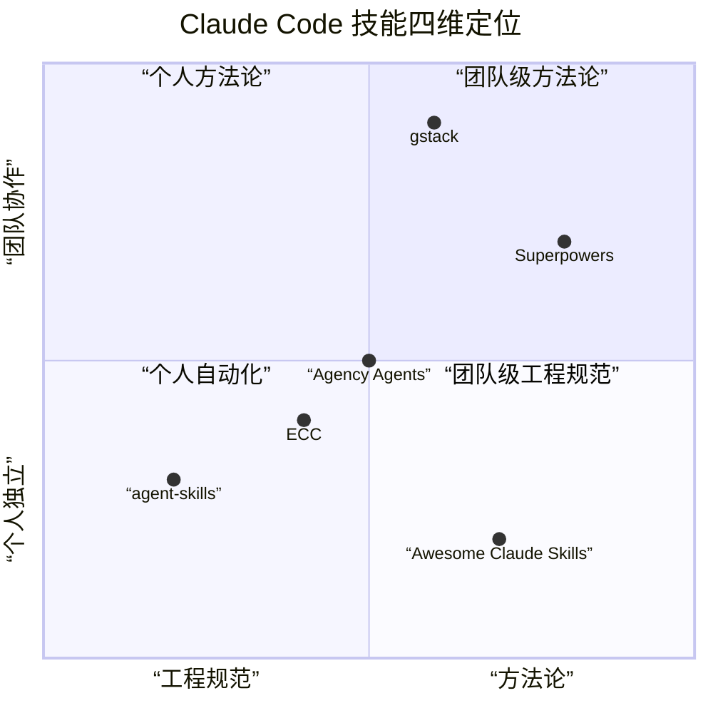

# 推荐6个顶级Claude Code技能：重塑AI开发工作流

用了 Claude Code 写代码，但总觉得它像个"聪明的新人"——能干活，但需要你一步步盯着、纠错、引导方向？问题不在 AI，而在你的「技能」不够强。

**Skills（技能）** 是 Claude Code 的核心扩展能力，能将通用 AI 转化为具备专业领域能力的开发专家——从代码生成升级为**架构设计、团队协作、自动化部署**的全流程开发助手。本文精选 6 个 GitHub 高星开源技能，覆盖四大核心场景，帮你彻底重构 AI 开发工作流。

## 1\. Superpowers：系统化全链路开发方法论

**来源**：obra/superpowers（GitHub 141k\+ 星标）
**核心定位**：AI 开发的 “标准化操作手册”，为编码代理提供完整的方法论框架。
Superpowers 是一套为 AI 编码代理量身打造的完整软件开发方法论，而非单一功能插件。它将零散的开发行为整合为**头脑风暴→方案设计→任务拆解→子代理开发→测试验证→代码审查→上线收尾**的标准化流程。

### 核心技能亮点

- **结构化头脑风暴（brainstorming）**：通过苏格拉底式提问细化模糊需求，输出可落地的设计文档。

- **子代理驱动开发（subagent\-driven\-development）**：自动分配子代理处理独立任务，支持并行开发与双层代码审查。

- **测试驱动开发（TDD）**：强制 “先写失败测试→最小实现→重构优化” 的闭环流程，杜绝无测试代码。

- **Git 工作流管理**：自动创建隔离开发分支，保障主分支稳定性。
**适用场景**：全规模项目开发、复杂系统重构、需要严格流程规范的团队协作。

## 2\. gstack：全栈虚拟工程团队

**来源**：garrytan/gstack（GitHub 68\.8k\+ 星标）
**核心定位**：一键召唤 “CEO \+ 架构师 \+ 设计师 \+ QA \+ 安全工程师” 的全能开发团队。
gstack 是由 Y Combinator 总裁 Garry Tan 打造的 AI 开发工具，将 23 个专业角色、8 大工具能力整合为 Claude Code 技能，让单人拥有团队级开发效率。它不仅是代码生成工具，更是**从产品构思到生产部署**的全链路解决方案。

### 核心技能亮点

- **产品预审（/office\-hours）**：以 YC 创业咨询标准评审需求，纠正错误产品定位。

- **多维度审查（/plan\-ceo/plan\-eng /plan\-design）**：从商业、架构、设计三层校验方案可行性。

- **自动化测试与部署（/qa/ship）**：自动启动浏览器测试、生成 PR 并完成部署。

- **浏览器自动化（/browse）**：控制真实浏览器完成 UI 测试、数据抓取等任务。
**适用场景**：初创项目快速落地、独立开发者全栈开发、需要多角色协作的复杂产品。

## 3\. Agency Agents：全领域专业化技能库

**来源**：msitarzewski/agency\-agents（GitHub 60k\+ 星标）
**核心定位**：144 个专业 AI 代理，覆盖 12 大领域的 “全能技能超市”。
Agency Agents 是目前最全面的 Claude Code 技能集合，打破 “AI 仅能写代码” 的局限，覆盖**工程、设计、市场、产品、法务**等 12 大领域。每个技能都是独立的专业代理，具备专属工作流和交付标准。

### 核心技能亮点

- **工程领域**：前端 / 后端架构师、安全工程师、数据库优化师。

- **设计领域**：UI 设计师、UX 研究员、品牌视觉专家。

- **业务领域**：增长黑客、SEO 专家、内容创作者、销售策略师。

- **特色能力**：游戏开发、空间计算、金融合规等垂直领域专业代理。
**适用场景**：跨领域项目、团队分工协作、需要垂直专业能力的开发场景。

## 4\. agent\-skills：谷歌级工程实践技能

**来源**：addyosmani/agent\-skills（GitHub 4\.2k\+ 星标）
**核心定位**：谷歌工程师沉淀的生产级开发技能，强调规范与质量。
由谷歌前工程师 Addy Osmani 打造，整合谷歌软件工程师最佳实践，输出 19 个生产级技能。核心特点是 **”流程大于结果”**，通过规范约束 AI 行为，避免 “野生代码”，适合企业级项目。

### 核心技能亮点

- **规范驱动开发（spec\-driven\-development）**：先写 PRD 文档，明确目标、结构、边界后再编码。

- **增量实现（incremental\-implementation）**：按 “垂直切片” 迭代开发，每步可测试、可交付。

- **代码审查与简化**：五维审查标准 \+ 复杂度精简，保障代码可读性。

- **安全与性能优化**：OWASP Top10 防护 \+ 性能基准测试。
**适用场景**：企业级项目、开源项目、需要长期维护的复杂系统。

## 5\. ECC（Everything Claude Code）：全场景增强技能包

**来源**：affaan\-m/everything\-claude\-code（GitHub 3\.8k\+ 星标）
**核心定位**：Claude Code 全能增强工具，覆盖**技能、规则、钩子、MCP 配置**全生态。
ECC 是目前最全面的 Claude Code 增强项目，不仅提供 200 \+ 技能，还包含**规则约束、自动化钩子、第三方集成**等能力，支持 Claude、Codex、Cursor 等多 AI 工具，是 “一站式 AI 开发增强方案”。

### 核心技能亮点

- **全链路开发**：需求分析→编码→测试→审查→部署全流程技能。

- **多语言支持**：TypeScript、Python、Go、Rust 等全栈语言技能。

- **第三方集成**：GitHub、Supabase、Vercel 等工具无缝对接。

- **安全防护**：内置密钥检测、漏洞扫描、代码审计技能。
**适用场景**：全类型项目、多 AI 工具协同、需要生态完整性的开发场景。

## 6\. Awesome Claude Skills：自动化集成技能库

**来源**：ComposioHQ/awesome\-claude\-skills（GitHub 2\.1k\+ 星标）
**核心定位**：连接 500 \+ 应用的自动化技能，让 AI 从 “写代码” 到 “做事情”。
Awesome Claude Skills 主打 **”AI 动作化”**，打破 AI 仅能生成文本/代码的局限，提供 100+ 自动化技能，可直接操作 GitHub、Slack、Notion、AWS 等 500+ 应用，完成 “代码生成→工具操作→结果交付” 的闭环。

### 核心技能亮点

- **开发自动化**：GitHub 操作、AWS 部署、数据库管理。

- **文档处理**：PDF/Word/Excel 解析、PPT 生成、Markdown 转换。

- **协作工具**：Slack 消息、Notion 页面、Jira 工单自动处理。

- **创意工具**：图片生成、视频编辑、海报设计。
**适用场景**：自动化工作流、工具集成开发、需要跨系统操作的项目。

## 总结

### 技能定位一览

### 选型建议

| 你的角色 | 推荐技能 | 理由 |
|---------|---------|------|
| 独立开发者/快速原型 | Superpowers + gstack | 方法论驱动 + 虚拟团队协作，从构思到交付一站式搞定 |
| 企业团队/工程规范 | agent-skills + Superpowers | 谷歌级工程实践 + 标准化流程，保障代码质量与可维护性 |
| 跨领域/多角色项目 | Agency Agents | 144 个专业代理覆盖 12 大领域，无需切换工具 |
| 自动化/工具集成 | Awesome Claude Skills + ECC | 500+ 应用对接 + 全生态增强，打通从代码到交付的最后一公里 |

以上 6 个顶级 Claude Code 技能，从**方法论、团队协作、工程规范、垂直领域、生态增强、自动化集成**六个维度，覆盖 AI 开发全场景需求。建议从自身角色定位出发，先选择 1-2 个技能上手体验，逐步构建属于自己的 AI 开发工作流。
