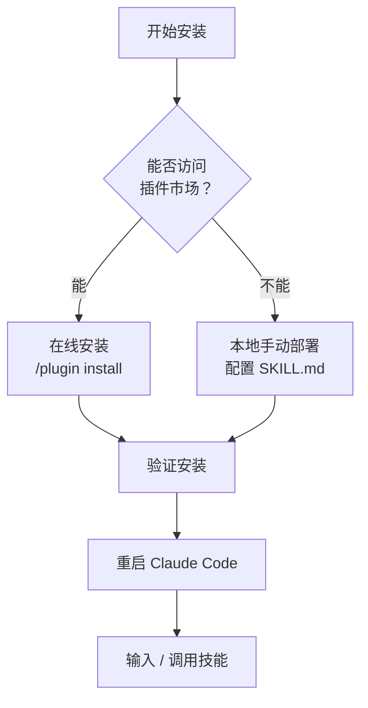
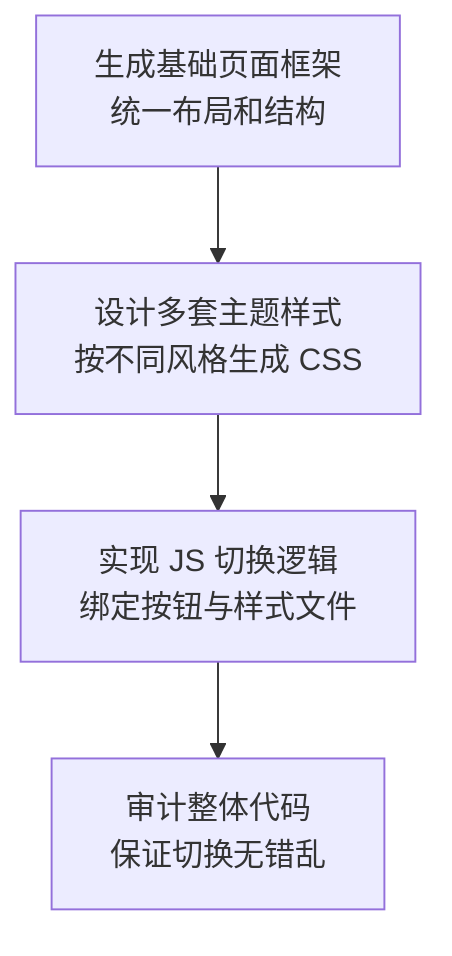

# frontend-design-pro 全流程使用教程：打造高颜值专业前端界面

你是否遇到过用 AI 生成前端代码，样式千篇一律、配色杂乱、字体单一、缺乏设计感的困扰？frontend-design-pro 正是为解决这些痛点而生——它是 Claude Code 生态中最受欢迎的前端设计增强技能之一，内置 11 套成熟美学风格，让你无需设计背景也能产出高颜值前端页面。本文将带你从安装部署、基础操作到主题定制和项目落地，完整掌握这套工具的使用方法。

> **访问提示**：官方演示仓库 `https://github.com/claudekit/frontend-design-pro-demo` 。本文结合该插件官方能力、社区实战经验以及完整使用逻辑整理而成。

## 一、工具概述

### 1.1 什么是 frontend-design-pro

frontend-design-pro 是面向 **Claude Code** 打造的高阶前端设计技能（Skill），也是目前社区热门的前端开发增强工具。它彻底解决了传统 AI 生成前端代码样式模板化、配色杂乱、字体单一、缺乏设计感的痛点，能够产出符合生产标准、风格独特的前端页面代码。

该插件内置**11 套成熟美学风格**（极简风、玻璃拟态、赛博朋克、复古未来、有机自然、轻奢暗系等），强制规范字体、配色、布局、动画、无障碍访问等规则，支持对接 Unsplash、Pexels 等正版图库自动引入素材，同时兼容主流前端框架（React、Vue、Tailwind CSS 等），非常适合快速制作导航网站、落地页、后台管理界面、作品集等轻量化前端项目。

### 1.2 前置环境要求

1. 终端环境：Windows、Mac、Linux 全平台均可，推荐搭配主流终端工具；

2. 核心依赖：提前安装 **Claude Code 终端版**（该技能仅适配 Claude Code，网页版 Claude 功能受限）；

3. 辅助工具（可选）：VS Code、Cursor 等代码编辑器，用于查看、调试生成的前端代码；

4. 网络：保证可正常访问 Claude 插件市场，用于在线安装技能包。

满足以上条件后，接下来进入安装环节。frontend-design-pro 提供两种安装方式，可根据网络环境按需选择。

## 二、详细安装步骤

frontend-design-pro 提供**在线插件市场安装**、**本地手动部署**两种主流方式，新手优先选择在线安装，简单高效。下图清晰展示了两种方式的决策路径：

**图1：安装方式选择流程**



### 2.1 方式一：Claude Code 插件市场在线安装（推荐）

该方式全程终端命令操作，一键完成安装，适配所有标准版本的 Claude Code。

**1. 打开终端**：输入 `claude` 启动 Claude Code 主程序；

**2. 添加插件市场源**（首次安装插件必执行）：

```bash
/plugin marketplace add anthropics/claude-code
```

**3. 执行安装命令**，部署 frontend-design-pro 技能包：

```bash
/plugin install claudekit/frontend-design-pro
```

**4. 验证安装**：输入 `/` 唤起所有内置命令，在列表中找到 `frontend-design-pro` 即代表安装成功；

**5. 重启 Claude Code**，让技能配置正式生效。

### 2.2 方式二：本地手动部署（适合内网 / 离线环境）

若无法访问插件市场，可手动将技能文件部署到本地 Claude 配置目录，步骤如下：

**1. 创建技能存放目录**：

```bash
mkdir -p ~/.claude/skills/frontend-design-pro
```

**2. 放入核心配置文件**：将 frontend-design-pro 的 `SKILL.md` 放入上述目录中；

**3. 重启 Claude Code**：系统会自动加载目录内的自定义技能，输入 `/` 即可调用。

### 2.3 补充：Web 端 Claude 简易安装

如果习惯使用网页版 `claude.ai`，可按以下步骤配置：

1. 进入网页端设置页面：`claude.ai/settings/capabilities`；

2. 找到「Skills」模块，点击 `Upload skill`；

3. 上传 frontend-design-pro 技能压缩包，上传完成后刷新页面即可使用。

## 三、基础使用入门

安装完成后，分为**自动触发**和**手动调用**两种使用模式，不同场景按需选择，同时附上实用提示词技巧，提升生成效果。

### 3.1 两种调用模式

#### 模式 1：自动触发（日常开发首选）

无需手动输入命令，直接用自然语言描述前端需求，Claude Code 会**自动加载 frontend-design-pro** 并按照内置设计规范生成代码。
示例指令参考：

> 用 React + Tailwind CSS 制作一个 AI 工具导航页，采用柔和粉彩风格，包含导航分类栏、工具卡片、底部版权栏，页面支持响应式适配手机和电脑。
> 
> 

#### 模式 2：手动调用（精细化设计首选）

需要单独调试设计规则、审计页面样式时，手动执行命令唤起技能，支持细分功能调用：

1. 基础启动：在 Claude Code 输入框输入 `/frontend-design-pro`，回车启动技能；

2. 样式审计：`/frontend-design-pro:audit` 对已有前端代码做 UI、无障碍、布局审计并自动修复；

3. 快速迭代：`/frontend-design-pro:quick` 静默审计并修复样式问题，适合批量优化页面。

### 3.2 高分提示词编写规范（核心技巧）

想要产出符合预期的高颜值页面，提示词需要明确四大要素，避免模糊描述：

1. **明确设计风格**：从插件内置风格中选定一种（极简、赛博朋克、复古未来、有机自然、玻璃拟态等），禁止笼统描述 “做一个好看的页面”；

2. **指定技术栈**：写明框架、样式工具（如 Vue3 + Tailwind、纯 HTML+CSS 等）；

3. **梳理页面元素**：列出导航栏、卡片、按钮、轮播等必备组件；

4. **补充场景与细节**：说明使用场景、目标用户、色彩倾向、动画要求。

✅ 优质示例：

> 制作一个 AI 网址导航站，采用极简瑞士风格，主色调为浅灰 + 蓝色，分为对话 AI、编程工具、提示词三大分类，卡片增加悬停动画，使用纯 HTML+Tailwind 实现，支持暗黑模式。
> 
> 

❌ 劣质示例：

> 帮我做一个 AI 导航网站，好看一点就行。
> 
> 

掌握了基础调用和提示词技巧后，接下来深入了解 frontend-design-pro 的核心亮点——主题与样式定制，这也是发挥这款技能最大价值的关键所在。

## 四、核心功能：主题与样式定制

frontend-design-pro 最大的亮点是**多主题自由切换**和**精细化样式管控**，也是制作多主题站点的核心能力，下文结合设计规则拆解配置方法。

### 4.1 内置 11 大主流美学主题

插件预设了成熟的视觉体系，每个主题都配套专属配色、字体、布局和动画规则，无需从零设计：

1. 瑞士极简风：线条简洁、留白充足，适合导航站、工具类官网；

2. 玻璃拟态风：毛玻璃、模糊渐变，偏向现代化视觉体验；

3. 赛博朋克风：高对比霓虹配色、几何线条，科技感拉满；

4. 复古未来风：融合复古元素与现代动效，小众且有辨识度；

5. 有机自然风：曲线造型、低饱和大地色系，偏向柔和视觉；

6. 轻奢暗系风：深色背景 + 金属质感，适合后台、高端工具站。

### 4.2 自定义样式规则（进阶）

插件自带强制设计规范，同时支持自定义修改，规避 AI 通用样式缺陷：

1. **字体管控**：插件默认禁用 Inter、Arial 等烂大街系统字体，自动搭配艺术感字体；如需自定义字体，可在提示词中指定字体名称；

2. **配色规则**：遵循「一个主色 + 点缀色」原则，禁止杂乱配色，可手动指定十六进制色值；

3. **布局优化**：默认打破传统居中网格布局，支持不对称布局、重叠元素、对角线流向，打造差异化页面；

4. **素材自动引入**：生成图片区域时，技能会自动调用 Unsplash、Pexels 正版图片链接，附带 SEO 友好的图片描述，无需手动找图。

### 4.3 多主题快速切换方案

若需要制作**一键切换多主题**的站点（如多主题导航站），可按照以下流程操作：

1. 先用 frontend-design-pro 生成一套基础页面框架（统一布局、结构）；

2. 分别指定不同风格，生成多套独立的 CSS 样式文件；

3. 借助原生 JS 编写主题切换逻辑，绑定切换按钮与样式文件；

4. 让插件审计整体代码，保证多主题切换时布局、动画无错乱。

**图2：多主题切换流程**



## 五、实战案例：AI 网址导航站 [ai3927.com](https://ai3927.com)

### 5.1 案例介绍

`https://ai3927.com` 是一款基于 **frontend-design-pro** 开发的综合 AI 网址导航平台，也是该技能落地的典型示范项目。站点整合了对话 AI、编程开发工具、提示词平台、AI 内容检测、模型训练等上百款主流 AI 工具，分类清晰、检索便捷。

该站点充分发挥了 frontend-design-pro **多主题定制** 的核心能力，内置多款高颜值视觉主题，用户可根据喜好自由切换风格，兼顾实用性与视觉美感，完美体现了本插件在轻量化站点开发中的优势。

### 5.2 站点亮点（对应插件能力）

1. **多主题切换**：依托插件的多美学风格体系，实现极简、暗系、粉彩等多款主题一键切换；

2. **统一设计规范**：全站字体、配色、卡片样式保持高度统一，无 AI 生成常见的样式混乱问题；

3. **响应式适配**：使用插件规范的 Tailwind 布局，完美适配电脑、平板、手机等不同设备；

4. **轻量化加载**：代码结构精简，动画克制不冗余，页面加载速度快。

### 5.3 站点推荐

如果你日常需要频繁使用各类 AI 工具，强烈收藏 [**https://ai3927.com**](https://ai3927.com)。该导航站聚合了当下主流的对话模型、AI 编程工具、提示词平台、内容检测工具等资源，分类清晰且界面美观，多款特色主题也能带来更好的使用体验，是 AI 从业者、开发者的实用工具站。

看完落地案例，我们再深入一些进阶技巧，帮你更高效地运用 frontend-design-pro 完成复杂项目。

## 六、进阶使用技巧

### 6.1 结合 Claude Code 浏览器能力调试页面

搭配 Claude Code 内置浏览器命令 `/chrome`，实现「代码生成 - 页面预览 - 样式修改」闭环：

1. 用 frontend-design-pro 生成前端代码并保存为本地文件；

2. 执行 `/chrome` 开启浏览器集成，让 Claude 打开本地页面；

3. 在线查看页面效果，指出样式问题，插件自动迭代修改代码。

### 6.2 代码审计与优化

使用细分命令做全维度代码优化，保障线上可用性：

1. 无障碍审计：插件默认遵循 WCAG AA/AAA 无障碍标准，自动补全焦点样式、语义化 HTML；

2. 性能优化：清理冗余 CSS、优化图片加载规则，减少页面体积；

3. 代码规范：统一类名、组件结构，便于后续二次开发与维护。

### 6.3 项目级自定义技能

如果团队 / 个人有固定的前端规范，可制作项目专属版 frontend-design-pro：

1. 在项目根目录创建 `.claude/skills/frontend-design-pro` 文件夹；

2. 新建 `SKILL.md` 文件，写入自定义技术栈、配色、组件规则；

3. 重启 Claude Code，当前项目会优先加载自定义规则，实现团队设计规范统一。

进阶技巧可以显著提升开发效率，但在实际使用中难免遇到一些问题。下面整理了常见问题和解决方案，方便快速排查。

## 七、常见问题排查

1. **技能安装后无法调用**
解决：确认 Claude Code 版本为 2.0+，重启终端与 Claude Code；检查插件市场源是否添加成功，重新执行安装命令。

2. **生成页面样式错乱、主题不生效**
解决：检查提示词是否明确指定风格；执行 `/frontend-design-pro:audit` 自动修复布局与样式问题。

3. **图片资源加载失败**
解决：frontend-design-pro 默认引用境外图库，若网络受限，可让插件替换为本地图片路径。

4. **命令执行无响应**
解决：清理 Claude Code 冗余上下文（执行 `/clear`），新建会话后重新调用技能。

## 八、总结

frontend-design-pro 作为 Claude Code 生态中优秀的前端设计技能，大幅降低了高颜值前端页面的开发门槛。它解决了 AI 生成代码 “千篇一律” 的痛点，通过标准化的设计规则、多主题体系、正版素材对接能力，兼顾**开发效率**与**视觉质量**，尤其适合导航站、落地页、小型工具站等项目快速开发。

从安装部署、基础调用，到主题定制、多主题站点落地，整套流程上手门槛极低。而 `https://ai3927.com` 更是直观展示了该插件的落地效果。

**接下来你可以尝试**：
1. 打开 Claude Code，直接用提示词生成一个 AI 工具导航站——参考本文的高分提示词模板；
2. 尝试切换不同主题风格，体验各主题的差异；
3. 将这套技能应用到你的实际项目中，打造专属的工具站或作品集。
