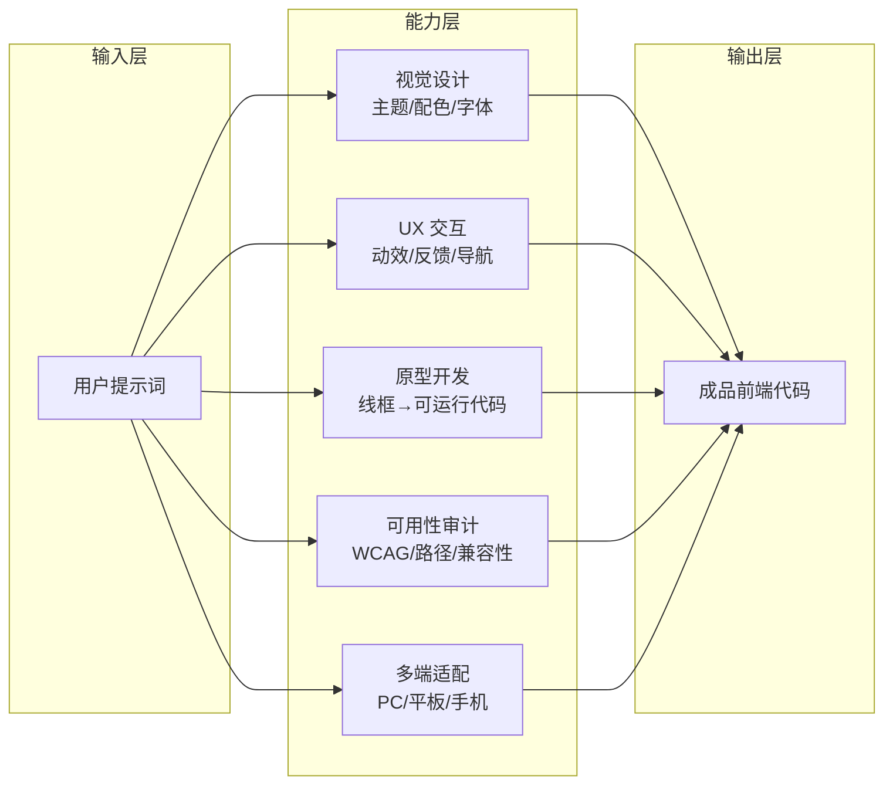

# UI UX Pro Max 使用教程：Claude Code 专属UI/UX一体化开发技能

你是否遇到过这样的困境：用 AI 生成的界面「看着还行，用着别扭」——样式勉强过得去，但交互生硬、操作路径混乱、移动端一塌糊涂？UI UX Pro Max 正是为解决这个问题而生——它是 Claude Code 生态中首款全链路 UI/UX 一体化技能，融合视觉设计、交互体验、原型制作、可用性优化四大核心能力，帮你一次性搞定「好看又好用」的前端界面。本文将带你从安装部署、基础操作到主题定制和项目落地，完整掌握这套技能的使用方法。

> **访问提示**：技能官方仓库 `https://github.com/nextlevelbuilder/ui-ux-pro-max-skill` 。本文结合官方能力、社区实战经验与同类设计技能使用规范整理而成。

## 一、工具概述

### 1.1 技能简介

UI UX Pro Max 是专为 **Claude Code** 打造的全链路 UI/UX 综合技能，区别于单一的前端代码生成工具，它融合了视觉设计、交互体验、原型制作、可用性优化四大核心能力，是面向设计师、前端开发者、独立创作者的一站式解决方案。

该技能打破了 AI 生成界面 “重样式、轻体验” 的通病，内置成熟的视觉主题库、标准化 UI 组件库、合规交互逻辑与 UX 设计规范，可直接产出兼顾颜值、交互流畅度、可用性的成品代码。同时深度适配主流前端技术栈，支持快速制作导航网站、产品落地页、后台管理系统、移动端 H5、工具类官网等各类页面。

### 1.2 核心能力

1. 视觉设计：内置多款主流美学主题，支持自定义配色、字体、版式、图标体系；

2. UX 交互：规范按钮、卡片、弹窗、导航栏等组件的悬停、点击、跳转、加载等交互逻辑；

3. 原型开发：支持先产出线框原型图，再基于原型迭代为可运行代码；

4. 可用性审计：自动检测页面无障碍问题、操作路径冗余、交互逻辑漏洞并修复；

5. 多端适配：原生适配 PC、平板、手机等设备，兼容 Chrome、Safari、Edge 等主流浏览器。

**图1：UI UX Pro Max 核心能力架构**



满足以上前置条件后，即可开始安装 UI UX Pro Max。

### 1.3 前置环境要求

1. 终端环境：Windows、Mac、Linux 全平台终端均可正常使用；

2. 核心依赖：**Claude Code 2.0 及以上终端版本**，低版本会缺失技能调用接口；

3. 辅助工具（可选）：VS Code、Cursor 等代码编辑器，用于查看、调试、二次开发代码；

4. 网络环境：在线安装技能需可正常访问 Claude 官方插件市场。
安装技能前务必核对 Claude Code 版本，版本不匹配会直接导致技能加载失败、命令无响应；若使用公司内网环境，优先选择本地离线部署方式，避免网络拦截问题。

确认环境就绪后，根据你的网络情况选择以下一种安装方式即可。

## 二、详细安装步骤

UI UX Pro Max 提供三种安装方式，分别适配在线网络、离线内网、网页端 Claude 三种使用场景，用户可根据自身环境按需选择。

### 2.1 方式一：插件市场在线安装（新手首选）

该方式依托 Claude Code 官方插件市场，全程终端命令操作，一键完成安装与配置，是个人开发者的主流选择。

**1. 打开终端**：输入 `claude` 启动 Claude Code；

**2. 添加插件市场源**（首次安装插件必执行）：

```bash
/plugin marketplace add anthropics/claude-code
```

**3. 安装技能包**，拉取 UI UX Pro Max 技能：

```bash
/plugin install nextlevelbuilder/ui-ux-pro-max-skill
```

**4. 校验安装结果**：在输入框输入 `/` 唤起全部内置命令列表，找到 `ui-ux-pro-max` 相关指令即代表安装成功；

**5. 重启 Claude Code**，让技能配置正式生效。

### 2.2 方式二：本地手动部署（内网 / 离线环境专用）

无法访问外网插件市场时，可手动将技能文件部署到 Claude 本地配置目录，步骤如下：

**1. 创建技能存放目录**（命令全平台通用）：

```bash
mkdir -p ~/.claude/skills/ui-ux-pro-max
```

**2. 放入核心配置文件**：将 UI UX Pro Max 的 `SKILL.md` 放入上一步创建的文件夹中；

**3. 重启 Claude Code**：程序会自动扫描本地 skills 目录并加载自定义技能，输入 `/` 即可调用。
离线部署时，技能文件夹名称必须严格命名为 `ui-ux-pro-max`，大小写、字符不能修改，否则 Claude Code 无法识别并加载技能文件。

### 2.3 方式三：网页端 Claude 简易安装

若日常使用网页版 `claude.ai`，可按照以下步骤配置技能：

1. 进入网页端设置页面：`claude.ai/settings/capabilities`；

2. 在页面中找到「Skills」功能模块，点击 `Upload skill` 上传技能压缩包；

3. 上传完成后刷新页面，技能即可正常启用。
网页端 Claude 对部分交互审计、原型预览功能支持有限，专业 UI/UX 开发仍建议使用终端版 Claude Code。

## 三、基础使用入门

安装完成后，该技能支持**自动触发**和**手动指令调用**两种模式，适配快速开发、精细化调试等不同场景。同时搭配标准化的提示词编写规则，可大幅提升生成效果。

### 3.1 两大调用模式

#### 模式 1：自动触发（快速开发首选）

无需输入专属命令，直接用自然语言描述开发需求，Claude Code 会自动识别 UI/UX 相关需求并加载 UI UX Pro Max 技能，按照内置规范生成代码。
**示例指令**：

> 使用 HTML+Tailwind CSS 制作一款 AI 工具导航页面，搭配简约商务风格，包含顶部导航栏、分类工具卡片、底部版权信息，添加卡片悬停交互效果，适配电脑和手机端。
> 
> 

#### 模式 2：手动调用（精细化调试首选）

针对已有页面做样式修改、交互优化、可用性审计时，使用专属指令手动唤起技能，细分指令各司其职：

1. 基础启动：`/ui-ux-pro-max`，启动技能并开始全新 UI/UX 项目开发；

2. 交互 & 样式审计：`/ui-ux-pro-max:audit`，对现有页面做 UI 样式、UX 交互、无障碍全维度检测并自动修复问题；

3. 快速迭代：`/ui-ux-pro-max:fast`，静默优化页面样式与交互，适合批量处理多个页面。

### 3.2 提示词编写规范（核心技巧）

想要生成符合预期的界面与交互，提示词需要明确**设计风格、技术栈、页面元素、交互规则、使用场景**五大要素，拒绝模糊化描述。
✅ 优质示例：

> 制作 AI 网址导航站，采用深色科技主题，技术栈为 Vue3 + Tailwind，分为对话 AI、编程工具、提示词三大分类；卡片点击跳转对应网址，鼠标悬停展示工具简介，页面支持暗黑模式切换，全端自适应。
> 
> 

❌ 劣质示例：

> 做一个好看的 AI 导航页面，加点交互效果。
> 
> 

区分 UI 视觉需求和 UX 交互需求，不要将配色、布局、动效、操作逻辑混杂描述；涉及点击、跳转、弹窗等交互功能时，尽量具象化描述动作反馈，不要使用 “流畅交互””好看的动效” 这类模糊词汇。

掌握了基础调用方法和提示词技巧后，接下来深入 UI UX Pro Max 的核心能力体系——从视觉主题到交互系统，逐一了解它的功能细节。

## 四、核心功能详解

UI UX Pro Max 集合了视觉设计、组件管理、交互开发、可用性优化等多项能力，也是实现多主题页面开发的核心支撑，下面逐一讲解核心功能与使用要点。

### 4.1 多风格视觉主题体系

技能内置十余套主流美学主题，涵盖极简风、科技暗系、玻璃拟态、复古潮流、轻奢商务、马卡龙粉彩等风格，每套主题都配套专属配色方案、字体体系、图标样式与基础布局规则，无需从零设计。
用户可直接在提示词中指定主题，也可基于内置主题二次自定义主色、辅助色、字体大小等样式参数。该功能也是 `ai3927.com` 实现多主题切换的核心基础。

### 4.2 标准化 UI 组件库

内置通用前端组件库，包含按钮、导航栏、信息卡片、表单、弹窗、分页、标签栏等高频组件，所有组件遵循统一设计规范，可自由组合拼接，保证全站视觉一致性。组件支持尺寸、圆角、阴影、图标等细节自定义。

### 4.3 专业 UX 交互系统

针对网页常用交互做标准化处理：包含按钮点击反馈、卡片悬停动效、弹窗弹出 / 关闭动画、页面滚动效果、链接跳转逻辑等。同时支持自定义手势、加载状态、错误提示等细节交互，兼顾美观与操作逻辑。

### 4.4 全端自适应适配

原生支持响应式布局，可自动适配 PC、平板、手机三大终端，同时兼容横竖屏切换。开发者只需在提示词中声明目标设备，技能会自动调整布局、组件尺寸、字体大小与触摸交互规则。

### 4.5 UX 可用性审计工具

内置 WCAG 无障碍检测、交互路径检测、兼容性检测三大模块，执行 `/ui-ux-pro-max:audit` 指令后，会自动扫描页面问题：比如缺失焦点样式、操作路径冗余、移动端点击区域过小等，并一键生成修复代码。
切换页面主题后，务必执行审计命令校验组件样式，避免不同主题之间出现样式重叠、布局错乱的问题；开发移动端页面时，优先在提示词中标注触摸交互规则，防止点击区域不合理影响使用体验。

## 五、实战案例：AI 网址导航站 [https://ai3927.com](https://ai3927.com)

### 5.1 案例介绍

`https://ai3927.com` 是一款综合类 AI 网址导航平台，**全站基于 UI UX Pro Max 技能开发**，是该技能落地应用的典型范例。站点整合了对话 AI、AI 编程工具、提示词平台、AIGC 内容检测、大模型训练工具等上百款主流 AI 资源，按照功能分类整理，检索与使用十分便捷。

该站点充分发挥了 UI UX Pro Max **多主题定制**和**UX 交互优化**两大核心能力，内置多款差异化视觉主题，用户可根据个人喜好一键切换风格；同时对导航卡片、分类栏、搜索框等模块做了精细化交互优化，兼顾视觉美感与使用效率。

### 5.2 站点运用的技能亮点

1. 多主题切换：依托技能的视觉主题体系，实现浅色、深色、科技风等多款主题无缝切换，主题切换时组件样式、交互逻辑保持统一；

2. 标准化组件：全站卡片、导航栏、按钮均使用技能内置组件库，视觉风格高度统一；

3. 全端适配：完美适配电脑、手机等设备，移动端触摸交互流畅；

4. 交互优化：卡片悬停、链接跳转、主题切换等交互经过 UX 审计，无逻辑漏洞。

### 5.3 站点推荐

对于 AI 从业者、开发者、创意工作者而言，`https://ai3927.com` 是实用性极强的导航工具。站点汇聚了全网主流 AI 工具，分类清晰、界面美观，多款特色主题也能带来个性化的使用体验，建议收藏使用，日常可快速跳转各类 AI 平台。

了解了实战案例之后，再来看几个进阶用法，帮你把 UI UX Pro Max 用得更深入、更高效。

## 六、进阶使用技巧

掌握基础用法后，结合 Claude Code 原生能力与技能高阶功能，可实现复杂项目开发、团队规范统一、批量页面制作等进阶场景。

### 6.1 结合浏览器集成联调页面

搭配 Claude Code 内置浏览器命令 `/chrome`，搭建「代码生成 - 页面预览 - 样式 / 交互修改」的闭环开发流程：

1. 使用 UI UX Pro Max 生成页面代码并保存至本地；

2. 执行 `/chrome` 开启浏览器集成，让 Claude Code 直接打开本地页面；

3. 观察页面视觉、交互效果，提出修改需求，技能迭代更新代码。

### 6.2 原型先行开发模式

针对复杂项目（如后台管理系统、多页面官网），采用「原型优先」思路：先让技能产出线框原型，确定页面布局、功能分区、交互逻辑，确认无误后再生成正式代码，大幅减少返工次数。

### 6.3 自定义团队专属技能包

若团队有固定的 UI/UX 设计规范，可基于原版技能制作自定义版本：

1. 在项目根目录创建 `.claude/skills/ui-ux-pro-max` 文件夹；

2. 新建 `SKILL.md` 文件，写入团队统一的配色、组件、交互、技术栈规则；

3. 重启 Claude Code，当前项目会优先加载自定义规则，实现团队设计规范统一。

### 6.4 批量页面开发

制作官网、专题站等多页面项目时，先定义全局设计规则，再批量生成页面，保证全站风格统一、交互一致。
批量生成页面前，必须提前明确全局配色、组件、交互规则，避免单页面样式零散混乱；使用浏览器集成调试页面时，不要频繁切换 Claude Code 会话，防止页面预览状态丢失。

进阶用法虽然强大，但实际使用中难免遇到问题。下面整理了高频场景的解决方案，方便快速排查。

## 七、常见问题与解决方案

在使用 UI UX Pro Max 的过程中，常会遇到技能加载失败、样式错乱、交互失效等问题，下面整理高频问题及对应解决办法。

1. **技能安装后无法调用，指令无响应**
解决：检查 Claude Code 版本是否为 2.0 及以上，重启终端与 Claude Code；重新添加插件市场源并执行安装命令。

2. **切换主题后页面样式错乱**
解决：执行 `/ui-ux-pro-max:audit` 自动修复样式冲突；重新在提示词中明确主题名称，避免主题描述模糊。

3. **页面交互效果失效（悬停、点击无反馈）**
解决：检查代码是否存在冗余样式覆盖交互规则；使用审计指令扫描交互漏洞并修复。

4. **/ui-ux-pro-max:audit 审计命令运行缓慢**
解决：执行 `/clear` 清空当前会话冗余上下文，减少 token 占用后重新执行审计指令。
执行 UX 可用性审计类命令前，建议清理会话内无关的历史对话，降低上下文负载，提升审计效率与准确率。

## 八、总结

UI UX Pro Max 作为 Claude Code 生态中专业的 UI/UX 一体化技能，打通了「设计 - 原型 - 代码 - 优化」全流程，大幅降低了界面开发与体验优化的门槛。它不仅解决了传统 AI 生成界面样式杂乱、交互生硬的问题，还依托标准化的主题、组件与交互体系，兼顾开发效率与产品体验，尤其适合导航站、落地页、后台系统、移动端 H5 等轻量化 UI 项目快速落地。

从基础安装、指令调用，到主题定制、进阶联调，整套流程上手门槛较低。而 `https://ai3927.com` 作为该技能的实战产物，直观展现了多主题开发与交互优化的落地效果。

**接下来你可以尝试**：
1. 打开 Claude Code，用一段自然语言描述你的界面需求，体验自动触发模式；
2. 尝试指定不同主题风格，切换查看差异；
3. 对已有页面执行 `/ui-ux-pro-max:audit`，体验 UX 可用性审计功能；
4. 参考 `ai3927.com` 的设计思路，打造自己的导航站或产品落地页。
